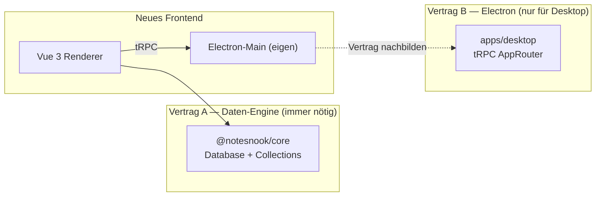

# NEXT_STEPS — Notesnook Vue Desktop Rewrite

> Single source of truth for the project plan, findings, decisions, and the
> next work items. Update this file as work progresses; treat it as the
> living project journal and onboarding doc.

---

## 1. Vorhaben im Detail

Komplettes, von-scratch-geschriebenes Frontend für Notesnook, das das bestehende
React-Renderer (`apps/web` im Hauptrepo `streetwriters/notesnook`) ersetzt und
deutlich benutzerfreundlicher wird. Ziele:

- **TailwindCSS v4 + Glassmorphism** statt Theme UI / Emotion
- **TypeScript** end-to-end (Main, Preload, Renderer, Tests)
- **Electron** als Desktop-Shell, **responsiv / mobile-first** im Layout-Denken
- **VS-Code-artige Editor-UX**: Multi-Tab, geschachtelte Split-Panes,
  Tab-Tear-out → neues Fenster (Focus-Mode), Command-Palette-Metapher
- **Backend-API-Kompatibilität** mit `@notesnook/core` (der Notesnook-Daten-
  engine, die client-seitig läuft — es gibt kein klassisches HTTP-Backend)
- **Eigenständiges Repo**, das die Notesnook-Packages via npm konsumiert

Die detaillierten UI-Anforderungen liegen in der YAML-Datei des Nutzers
(`Untitled-1`), zusammengefasst in §4 unten.

### 1.1 Architektur-Entscheidungen (fixiert)

| Aspekt | Entscheidung | Begründung |
|---|---|---|
| Repo | Separat unter `/Users/marco/Projects/notesnook-vue` | Unabhängige Roadmap, eigene CI, keine Hauptrepo-Blocker |
| Package Manager | **npm workspaces** | Kompatibel mit Hauptrepo; bewährter Pfad |
| Layout | **Monorepo** (`apps/desktop`, `packages/*`) | Skaliert für spätere Web-/Mobile-Apps |
| Framework | **Vue 3.5** + Vite | Völlig neues UX-Ziel, React-Renderer wird ersetzt |
| Styling | **TailwindCSS v4** + `@tailwindcss/vite` | Glassmorphism trivial, Design-Token-Plugin |
| UI-Primitives | Radix Vue (`reka-ui`) — geplant | Accessibility + Keyboard + Tailwind-freundlich |
| State | **Pinia** für App-Shell; Zustand-Stores aus `@notesnook/editor` bleiben | Framework-agnostisch, sauber faktoriert |
| Routing | Vue Router 4 — geplant | ersetzt den dual-Router des Hauptrepos |
| Editor | **TipTap mit `@tiptap/vue-3`** (Port von `@notesnook/editor`) | 60% der Extensions sind reines ProseMirror und laufen unverändert |
| Electron-Scaffolding | **`electron-vite`** | Main/Preload/Renderer getrennt, reif |
| Electron-Main | Eigenbau, aber **AppRouter-Vertrag nachbilden** | Freiheit + Kompatibilität mit dem bestehenden Main-Vertrag |
| Backend-Anbindung | `npm install @notesnook/core` etc. | Public auf npm, GPL-3.0-kompatibel |
| Lizenz | **GPL-3.0-or-later** | Pflicht bei Konsum von `@notesnook/core` |

### 1.2 Warum Vue statt React

- TipTap hat **native Vue-3-Bindings** (`@tiptap/vue-3`)
- `@notesnook/editor` ist *nicht* mit `@tiptap/react` gebaut — es hat eine
  eigene, dünne React-Node-View-Schicht auf `@tiptap/core`. Diese Schicht wird
  beim Port **gelöscht** und durch `nodeViewRenderer` + `NodeViewWrapper` von
  `@tiptap/vue-3` ersetzt
- ~60% der Editor-Codebasis sind reines ProseMirror (Schema, Commands, Plugins,
  KaTeX-Math, vendored `prosemirror-tables`) und laufen unter Vue unverändert
- Der wahre Hebel ist ohnehin der Ersatz von Theme UI durch Tailwind — der
  fällt *global* in einem Schritt weg, unabhängig vom UI-Framework

---

## 2. Was wir herausgefunden haben

### 2.1 Aktuelles Hauptrepo (IST-Zustand)

**Apps:**
- `apps/web` — **ein** React-18-Renderer für Web + Electron (Build-Aliase
  tauschen `desktop-bridge` und `sqlite` je `PLATFORM`)
- `apps/desktop` — reiner Electron-Main-Prozess (~6–10k LOC), lädt das
  `apps/web`-Bundle via Custom-Protocol `https://app.notesnook.com/*`
- `apps/mobile` — separate React-Native-App mit eigener Editor-Shell
  (`@notesnook/editor-mobile`)

**Stack des Renderers (`apps/web`):**
- React 18.3 + Vite 5.4 + SWC
- **Zustand 4.5** (16 Stores), klassenbasiert via `BaseStore`
- TanStack Query v4 + tRPC (nur für Electron-Bridge)
- **wouter** + eigener Hash-Router (zwei parallele Router)
- **Theme UI + Emotion** (`sx`-Prop überall), **kein Tailwind**
- `@notesnook/theme` — Scoped-CSS-Variablen pro UI-Region (`base`, `titleBar`,
  `list`, `editor`, …), JSON-validiert via Schema
- `@notesnook/ui` — nur ~4 Primitive (Menu, PopupPresenter, ScrollContainer, Icon)
- TipTap 2.6.6 mit **46 Custom-Extensions** + vendored `prosemirror-tables`
- Lingui 5.1 für i18n, `@dnd-kit` für DnD, `react-freeze` für Tab-Kaltstellung

**Bestehende VS-Code-artige Features (schon heute, aber custom):**
- `editor-store.ts` (~700+ LOC) mit rekursivem `LayoutNode`-Baum
  (`type: "group" | "split"`, `direction: "vertical" | "horizontal"`)
- Custom `SplitPane`, Tab-Pinning, Back/Forward-History per Tab
- Electron-Multi-Window: Main / Multi-Tab / Single-Note / Drag-Overlay,
  Cross-Window-Sync via `app:note-changed` (debounced pro noteId 300ms)

**Größenordnungen:**
- `apps/web/src`: ~317 Dateien, ~50–90k LOC
- `@notesnook/core`: ~98 Dateien, ~30–50k LOC (Daten-Engine)
- `@notesnook/editor`: ~148 Dateien, ~20–40k LOC (TipTap + 46 Extensions)
- `apps/desktop/src`: ~28 Dateien, ~6–10k LOC (Electron-Main)

### 2.2 Kopplungsanalyse — die zwei Verträge



**Vertrag A — `@notesnook/core` (Pflicht):**
- `Database`-Klasse mit `setup(options)`-Methode
- Collections: `notes`, `notebooks`, `tags`, `colors`, `reminders`,
  `attachments`, `vaults`, `monographs`, `settings`
- APIs: `sync`, `user`, `mfa`, `vault`, `lookup`, `pricing`, `subscriptions`
- Platform-Interfaces: `IStorage`, `IFileStorage`, `ICompressor`,
  `SQLiteOptions.dialect` — *Implementierungen liefert das Frontend*
- Datenmodell: `Note`, `Notebook`, `Topic`, `Tag`, `Color`, `Reminder`,
  `Attachment`, `Vault`, `ContentItem` (TipTap-Dokument), `DatabaseUpdatedEvent`
- **Wichtig:** Notes werden als ProseMirror-JSON gespeichert — ein neuer
  Editor muss dieses Format lesen & schreiben können

**Vertrag B — `apps/desktop` tRPC `AppRouter` (nur Electron):**
- ~33 Prozeduren in 9 Routern: `window`, `sqlite`, `os-integration`,
  `updater`, `safeStorage`, `spellChecker`, `backups`, `compress`, `bridge`
- 4 rohe IPC-Events: `app:note-changed`, `app:open-note`, `app:close-tab`,
  `app:external-drop`
- Wir bauen einen **eigenen Main**, implementieren dieselben Prozedur-Namen +
  Input/Output-Shapes — das ist der Mittelweg zwischen „frei" und
  „kompatibel"

### 2.3 Editor-Vue-Port — Aufwandschätzung

| Layer | Anteil | Vue-Port |
|---|---|---|
| Reine ProseMirror-Extensions (37 von 46) | ~50% | **0 Aufwand** — laufen unter `@tiptap/vue-3` |
| Zustand-Stores, Utils, `tool-definitions.ts` | ~10% | **0 Aufwand** — framework-agnostisch |
| Eigene `react/`-Node-View-Schicht (~500 LOC) | ~3% | **löschen**, durch `@tiptap/vue-3` ersetzen |
| 9 React-Node-View-`component.tsx` (attachment, audio, code-block, embed, image, table, task-item, task-list, web-clip) | ~10% | als `.vue` SFCs neu bauen |
| Toolbar + 8 Popups + Floating Menus + 16 Tool-Impl. | ~20% | neu (größter Einzel-Chunk) |
| `src/components/`, `src/hooks/` | ~5% | neu |
| `src/index.ts` (Hook + Component-Exporte) | ~2% | durch Vue-Äquivalente ersetzen |

**Gesamtschätzung:** ~10–14 Wochen Solo für einen treuen Port. **~7–9 Wochen**
bei bewusster Reduktion auf ~18 MVP-Extensions statt 46 + Command-Palette statt
vollständiger Toolbar.

### 2.4 npm-Verfügbarkeit der Packages (geprüft am 2026-07-19)

| Package | auf npm | Version |
|---|---|---|
| `@notesnook/core` | ✅ | 8.1.3 |
| `@notesnook/editor` | ✅ | 2.1.3 |
| `@notesnook/theme` | ✅ | 2.1.3 |
| `@notesnook/ui` | ✅ | 2.1.3 |
| `@notesnook/common` | ✅ | 2.1.3 |
| `@notesnook/crypto` | ✅ | 2.1.3 |
| `@notesnook/sodium` | ✅ | 2.1.3 |
| `@notesnook/streamable-fs` | ✅ | 2.1.3 |
| `@notesnook/logger` | ✅ | 2.1.3 |
| `@notesnook/intl` | ❌ **nicht published** | — |
| `@notesnook/desktop` | ❌ **nicht published** | — |

**Konsequenzen:**
- `@notesnook/intl` muss aus dem Hauptrepo-Source kopiert oder als eigenes
  Fork-Package veröffentlicht werden (Lingui-Strings + Locale-Loader)
- `@notesnook/desktop` wird nur als **Type-Import** für den `AppRouter`
  benötigt — wir definieren den Vertrag selbst in
  `apps/desktop/src/contracts/router.ts`

### 2.5 Was 1:1 bleiben muss vs. was frei neu gedacht werden darf

**Muss 1:1 (Backend-Verträge):**
- `@notesnook/core` Collections-API, Datenmodell, TipTap-Dokumentformat
- Sync-Engine, Vault-Verschlüsselung, Migrationslogik, Backup-Reader
- `IStorage` / `IFileStorage` / `ICompressor` / `SQLiteOptions` — nur
  Implementierungen liefern, Interface unverändert
- Vendored `prosemirror-tables`, KaTeX-Math-Node-View (reines ProseMirror)

**Darf frei neu gedacht werden:**
- Alle 16 Stores → auf 6–8 Pinia-Stores reduzieren
- ~35 Dialoge + 20 Settings-Sections → Settings als View, Dialoge als Wizard
- Custom Titlebar, SplitPane, Routing, Toolbar (Command Palette statt Ribbon)
- Mobile/Tablet-Slider → später oder streichen
- 46 Editor-Extensions → ~18 im MVP, Rest Phase 2/3

**Darf nicht neu gebaut werden (Kosten/Nutzen schlecht):**
- Sync-Engine, Vault, Migrationslogik, Backup-Reader — alles in `@notesnook/core`

---

## 3. Aktueller Stand im Repo `/Users/marco/Projects/notesnook-vue`

### 3.1 Was steht

- ✅ Monorepo-Layout: `apps/desktop`, `packages/contracts`, `packages/shared`
- ✅ `electron-vite`-Setup mit Main / Preload / Renderer getrennt
- ✅ Vue 3.5 + Vite + TailwindCSS v4 (`@tailwindcss/vite`)
- ✅ Pinia, Vue Router (noch nicht aktiv), TipTap 2.6.6 + `@tiptap/vue-3`
- ✅ `@notesnook/*` als npm-Dependencies installiert (alle außer `intl`, `desktop`)
- ✅ Electron-Main mit frameless Window + macOS `vibrancy: "under-window"`
- ✅ Preload via `contextBridge`: `appEvents` (4 Listener) + `os`
- ✅ tRPC `AppRouter`-Vertrag in `apps/desktop/src/contracts/router.ts`
  (window/sqlite/updater — wird pro Feature ergänzt)
- ✅ Renderer-Shell: `TitleBar`, `Sidebar`, `NotesList`, `Editor` (Placeholder)
- ✅ Pinia `notes`-Store als Stub (UI render-bar, API fehlt noch)
- ✅ `packages/contracts` als Single-Source-of-Truth für Notesnook-Typen
  - `DatabaseOptions` / `SQLiteOptions` / `FileStorageAccessor` via
    `Parameters<Database["setup"]>[0]` abgeleitet — robust gegen Renames
- ✅ Vertragstest-Suite `tests/contract/core-surface.spec.ts` (7 Specs, grün)
- ✅ `tsconfig` Project References (Node + Web), beide via `tsc` / `vue-tsc` clean
- ✅ `electron-vite build` produziert Main (1.6 KB) + Preload (1 KB) + Renderer
  (209 KB JS + 15 KB CSS)
- ✅ Git: 2 Commits, sauberer Baum, `.gitignore`, `.prettierignore`,
  `.vscode/extensions.json`

### 3.2 Wie vertragssicher gearbeitet wird

1. **Type-Lock:** `package.json` nutzt `~` statt `^` für `@notesnook/*` —
   nur Patch-Releases automatisch, Minor/Major bewusst
2. **Vertragsschicht:** Alle Code-Stellen importieren Notesnook-Typen von
   `@notesnook-vue/contracts`, nie direkt von `@notesnook/core`
3. **Vertragstests in CI:** Runtime-Prüfung der öffentlichen `core`-Exports
   bei jedem PR + jedem `@notesnook/*`-Bump
4. **Abgeleitete Typen:** `SQLiteOptions` etc. werden aus `Database["setup"]`
   abgeleitet — kein Duplikat, das bei Upgrades pflegebedürftig wäre
5. **Upgrade-Routine:** Monatlich `npm outdated @notesnook/*`, Upgrade-Branch
   mit Vertragstests, Release-Changelog des Hauptrepos lesen

### 3.3 Reproduzierbare Befehle

```bash
cd /Users/marco/Projects/notesnook-vue
npm install                                  # Dependencies + native Module
npm run dev                                  # Electron + Vite-Dev (Renderer-HMR)
npm run build                                # Production-Build (Main+Preload+Renderer)
npm run test:contract                        # Vertragstests (vitest)
npm run test:contract:watch                  # Vertragstests im Watch-Modus
(cd apps/desktop && npm run typecheck)       # tsc + vue-tsc
(cd apps/desktop && npm run typecheck:node)  # nur Node-Seite
(cd apps/desktop && npm run typecheck:web)   # nur Web-Seite
```

---

## 4. UI-Anforderungen (aus der YAML-Datei des Nutzers)

### 4.1 Sidebar (links)
- **All Notes**
- **Notebooks und Subnotebooks**
  - Icons pro Notebook setzbar
  - Sortierbar
- **Tags und Subtags**
  - Icons pro Tag setzbar
  - Sortierbar
- **Trash** (mit Restore-Funktion) ganz unten
- **Monographs**
- **Archive**
- **Settings** → **separates Fenster**
- **Sync Status** (irgendwo sichtbar)
- **Update Notifier** unten in der Sidebar

### 4.2 Notes List
- **Suchleiste oben mit Regex-Support**
- **Sortierbar** nach Titel, Erstellungsdatum, Änderungsdatum, Custom-Order
- **Gruppierung** nach Datum, Notebook, Tag, Custom Groups (gruppierbar)
- Oben rechts: **„New Note"-Button**, oben links: **Collapse-Sidebar-Button**
- **List-Entry zeigt:** Titel, erste Zeile, Erstellungsdatum, Änderungsdatum, Tags
  - Bei TipTap-Checkboxes: **Fortschrittsbalken** (x / y checked)
  - Bei Bild-Notiz: **erstes Bild als Thumbnail**

### 4.3 Note Editor
- **TipTap-basiert** wie das Original
- **Tab-Support** mit VS-Code-artigen Split-Panes
- Tabs sortierbar und schließbar
- **Tab-Drag-out → neues Fenster** (default Focus-Mode: ohne Sidebar + Notes List)
- **Feature-Parität** beim Editieren + Toolbar
  - Toolbar enthält: **Undo/Redo, Search, ToC**
  - **ToC als MiniMap rechts** des Editors
- **`…`-Menü** für Features außerhalb der Toolbar
  - **Properties → rechtes Sidebar:** Title, Notebook, Tags, Created, Modified,
    Word/Character/Line Count, Toggles (Pin, Favorite, Lock, Read Only,
    Archive, Disable Sync, Spell Check), Publish (Monograph), Linked Notes
    (in/out), History

---

## 5. Nächste Schritte (Roadmap)

Die Reihenfolge ist ein Vorschlag — der Nutzer steuert die Priorisierung.

### Phase 1 — Fundament & Daten-Pipeline (Woche 1–3)

- [ ] **1.1 Platform-Implementierungen** in `apps/desktop/src/renderer/src/platform/`:
  - `sqlite-dialect.ts` — Kysely-Dialect für `better-sqlite3-multiple-ciphers`,
    läuft im Main-Prozess, erreichbar via tRPC `sqlite.run`
  - `storage.ts` — `IStorage` via Electron `safeStorage` + JSON-File
  - `file-storage.ts` — `IFileStorage` via `electronFS.createWritableStream`
  - `compressor.ts` — `ICompressor` via Node `zlib` im Main-Prozess
- [ ] **1.2 tRPC-Bridge** zwischen Renderer und Main via `electron-trpc`:
  - `apps/desktop/src/main/ipc.ts` — `createIPCHandler` aus `electron-trpc/main`
  - Preload: `electronTRPC` via `contextBridge` exponieren (ersetzt aktuell
    rohe `appEvents`)
  - Renderer: `createTRPCProxyClient<AppRouter>({ links: [ipcLink()] })` in
    `src/renderer/src/platform/desktop-bridge.ts`
- [ ] **1.3 Datenbank-Wiring** in `src/renderer/src/platform/database.ts`:
  - `new Database()`, `db.setup({ sqliteOptions, storage, fs, compressor, … })`
  - Singleton-Export `database` für alle Stores
  - Init-Reihenfolge: warten auf `app.whenReady` + tRPC-Client bereit
- [ ] **1.4 Erste echte Komponente** — `NotesList` ruft `database.notes.all()`
  auf und rendert echte Notes; Smoke-Test der vollen Pipeline
- [ ] **1.5 Vertragstests erweitern** — `notes.add`, `notebooks.add`, `sync.start`,
  `vault.create`, `vault.unlock`, `attachments.add`, `reminders.add`,
  `settings.set` als Specs gegen In-Memory-SQLite

### Phase 2 — Editor-Port (Woche 2–8, parallel zu Phase 1 möglich)

- [ ] **2.1 TipTap-Vue-Spike** — `@tiptap/vue-3` mit 1 reinen ProseMirror-Ext.
  (z.B. `paragraph`) im `Editor.vue`, proof-of-concept
- [ ] **2.2 Tailwind-Token-Adapter** — `@notesnook/theme`'s `ThemeDefinition.scopes`
  → Tailwind-CSS-Variablen (`--color-surface`, `--backdrop-blur-base`, …)
  - Schema um `opacity` / `backdropBlur`-Felder erweitern (rückwärtskompatibel)
- [ ] **2.3 Vue-Primitives** — `Flex`/`Box`/`Text`/`Button`/`Input` mit Tailwind
  statt Theme UI (erspart spätere `sx`-Migration in jeder Komponente)
- [ ] **2.4 Port-Reihenfolge der 9 React-Node-Views** (einfach → komplex):
  1. `attachment` (rein presentational)
  2. `audio` (blob URL + `<audio>`)
  3. `web-clip` (iframe + fullscreen listener)
  4. `embed` (Resizer + iframe sandbox)
  5. `image` (IntersectionObserver + blob URL + alignment)
  6. `task-item` + `task-list` (checkbox toggle + progress bar)
  7. `code-block` (language selector + prism + caret tracking)
  8. `table` (vendored `prosemirror-tables` + row/column toolbars — am aufwendigsten)
- [ ] **2.5 Toolbar** als letztes (höchste Masse, geringstes Schema-Risiko):
  - Erst Command Palette (`Ctrl+Shift+P`) + Slash-Commands (`/`)
  - Dann klassische Toolbar-Buttons für die verbleibenden Aktionen
  - 8 Popups reduzieren auf 4–5: Link, Color, Image, Table, ggf. Embed
- [ ] **2.6 `@notesnook/intl`-Quelle klären** — Lingui-Strings aus Hauptrepo
  kopieren oder eigene Fork publishen; vue-i18n-Konverter für `.po`-Files

### Phase 3 — App-Shell & Navigation (Woche 4–7)

- [ ] **3.1 Custom Titlebar** — macOS Traffic-Lights + Window Controls Overlay
  (Win/Linux), `vibrancy`/`acrylic`-Erkennung
- [ ] **3.2 Sidebar** — VS-Code-Explorer-Metapher mit Collapse-Sektionen:
  - All Notes, Notebooks (rekursiv mit Icons), Tags (rekursiv mit Icons),
    Monographs, Archive, Trash (unten), Settings (unten)
  - Sortable via `vue-draggable-plus`
- [ ] **3.3 Notes List** — Suchleiste mit Regex, Sort/Group-Controls, New-Note,
  Collapse-Sidebar, List-Entries mit Thumbnail + Progress-Bar + Tags
- [ ] **3.4 StatusBar unten** — Sync-Status, Wortzahl, Cursor-Position
- [ ] **3.5 Vue Router** — file-based via `unplugin-vue-router` oder klassisch;
  ersetzt den dual-Router-Ansatz des Hauptrepos

### Phase 4 — Multi-Window & Multi-Tab (Woche 7–12)

- [ ] **4.1 LayoutNode-Baum** als Pinia-Store (`stores/editor-layout.ts`):
  - Rekursive `type: "group" | "split"` mit `direction` + `children`
  - Tab-History (Back/Forward) per Tab
  - Sessions (`default`, `locked`, `readonly`, `deleted`, `conflicted`, `diff`)
  - `react-freeze` → Vue `<KeepAlive>` + `defineAsyncComponent`/Suspense
- [ ] **4.2 SplitPane** — `vue-splitpanes` oder Eigenbau mit Sash + Persistenz
- [ ] **4.3 Tabs** — Radix Vue Tabs + `vue-draggable-plus` für Sortierung
- [ ] **4.4 Tab-Tear-out → neues Fenster**:
  - `WindowManager` im Main-Prozess: `createWindow({ kind: "focus" })`
  - Drag-Session: transparentes Overlay-Window (`startDragSession`/`endDragSession`)
  - Cross-Window-Sync via `app:note-changed` (debounced pro noteId)
- [ ] **4.5 Settings als separates Fenster** — eigener Fenstertyp mit nur
  Settings-View (kein Editor, keine Sidebar)
- [ ] **4.6 Detach-Pane-into-Window** — Pane-Subtree serialisieren → an
  `window.open` → in altem Baum löschen (VS-Code-Feature)

### Phase 5 — Properties & ToC & Toolbar-Polish (Woche 10–14)

- [ ] **5.1 Properties-Panel als rechtes Sidebar** — Title, Notebook, Tags,
  Created/Modified, Word/Char/Line Count, Toggles (Pin/Favorite/Lock/ReadOnly/
  Archive/DisableSync/SpellCheck), Publish, Linked Notes, History
- [ ] **5.2 ToC als MiniMap rechts** — `getTableOfContents` aus
  `@notesnook/editor` nutzen, live aktualisieren, Klick → Cursor-Sprung
- [ ] **5.3 Toolbar** — Undo/Redo, Search (Slash-Command oder Modal),
  ToC-Toggle, Rest über Command Palette
- [ ] **5.4 `…`-Menü** — alle Features außerhalb der Toolbar

### Phase 6 — Sync, Vault, Native Features (Woche 12–16)

- [ ] **6.1 Sync-Status** — `database.sync`-Events abonnieren, StatusBar-Anzeige
- [ ] **6.2 Auto-Updater** — `electron-updater` im Main, tRPC `updater.*`
- [ ] **6.3 Vault** — Lock/Unlock via `database.vaults`, Secure-Storage via
  Electron `safeStorage`
- [ ] **6.4 Tray** — System-Tray mit „New Note / New Notebook / Show / Quit"
- [ ] **6.5 Deep Links** — `nn://`-Protocol, `app.setAsDefaultProtocolClient`
- [ ] **6.6 Spell-Checker** — Electron `session.defaultSession.spellcheck`
- [ ] **6.7 Backup/Restore** — `database.backups` + Sandboxed-Path-Checks

### Phase 7 — Polish & Release (Woche 16+)

- [ ] **7.1 i18n** — Lingui oder vue-i18n, `.po`-Files, Pseudo-Locale für Dev
- [ ] **7.2 PWA** — `vite-plugin-pwa` für den optionalen Web-Build
- [ ] **7.3 Theme-Editor** — `ThemeDefinition`-Schema, Scoped-Themes,
  Glassmorphism-Tokens (`opacity`, `backdropBlur`)
- [ ] **7.4 Performance** — `backdrop-filter` nur auf Overlays/Toolbars,
  native Vibrancy auf macOS, Acrylic auf Win11, `<KeepAlive>` für Tabs
- [ ] **7.5 electron-builder** — dmg + zip (macOS arm64/x64), nsis + portable
  (Win), AppImage + snap (Linux)
- [ ] **7.6 CI** — GitHub Actions: typecheck + tests + build für Win/macOS/Linux

---

## 6. Offene Entscheidungen (klären, wenn drankommend)

| # | Frage | Kontext | Empfehlung |
|---|---|---|---|
| 1 | **Lingui vs. vue-i18n** | `@lingui/react` ist React-spezifisch (`<Trans>`). `@notesnook/intl` nicht auf npm. | `@lingui/macro` nur mit `i18n._()`-Aufrufen weiterverwenden ODER vue-i18n + `.po`-Converter |
| 2 | **`block-id` & `outline-list` Lesbarkeit** | Alte Notes haben diese Block-Typen. Nur darstellen oder editieren? | Erst nur darstellen (billig), Edit-Support später |
| 3 | **Electron bleiben vs. Tauri** | Tauri = Rust-Main, kleineres Bundle, aber `better-sqlite3` + `sodium-native` neu bauen | **Electron bleiben** — 1–2 Monate Neubau gespart |
| 4 | **Editor-Fork im Hauptrepo vs. eigenes Package** | Port im Notesnook-Mainline oder Fork pflegen? | Im neuen Repo als `packages/editor-vue` (später Upstream-PR möglich) |
| 5 | **Theme-Schema-Erweiterung** | `ThemeDefinition.scopes` hat keine `opacity`/`backdropBlur`-Felder | Vor Phase 2.2 klären + rückwärtskompatibel defaulten |
| 6 | **MVP-Editor-Umfang** | 46 Extensions → wie viele im MVP? | ~18: paragraph, heading, bold/italic/underline/strike, link, bullet/ordered/task/check-list, blockquote, code-block, highlight, image, attachment, table, math |
| 7 | **`@notesnook/desktop`-Type-Quelle** | Nicht auf npm, nur als Type-Import nötig | Eigener Vertrag in `apps/desktop/src/contracts/router.ts` (bereits angelegt) |
| 8 | **Mobile / Tablet** | Hauptrepo hat Mobile-Slider; Vue-Äquivalent? | Später — Desktop zuerst |

---

## 7. Risiken & Mitigationen

| Risiko | Wahrscheinlichkeit | Impact | Mitigation |
|---|---|---|---|
| `@notesnook/core`-Breaking-Change bei Minor-Upgrade | Mittel | Hoch | `~`-Pinning + Vertragstests in CI |
| `@notesnook/editor`-Port-Aufwand unterschätzt | Mittel | Hoch | Reduktion auf ~18 MVP-Extensions, Command Palette statt Toolbar |
| Theme-Schema bricht alte Themes bei Glassmorphism-Erweiterung | Niedrig | Mittel | Rückwärtskompatible Defaults für neue Felder |
| Tab-Tear-out-Komplexität (Overlay-Window, Cross-Window-Sync) | Hoch | Mittel | Schrittweise: erst Single-Window, dann Multi-Tab, dann Tear-out |
| `react-freeze` hat kein Vue-Äquivalent | Mittel | Niedrig | `<KeepAlive>` + Suspense, ggf. eigener Freeze-Mechanismus |
| `re-resizable` / `react-colorful` ohne Vue-Pendant | Niedrig | Niedrig | `vue3-draggable-resizable` + `@ckpack/vue-color` |
| Native Module (`better-sqlite3`, `sodium-native`) bauen nicht | Niedrig | Hoch | `patch-package` bereits als devDep, `npm approve-scripts` dokumentiert |
| `@notesnook/intl` fehlt auf npm | Hoch | Mittel | Source kopieren (GPL) oder eigenes Fork-Package publishen |
| API-Drift zwischen eigenem Main und Upstream-`AppRouter` | Mittel | Mittel | Vertragstests gegen `AppRouter`-Shape, monatlicher Diff-Check |

---

## 8. Referenzen

- **Hauptrepo:** `https://github.com/streetwriters/notesnook`
- **Neues Repo:** `/Users/marco/Projects/notesnook-vue`
- **Vertragsschicht:** `packages/contracts/src/index.ts`
- **Vertragstests:** `tests/contract/core-surface.spec.ts`
- **tRPC-Vertrag:** `apps/desktop/src/contracts/router.ts`
- **Plattform-Seam:** `apps/desktop/src/renderer/src/platform/`
- **Pinia-Store-Stub:** `apps/desktop/src/renderer/src/stores/notes.ts`
- **Editor-Port-Analyse:** siehe Chat-Verlauf (Subagent-Report vom 2026-07-19)
- **UI-Anforderungen:** YAML-Datei `Untitled-1` (in §4 oben zusammengefasst)

---

## 9. Glossar

- **Vertrag A** — `@notesnook/core` Collections-API (Pflicht)
- **Vertrag B** — `apps/desktop` tRPC `AppRouter` (nur Electron)
- **LayoutNode-Baum** — rekursive `group | split`-Struktur für Editor-Splits
- **Glassmorphism** — `backdrop-filter: blur()` + Translucenz auf Panels/Toolbars
- **Vibrancy** (macOS) / **Acrylic** (Win11) — native Compositor-Effekte via
  transparentes `BrowserWindow` + `vibrancy`/`backgroundMaterial`
- **Command Palette** — VS-Code-artiges `Ctrl+Shift+P`-Overlay für Aktionen
- **Slash-Commands** — TipTap `/`-Menü für Block-Einfügung
- **Focus Mode** — Editor-only-Ansicht ohne Sidebar + Notes List
- **Tab-Tear-out** — Tab per Drag in neues Fenster lösen
- **Detach-Pane** — Pane-Subtree in neues Fenster verschieben

---

_Zuletzt aktualisiert: 2026-07-19_
_Status: Repo scaffolded, Vertragstests grün, Typecheck + Build clean. Bereit für Phase 1._