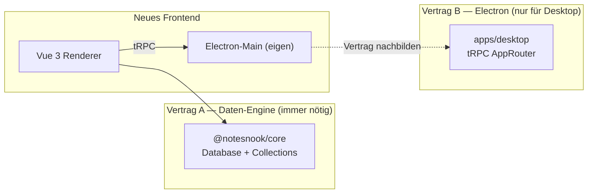

# NEXT_STEPS — Notesnook Vue Desktop Rewrite

> Single source of truth for the project plan, findings, decisions, and the
> next work items. Update this file as work progresses; treat it as the
> living project journal and onboarding doc.

---

## 1. Vorhaben im Detail

Komplettes, von-scratch-geschriebenes Frontend für Notesnook, das das bestehende
React-Renderer (`apps/web` im Hauptrepo `streetwriters/notesnook`) ersetzt und
deutlich benutzerfreundlicher wird. Ziele:

- **TailwindCSS v4 + Glassmorphism** statt Theme UI / Emotion
- **TypeScript** end-to-end (Main, Preload, Renderer, Tests)
- **Electron** als Desktop-Shell, **responsiv / mobile-first** im Layout-Denken
- **VS-Code-artige Editor-UX**: Multi-Tab, geschachtelte Split-Panes,
  Tab-Tear-out → neues Fenster (Focus-Mode), Command-Palette-Metapher
- **Backend-API-Kompatibilität** mit `@notesnook/core` (der Notesnook-Daten-
  engine, die client-seitig läuft — es gibt kein klassisches HTTP-Backend)
- **Eigenständiges Repo**, das die Notesnook-Packages via npm konsumiert

Die detaillierten UI-Anforderungen liegen in der YAML-Datei des Nutzers
(`Untitled-1`), zusammengefasst in §4 unten.

### 1.1 Architektur-Entscheidungen (fixiert)

| Aspekt | Entscheidung | Begründung |
|---|---|---|
| Repo | Separat unter `/Users/marco/Projects/notesnook-vue` | Unabhängige Roadmap, eigene CI, keine Hauptrepo-Blocker |
| Package Manager | **npm workspaces** | Kompatibel mit Hauptrepo; bewährter Pfad |
| Layout | **Monorepo** (`apps/desktop`, `packages/*`) | Skaliert für spätere Web-/Mobile-Apps |
| Framework | **Vue 3.5** + Vite | Völlig neues UX-Ziel, React-Renderer wird ersetzt |
| Styling | **TailwindCSS v4** + `@tailwindcss/vite` | Glassmorphism trivial, Design-Token-Plugin |
| UI-Primitives | Radix Vue (`reka-ui`) — geplant | Accessibility + Keyboard + Tailwind-freundlich |
| State | **Pinia** für App-Shell; Zustand-Stores aus `@notesnook/editor` bleiben | Framework-agnostisch, sauber faktoriert |
| Routing | Vue Router 4 — geplant | ersetzt den dual-Router des Hauptrepos |
| Editor | **TipTap mit `@tiptap/vue-3`** (Port von `@notesnook/editor`) | 60% der Extensions sind reines ProseMirror und laufen unverändert |
| Electron-Scaffolding | **`electron-vite`** | Main/Preload/Renderer getrennt, reif |
| Electron-Main | Eigenbau, aber **AppRouter-Vertrag nachbilden** | Freiheit + Kompatibilität mit dem bestehenden Main-Vertrag |
| Backend-Anbindung | `npm install @notesnook/core` etc. | Public auf npm, GPL-3.0-kompatibel |
| Lizenz | **GPL-3.0-or-later** | Pflicht bei Konsum von `@notesnook/core` |

### 1.2 Warum Vue statt React

- TipTap hat **native Vue-3-Bindings** (`@tiptap/vue-3`)
- `@notesnook/editor` ist *nicht* mit `@tiptap/react` gebaut — es hat eine
  eigene, dünne React-Node-View-Schicht auf `@tiptap/core`. Diese Schicht wird
  beim Port **gelöscht** und durch `nodeViewRenderer` + `NodeViewWrapper` von
  `@tiptap/vue-3` ersetzt
- ~60% der Editor-Codebasis sind reines ProseMirror (Schema, Commands, Plugins,
  KaTeX-Math, vendored `prosemirror-tables`) und laufen unter Vue unverändert
- Der wahre Hebel ist ohnehin der Ersatz von Theme UI durch Tailwind — der
  fällt *global* in einem Schritt weg, unabhängig vom UI-Framework

---

## 2. Was wir herausgefunden haben

### 2.1 Aktuelles Hauptrepo (IST-Zustand)

**Apps:**
- `apps/web` — **ein** React-18-Renderer für Web + Electron (Build-Aliase
  tauschen `desktop-bridge` und `sqlite` je `PLATFORM`)
- `apps/desktop` — reiner Electron-Main-Prozess (~6–10k LOC), lädt das
  `apps/web`-Bundle via Custom-Protocol `https://app.notesnook.com/*`
- `apps/mobile` — separate React-Native-App mit eigener Editor-Shell
  (`@notesnook/editor-mobile`)

**Stack des Renderers (`apps/web`):**
- React 18.3 + Vite 5.4 + SWC
- **Zustand 4.5** (16 Stores), klassenbasiert via `BaseStore`
- TanStack Query v4 + tRPC (nur für Electron-Bridge)
- **wouter** + eigener Hash-Router (zwei parallele Router)
- **Theme UI + Emotion** (`sx`-Prop überall), **kein Tailwind**
- `@notesnook/theme` — Scoped-CSS-Variablen pro UI-Region (`base`, `titleBar`,
  `list`, `editor`, …), JSON-validiert via Schema
- `@notesnook/ui` — nur ~4 Primitive (Menu, PopupPresenter, ScrollContainer, Icon)
- TipTap 2.6.6 mit **46 Custom-Extensions** + vendored `prosemirror-tables`
- Lingui 5.1 für i18n, `@dnd-kit` für DnD, `react-freeze` für Tab-Kaltstellung

**Bestehende VS-Code-artige Features (schon heute, aber custom):**
- `editor-store.ts` (~700+ LOC) mit rekursivem `LayoutNode`-Baum
  (`type: "group" | "split"`, `direction: "vertical" | "horizontal"`)
- Custom `SplitPane`, Tab-Pinning, Back/Forward-History per Tab
- Electron-Multi-Window: Main / Multi-Tab / Single-Note / Drag-Overlay,
  Cross-Window-Sync via `app:note-changed` (debounced pro noteId 300ms)

**Größenordnungen:**
- `apps/web/src`: ~317 Dateien, ~50–90k LOC
- `@notesnook/core`: ~98 Dateien, ~30–50k LOC (Daten-Engine)
- `@notesnook/editor`: ~148 Dateien, ~20–40k LOC (TipTap + 46 Extensions)
- `apps/desktop/src`: ~28 Dateien, ~6–10k LOC (Electron-Main)

### 2.2 Kopplungsanalyse — die zwei Verträge



**Vertrag A — `@notesnook/core` (Pflicht):**
- `Database`-Klasse mit `setup(options)`-Methode
- Collections: `notes`, `notebooks`, `tags`, `colors`, `reminders`,
  `attachments`, `vaults`, `monographs`, `settings`
- APIs: `sync`, `user`, `mfa`, `vault`, `lookup`, `pricing`, `subscriptions`
- Platform-Interfaces: `IStorage`, `IFileStorage`, `ICompressor`,
  `SQLiteOptions.dialect` — *Implementierungen liefert das Frontend*
- Datenmodell: `Note`, `Notebook`, `Topic`, `Tag`, `Color`, `Reminder`,
  `Attachment`, `Vault`, `ContentItem` (TipTap-Dokument), `DatabaseUpdatedEvent`
- **Wichtig:** Notes werden als ProseMirror-JSON gespeichert — ein neuer
  Editor muss dieses Format lesen & schreiben können

**Vertrag B — `apps/desktop` tRPC `AppRouter` (nur Electron):**
- ~33 Prozeduren in 9 Routern: `window`, `sqlite`, `os-integration`,
  `updater`, `safeStorage`, `spellChecker`, `backups`, `compress`, `bridge`
- 4 rohe IPC-Events: `app:note-changed`, `app:open-note`, `app:close-tab`,
  `app:external-drop`
- Wir bauen einen **eigenen Main**, implementieren dieselben Prozedur-Namen +
  Input/Output-Shapes — das ist der Mittelweg zwischen „frei" und
  „kompatibel"

### 2.3 Editor-Vue-Port — Aufwandschätzung

| Layer | Anteil | Vue-Port |
|---|---|---|
| Reine ProseMirror-Extensions (37 von 46) | ~50% | **0 Aufwand** — laufen unter `@tiptap/vue-3` |
| Zustand-Stores, Utils, `tool-definitions.ts` | ~10% | **0 Aufwand** — framework-agnostisch |
| Eigene `react/`-Node-View-Schicht (~500 LOC) | ~3% | **löschen**, durch `@tiptap/vue-3` ersetzen |
| 9 React-Node-View-`component.tsx` (attachment, audio, code-block, embed, image, table, task-item, task-list, web-clip) | ~10% | als `.vue` SFCs neu bauen |
| Toolbar + 8 Popups + Floating Menus + 16 Tool-Impl. | ~20% | neu (größter Einzel-Chunk) |
| `src/components/`, `src/hooks/` | ~5% | neu |
| `src/index.ts` (Hook + Component-Exporte) | ~2% | durch Vue-Äquivalente ersetzen |

**Gesamtschätzung:** ~10–14 Wochen Solo für einen treuen Port. **~7–9 Wochen**
bei bewusster Reduktion auf ~18 MVP-Extensions statt 46 + Command-Palette statt
vollständiger Toolbar.

### 2.4 npm-Verfügbarkeit der Packages (geprüft am 2026-07-19)

| Package | auf npm | Version |
|---|---|---|
| `@notesnook/core` | ✅ | 8.1.3 |
| `@notesnook/editor` | ✅ | 2.1.3 |
| `@notesnook/theme` | ✅ | 2.1.3 |
| `@notesnook/ui` | ✅ | 2.1.3 |
| `@notesnook/common` | ✅ | 2.1.3 |
| `@notesnook/crypto` | ✅ | 2.1.3 |
| `@notesnook/sodium` | ✅ | 2.1.3 |
| `@notesnook/streamable-fs` | ✅ | 2.1.3 |
| `@notesnook/logger` | ✅ | 2.1.3 |
| `@notesnook/intl` | ❌ **nicht published** | — |
| `@notesnook/desktop` | ❌ **nicht published** | — |

**Konsequenzen:**
- `@notesnook/intl` muss aus dem Hauptrepo-Source kopiert oder als eigenes
  Fork-Package veröffentlicht werden (Lingui-Strings + Locale-Loader)
- `@notesnook/desktop` wird nur als **Type-Import** für den `AppRouter`
  benötigt — wir definieren den Vertrag selbst in
  `apps/desktop/src/contracts/router.ts`

### 2.5 Was 1:1 bleiben muss vs. was frei neu gedacht werden darf

**Muss 1:1 (Backend-Verträge):**
- `@notesnook/core` Collections-API, Datenmodell, TipTap-Dokumentformat
- Sync-Engine, Vault-Verschlüsselung, Migrationslogik, Backup-Reader
- `IStorage` / `IFileStorage` / `ICompressor` / `SQLiteOptions` — nur
  Implementierungen liefern, Interface unverändert
- Vendored `prosemirror-tables`, KaTeX-Math-Node-View (reines ProseMirror)

**Darf frei neu gedacht werden:**
- Alle 16 Stores → auf 6–8 Pinia-Stores reduzieren
- ~35 Dialoge + 20 Settings-Sections → Settings als View, Dialoge als Wizard
- Custom Titlebar, SplitPane, Routing, Toolbar (Command Palette statt Ribbon)
- Mobile/Tablet-Slider → später oder streichen
- 46 Editor-Extensions → ~18 im MVP, Rest Phase 2/3

**Darf nicht neu gebaut werden (Kosten/Nutzen schlecht):**
- Sync-Engine, Vault, Migrationslogik, Backup-Reader — alles in `@notesnook/core`

---

## 3. Aktueller Stand im Repo `/Users/marco/Projects/notesnook-vue`

### 3.1 Was steht

- ✅ Monorepo-Layout: `apps/desktop`, `packages/contracts`, `packages/shared`
- ✅ `electron-vite`-Setup mit Main / Preload / Renderer getrennt
- ✅ Vue 3.5 + Vite + TailwindCSS v4 (`@tailwindcss/vite`)
- ✅ Pinia, Vue Router (noch nicht aktiv), TipTap 2.6.6 + `@tiptap/vue-3`
- ✅ `@notesnook/*` als npm-Dependencies installiert (alle außer `intl`, `desktop`)
- ✅ Electron-Main mit frameless Window + macOS `vibrancy: "under-window"`
- ✅ Preload via `contextBridge`: `appEvents` (4 Listener) + `os` + `electronTRPC`
  (tRPC-Bridge via `exposeElectronTRPC`)
- ✅ tRPC `AppRouter`-Vertrag in `apps/desktop/src/contracts/router.ts`
  mit echten Prozeduren: `ping`, `log`, `window`, `sqlite` (open/run/close/
  delete), `compress` (gzip/gunzip), `safeStorage` (set/get/remove),
  `fs` (10 Chunk-Store-Methoden), `updater` (Stub). Registry-Pattern: Main
  registriert Impls, Renderer importiert nur den Typ.
- ✅ Renderer-Shell: `TitleBar`, `Sidebar`, `NotesList` (echte Notes), `Editor`
  (aktive Note, read-only bis Phase 2), `App.vue` (Boot-Overlay)
- ✅ **Phase-2.1 TipTap-Spike** — `Editor.vue` läuft mit `@tiptap/vue-3` +
  `@tiptap/starter-kit`: lädt Notiz-Content als HTML via
  `database.content.findByNoteId`, rendert per `<EditorContent>`,
  debounced Autosave (800 ms) via `database.notes.add`. Store erweitert um
  `activeContent`, `contentState`, `saveState`, `loadActiveContent()`,
  `saveContent(noteId, html)`. ProseMirror-Base-CSS in `style.css`.
  **Runtime-Check: `npm run dev` bootet bis `bootState ready`** (siehe 2.5).
- ✅ **Phase-2.4a/b/c/e/h Editor-Node-View-Port** — neues Workspace-Paket
  `packages/editor-vue` (`@notesnook-vue/editor-vue`, Source-as-Entry,
  pfad-aliasiert). 7 der 9 React-Node-Views portiert: `attachment`
  (inline Atom), `task-item` + `task-list` (Editable-Content +
  `appendTransaction`-Stats-Plugin → Progress-Bar), `embed` (sandboxed iframe
  + hand-rolled `Resizer.vue`, single bottomRight handle, kein neuer Dep),
  `code-block` (refractor-Syntax-Highlighting + Lazy-Lang-Loading via 297
  Literal-Import-Thunks + caret/lines-Sync; StarterKit-`codeBlock` deaktiviert),
  `image` (IntersectionObserver-Lazy-Blob via `useObserver` + `Resizer` +
  `data-align`/`width`/`height`/`data-aspect-ratio`-Round-trip; Blob-Pfad
  Phase-6-gated über `editor.storage.getAttachmentData`, inline-`src` rendert
  sofort),
  `table` (vendored prosemirror-tables-Fork + `Table`/`TableCell`/`TableHeader`
  Nodes + npm `TableRow` + Vue `TableComponent.vue` mit Row/Column-Toolbars +
  RowProperties/TableProperties-Popups; `columnResizing({View:null})` →
  Vue-Node-View via `addNodeView`; colwidth-Fingerprint-`update`).
  Schema/parseHTML/renderHTML **verbatim** vom Upstream
  (`streetwriters/notesnook`, Branch `master`) für Byte-stabilen HTML-Round-trip;
  React-Node-View-Layer → `VueNodeViewRenderer` + `NodeViewWrapper`/
  `NodeViewContent`. Wiederverwendbare Helfer: `getDataAttribute`,
  `prosemirror.ts`-Subset, `formatBytes`, `sandbox.ts` (`getSandboxFeatures`),
  `components/Resizer.vue`, `code-block/loader.ts`, `downloader.ts`
  (`corsify`/`toBlobURL`/`revokeBloburl`/`downloadImage`/`toDataURL`/`toBlob`,
  vendored `dataurl.ts` statt `@notesnook/common` — kein React-Leck),
  `use-observer.ts` (Vue-Composable, Viewport-Root).
  Round-trip-Vertragstest `tests/contract/editor-html.spec.ts` (27 Tests,
  happy-dom per File-Env-Override, Schema via leeren `Editor` gebaut).
  115 Contract-Tests grün, typecheck (node+web) + build clean.
  `Editor.vue` nutzt `[StarterKit.configure({codeBlock:false}), AttachmentNode,
  TaskListNode, TaskItemNode.configure({nested:true}), EmbedNode, ImageNode,
  CodeBlock, Table.configure({resizable:true, showResizeHandleOnSelection:true}),
  TableRow, TableCell, TableHeader]`.
  **Runtime-Check: bootet (2.5); visuelle Node-View-Gates brauchen On-Site-Review.**
- ✅ **Phase-2.2 Tailwind-Token-Adapter** — neues Workspace-Paket
  `packages/theme-vue` (`@notesnook-vue/theme-vue`, Source-as-Entry,
  pfad-aliasiert). Vendored TS-Port von `@notesnook/theme`'s `themeToCSS`/
  `buildVariants`/`colorsToCSSVariables`/`deriveShadeColor` (byte-kompatibler
  `.theme-scope-<scope>-<variant>`-Output) + vendored `ThemeDark`/`ThemeLight`
  (generiert via `scripts/extract-default-themes.mjs`) + `validateTheme`-Port.
  **Nur Type-Only-Import** von `@notesnook/theme` (`import type`) → React/
  theme-ui/zustand bleiben aus dem Renderer-Bundle (grep verifiziert 0 Lecks;
  Bundle +10 KB). Glassmorphism-Erweiterung `VueTheme = ThemeDefinition &
  { glassmorphism?: { backdropBlur?; surfaceOpacity? } }` (global, Defaults
  `24px`/`65`) → `--nn-backdrop-blur`/`--nn-surface-opacity`. Tailwind-v4-
  `@theme inline`-Bridge in `style.css` + runtime `:root`-Bridge via
  `injectTheme()`. `bootstrap.ts` ruft `injectTheme(ThemeDark)` als Step 0.
  Vertragstest `tests/contract/theme.spec.ts` (11 Tests, happy-dom). 68
  Contract-Tests grün, typecheck (node+web) + build clean. **Runtime-Check: bootet (2.5); Theme-First-Paint braucht On-Site-Review.**
- ✅ **Phase-2.5 Runtime-Check** — `npm run dev` bootet end-to-end (headless
  verifiziert): tRPC-Bridge → `@notesnook/core` `new Database()` im Renderer
  → Bridge-Dialect → Main `better-sqlite3-multiple-ciphers` → verschlüsseltes
  `notesnook.sql` in userData → 6 Seed-Notizen → `bootState ready`
  (`[boot] ready — 6 notes loaded`). 5 Boot-Blocker gelöst (Fork-Type-Imports,
  Buffer/`process`-Polyfill, tRPC-`.bind`-Bug, native-ABI-Rebuild,
  Console-Source-Logging) + `electron-trpc`-CJS-Shim (vorherige Session).
  Dual-ABI native Module via Pre-Script-Rebuild-Swap (`predev`→Electron-ABI,
  `pretest:contract`→System-Node-ABI). Commits `d381546` + `a0f7f74`. **Visuelle/
  Interaktions-Gates (Theme-First-Paint, Editor-Mount bei Notiz-Klick,
  Checklist-Toggle, Edit-Persistenz) brauchen physische Anwesenheit.**
- ✅ **Phase-1-Plattform-Seam** in `apps/desktop/src/renderer/src/platform/`:
  `desktop-bridge.ts` (lazy tRPC-Client), `sqlite-dialect.ts` (Kysely-Dialect
  → `sqlite.run`), `compressor.ts`, `key-store.ts` (safeStorage), `key-value.ts`
  (IndexedDB), `nncrypto.ts` (sodium), `storage.ts` (NNStorage), `file-store.ts`
  + `fs.ts` (FileStorage), `database.ts` (`initDatabase`-DI + `createDesktopPlatform`),
  `bootstrap.ts` (Ping → DB-Init → Seed), `stub-storage.ts`/`stub-fs.ts` (Gate-Stubs)
- ✅ Pinia `notes`-Store **echt**: `load()` → `database.notes.all().items()`,
  `create()`, `selectNote()`, `activeNote`
- ✅ Main-Prozess: `ipc.ts`, `sqlite.ts`, `compress.ts`, `safe-storage.ts`,
  `file-storage.ts` (alle via Registry-Pattern in `contracts/router.ts`)
- ✅ `packages/contracts` als Single-Source-of-Truth für Notesnook-Typen
  - `DatabaseOptions` / `SQLiteOptions` / `FileStorageAccessor` via
    `Parameters<Database["setup"]>[0]` abgeleitet — robust gegen Renames
  - Zusätzlich re-exportiert: `Cipher`, `SerializedKey`, `DataFormat`,
    `RequestOptions`, `Output`, `FileEncryptionMetadata*`, `Cancellable`,
    `hosts` + die Server-Interfaces (`SQLiteServer`, `CompressorServer`,
    `SafeStorageServer`, `FileStorageServer`, `FSFile`)
- ✅ Vertragstest-Suite: **9 Spec-Dateien, 36 Tests, alle grün** —
  `core-surface`, `bridge-router`, `sqlite-engine`, `bridge-dialect`,
  `data`, `database-encryption`, `nnstorage`, `filestorage`, `collections`
- ✅ `tsconfig` Project References (Node + Web), beide via `tsc` / `vue-tsc` clean
- ✅ `electron-vite build` produziert Main (17.6 KB) + Preload (1.15 KB) +
  Renderer (~4,19 MB JS — `@notesnook/core` + sodium inlined; lazy prism/katex-
  Chunks) + 15 KB CSS
- ✅ Git: 9 Commits auf `main` (3 Scaffold + 6 Phase 1), sauberer Baum,
  `.gitignore`, `.prettierignore`, `.vscode/extensions.json`

### 3.2 Wie vertragssicher gearbeitet wird

1. **Type-Lock:** `package.json` nutzt `~` statt `^` für `@notesnook/*` —
   nur Patch-Releases automatisch, Minor/Major bewusst
2. **Vertragsschicht:** Alle Code-Stellen importieren Notesnook-Typen von
   `@notesnook-vue/contracts`, nie direkt von `@notesnook/core`
3. **Vertragstests in CI:** Runtime-Prüfung der öffentlichen `core`-Exports
   bei jedem PR + jedem `@notesnook/*`-Bump
4. **Abgeleitete Typen:** `SQLiteOptions` etc. werden aus `Database["setup"]`
   abgeleitet — kein Duplikat, das bei Upgrades pflegebedürftig wäre
5. **Upgrade-Routine:** Monatlich `npm outdated @notesnook/*`, Upgrade-Branch
   mit Vertragstests, Release-Changelog des Hauptrepos lesen

### 3.3 Reproduzierbare Befehle

```bash
cd /Users/marco/Projects/notesnook-vue
npm install                                  # Dependencies + native Module
npm run dev                                  # Electron + Vite-Dev (Renderer-HMR)
npm run build                                # Production-Build (Main+Preload+Renderer)
npm run test:contract                        # Vertragstests (vitest)
npm run test:contract:watch                  # Vertragstests im Watch-Modus
(cd apps/desktop && npm run typecheck)       # tsc + vue-tsc
(cd apps/desktop && npm run typecheck:node)  # nur Node-Seite
(cd apps/desktop && npm run typecheck:web)   # nur Web-Seite
```

---

## 4. UI-Anforderungen (aus der YAML-Datei des Nutzers)

### 4.1 Sidebar (links)
- **All Notes**
- **Notebooks und Subnotebooks**
  - Icons pro Notebook setzbar
  - Sortierbar
- **Tags und Subtags**
  - Icons pro Tag setzbar
  - Sortierbar
- **Trash** (mit Restore-Funktion) ganz unten
- **Monographs**
- **Archive**
- **Settings** → **separates Fenster**
- **Sync Status** (irgendwo sichtbar)
- **Update Notifier** unten in der Sidebar

### 4.2 Notes List
- **Suchleiste oben mit Regex-Support**
- **Sortierbar** nach Titel, Erstellungsdatum, Änderungsdatum, Custom-Order
- **Gruppierung** nach Datum, Notebook, Tag, Custom Groups (gruppierbar)
- Oben rechts: **„New Note"-Button**, oben links: **Collapse-Sidebar-Button**
- **List-Entry zeigt:** Titel, erste Zeile, Erstellungsdatum, Änderungsdatum, Tags
  - Bei TipTap-Checkboxes: **Fortschrittsbalken** (x / y checked)
  - Bei Bild-Notiz: **erstes Bild als Thumbnail**

### 4.3 Note Editor
- **TipTap-basiert** wie das Original
- **Tab-Support** mit VS-Code-artigen Split-Panes
- Tabs sortierbar und schließbar
- **Tab-Drag-out → neues Fenster** (default Focus-Mode: ohne Sidebar + Notes List)
- **Feature-Parität** beim Editieren + Toolbar
  - Toolbar enthält: **Undo/Redo, Search, ToC**
  - **ToC als MiniMap rechts** des Editors
- **`…`-Menü** für Features außerhalb der Toolbar
  - **Properties → rechtes Sidebar:** Title, Notebook, Tags, Created, Modified,
    Word/Character/Line Count, Toggles (Pin, Favorite, Lock, Read Only,
    Archive, Disable Sync, Spell Check), Publish (Monograph), Linked Notes
    (in/out), History

---

## 5. Nächste Schritte (Roadmap)

Die Reihenfolge ist ein Vorschlag — der Nutzer steuert die Priorisierung.

### Phase 1 — Fundament & Daten-Pipeline (Woche 1–3)

> **Status 2026-07-19:** Phase 1 **komplett** (M1–M3, M5–M11; M4 entfällt).
> 36 Contract-Tests grün, typecheck (node+web) + build clean. Die Pipeline
> läuft end-to-end: `db.init()` + Migrationen + `notes.add`/`all` — im Renderer
> über die Bridge-Dialect, in Tests über In-Process-SQLite. NotesList liest
> `database.notes.all()`, bootstrap seeed zwei Willkommens-Notes.
> **Offen:** Runtime-Check per `npm run dev` steht auf der User-Maschine aus
> (in dieser Sandbox ist das Electron-Binary unvollständig — Frameworks fehlen,
> kein Netz zum Reinstall). Code ist fertig + deterministisch verifiziert.
> **M4 (FTS5 native Extensions) entfällt** — SQLite 3.53.2 (bündelt mit
> `better-sqlite3-multiple-ciphers@12`) liefert `trigram` als Built-in-Tokenizer;
> Migrationen laufen ohne ladbare Extensions. `html`-Tokenizer fehlt noch
> (nur für Search-Highlighting nötig) → ggf. Phase 6/7.
> **Attach­ments-Collection ist user-gated** (`_getEncryptionKey` →
> `db.user.getAttachmentsKey`, gesetzt beim Login) → voller Attachments-Round-
> trip braucht Auth (Phase 6). Die FileStorage-Verschlüsselung darunter ist
> verifiziert (`filestorage.spec`).
> **Fix:** `apps/desktop/package.json` `main` war `./dist-electron/…`, aber
> electron-vite baut nach `./out/…` → `npm run dev` scheiterte an "No electron
> app entry file found". Auf `./out/main/index.js` korrigiert.

- [x] **M1 tRPC-Bridge** — `main/ipc.ts` (`createIPCHandler`), Preload
  `exposeElectronTRPC()` (`appEvents`+`os` bleiben), Renderer
  `platform/desktop-bridge.ts` (`ipcLink`, lazy Proxy) + `ping`/`log`. ✅
- [x] **M2 Main-SQLite** — `main/sqlite.ts` (Port von Upstream
  `sqlite-kysely.ts`: `better-sqlite3-multiple-ciphers`, Prepared-Cache, Retry,
  Path-Allowlist, `unsafeMode`), Registry-Pattern (`registerSQLiteServer`).
  ✅
- [x] **M3 Renderer-Dialect** — `platform/sqlite-dialect.ts` (Port von
  `index.desktop.ts`: `SqliteDriver`/`SqliteBridgeConnection` forwarden an
  `sqlite.run`, Mutex, DI-Client). `@streetwriters/kysely` als direkte Dep. ✅
- [~] **M4 FTS5-Extensions** — **ENTFÄLLT** (Built-in-Trigram reicht, siehe oben).
- [x] **M5 Compressor** — `main/compress.ts` (Node `zlib`, base64) +
  `platform/compressor.ts` (`ICompressor` forwardet an `desktop.compress`). ✅
- [x] **Gate `db.init()`** — `platform/database.ts` (`initDatabase` mit DI,
  `createDesktopPlatform`) + `stub-storage.ts`/`stub-fs.ts`. Deterministisch
  verifiziert via `data.spec.ts` (In-Process) + `bridge-dialect.spec.ts`
  (echte Bridge-Forwarder über Fake-Bridge). ✅
- [x] **M6 Key-Store (safeStorage)** — `main/safe-storage.ts` (OS-Keychain,
  `secrets.json`-Persistenz) + Renderer `key-store.ts` (`getDatabaseKey`,
  `databaseKeyToPassword` hex, `SafeStorageKeyStore`); `sqliteOptions.password`
  verschlüsselt die DB (verifiziert in `database-encryption.spec`). ✅
- [x] **M7 NNStorage (echtes IStorage)** — `key-value.ts` (IndexedDB +
  Memory), `nncrypto.ts` (`@notesnook/crypto` sync, sodium), `storage.ts`
  (NNStorage, IStorage-Oberfläche nur — PGP/`openpgp`/`intl` entfallen, da
  nicht in `IStorage`). Verifiziert in `nnstorage.spec`. ✅
- [x] **M8 FileStorage (echtes IFileStorage)** — `main/file-storage.ts`
  (Node-fs Chunk-Store, namenssanitisiert) + Renderer `file-store.ts`
  (`NodeFSFileStore` forwardet) + `fs.ts` (`FileStorage`: streamable-fs +
  sodium secretstream + SHA-256-Hash; HTTP-Sync-Methoden stubben Phase 6).
  Verifiziert in `filestorage.spec`. ✅
- [x] **M9 Full-Init + Singleton-Boot** — `createDesktopPlatform` waltet
  echte NNStorage + FileStorage + Compressor + Dialect + Password;
  `bootstrap()` läuft beim App-Start; `getDatabase()` Singleton. ✅
- [x] **M10 Echte NotesList** — `stores/notes.ts` `load()` →
  `database.notes.all().items()`; `NotesList.vue` rendert Title/Headline/
  Datum/Tags; New-Note-Button; `Editor.vue` zeigt aktive Note (read-only bis
  TipTap Phase 2); `App.vue` Boot-Overlay. ✅
- [x] **M11 Contract-Tests erweitern** — `collections.spec`: notebooks, tags,
  settings, vault, sync (Attachments user-gated → Phase 6). ✅

#### Ursprüngliche 1.x-Items (Referenz, z.T. durch M-Struktur ersetzt)

- [x] 1.1 Platform-Implementierungen (sqlite-dialect + compressor + storage + fs)
- [x] 1.2 tRPC-Bridge (Preload `exposeElectronTRPC`, nicht rohe `appEvents`)
- [x] 1.3 Datenbank-Wiring (`initDatabase`-DI-Helfer + `createDesktopPlatform`)
- [x] 1.4 Erste echte Komponente — NotesList (`database.notes.all()`)
- [x] 1.5 Vertragstests erweitern (9 Spec-Dateien, 36 Tests)

### Phase 2 — Editor-Port (Woche 2–8, parallel zu Phase 1 möglich)

- [x] **2.1 TipTap-Vue-Spike** — `@tiptap/vue-3` + `@tiptap/starter-kit` in
  `Editor.vue` geladen; Editor lädt aktive Note als HTML via
  `database.content.findByNoteId`, rendert per `<EditorContent>`,
  debounced Autosave (800 ms) via `database.notes.add` (Content-Upsert +
  `dateEdited`/`headline`-Bump). Build + typecheck (node+web) clean, 36
  Contract-Tests grün. **Runtime-Check: `npm run dev` bootet bis `ready` (2.5); visuelle Gates on-site.**
  ✅
- [x] **2.2 Tailwind-Token-Adapter** — `@notesnook/theme`'s `ThemeDefinition.scopes`
  → Tailwind-CSS-Variablen (`--color-surface`, `--backdrop-blur-base`, …)
  - Schema um `opacity` / `backdropBlur`-Felder erweitern (rückwärtskompatibel)
  - **Status 2026-07-19 (done):** neues Workspace-Paket `packages/theme-vue`
    (`@notesnook-vue/theme-vue`, Source-as-Entry, pfad-aliasiert). Vendored
    TS-Port von `themeToCSS`/`buildVariants`/`colorsToCSSVariables`/
    `deriveShadeColor` (byte-kompatibel mit Upstream `.theme-scope-*`-Output)
    + vendored `ThemeDark`/`ThemeLight` (generiert via
    `scripts/extract-default-themes.mjs`) + `validateTheme`-Port. **Nur
    Type-Only-Import** von `@notesnook/theme` (erased) — React/theme-ui/zustand
    bleiben aus dem Renderer-Bundle (grep bestätigt 0 Lecks; Bundle +10 KB).
    Glassmorphism-Erweiterung `VueTheme = ThemeDefinition & { glassmorphism?:
    { backdropBlur?; surfaceOpacity? } }` (global, backward-kompatibel, Defaults
    `24px`/`65`) → `--nn-backdrop-blur`/`--nn-surface-opacity`. Tailwind-v4-
    `@theme inline`-Bridge in `style.css` (`--color-surface: var(--background)`
    etc.) + runtime `:root`-Bridge (`--color-*` + `--backdrop-blur-base:
    var(--nn-backdrop-blur)`). `bootstrap.ts` ruft `injectTheme(ThemeDark)`
    als Step 0. Vertragstest `theme.spec.ts` (11 Tests, happy-dom).
    68 Contract-Tests grün, typecheck (node+web) + build clean. **Runtime-Check
    offen.**
- [x] **2.3 Vue-Primitives** — `Flex`/`Box`/`Text`/`Button`/`Input` mit Tailwind
  statt Theme UI (erspart spätere `sx`-Migration in jeder Komponente)
  - **Status 2026-07-19 (done):** neues Workspace-Paket `packages/ui-vue`
    (`@notesnook-vue/ui-vue`, Source-as-Entry, pfad-aliasiert wie `editor-vue`/
    `theme-vue`). 7 Primitive SFCs: `Box`/`Flex`/`Text`/`Button`/`Input`/`Icon`/
    `Surface` (`<script setup lang="ts">`, `withDefaults(defineProps<{}>())`,
    `defineOptions({ inheritAttrs: false })` + `cx`-Merge-Pattern nach
    `Resizer.vue`-Vorbild). Farben via `theme-vue`-Token-Utilities (`bg-surface`,
    `text-text`, `text-text-muted`, `text-heading`, `border-border`, `bg-accent`,
    `text-accent`, `bg-hover`, `text-placeholder`, `text-icon`, `bg-backdrop`);
    `danger`/`error` via `--red-static`-Arbitrary-Value (kein Red-Token gebridged
    — themed `error`-Variante = future Polish). Glassmorphism (`Box`/`Flex`/
    `Surface`) liest die Theme-CSS-Vars (`--backdrop-blur-base`,
    `--nn-surface-opacity`, `--background`) inline via `glassStyle()`. Class-Merge
    via **`tailwind-merge`** (Caller-Klassen überschreiben Primitive-Defaults
    sauber). `Icon` wrappt einen MDI-`path` (`viewBox 0 0 24 24`,
    `fill="currentColor"`, `size`/`title`/`spin`); `Surface` = `Box`+Glass-Baked-in
    (`blur`/`opacity`-Flags). **Kein `sx`-Objekt-Prop** (Renderer ist greenfield,
    0× Theme-UI-Footprint). Vertragstest `tests/contract/ui-primitives.spec.ts`
    (41 Tests, happy-dom, `@vue/test-utils` mount + `glassStyle()`-Unit-Tests —
    happy-dom droppt `color-mix()` in `element.style.background`, daher wird der
    `background`-Teil des Glass-Recipes direkt an der Funktion getestet).
    109 Contract-Tests grün (68 + 41), typecheck (node+web) + build clean.
    `tailwind-merge` + `@vue/test-utils` als neue Deps. **Runtime-Check: Paket
    wird noch von keiner Komponente importiert → Renderer-Bundle unverändert;
    visuelle Integration (Ersetzen der inline Buttons/Inputs in
    NotesList/TitleBar/Sidebar/Editor) ist ein On-Site-/Visual-Change-Follow-up.**
- [~] **2.4 Port-Reihenfolge der 9 React-Node-Views** (einfach → komplex).
  Eigener Paket-Scaffold `packages/editor-vue` (`@notesnook-vue/editor-vue`,
  Source-as-Entry, pfad-aliasiert wie `contracts`). Pro Node: `<name>.ts`
  (TipTap-Node, Schema/parseHTML/renderHTML **verbatim** vom Upstream für
  Byte-stabilen Round-trip) + `Component.vue` (Vue-View via `VueNodeViewRenderer`
  + `NodeViewWrapper`/`NodeViewContent` aus `@tiptap/vue-3`). Importe NIE direkt
  von `@tiptap/core`, sondern von `@tiptap/vue-3` (re-exportiert core).
  **Status 2026-07-19 (2.4a + 2.4b + 2.4c + 2.4h):**
  1. [x] `attachment` (inline Atom, File-Chip aus Attrs; Blob = Phase 6) ✅
  6. [x] `task-item` + `task-list` (Checkbox-Toggle, Editable-Content via
     `NodeViewContent`, `appendTransaction`-Stats-Plugin → Progress-Bar) ✅
  4. [x] `embed` (Resizer + iframe sandbox) — selbstständig, kein Attachments ✅
  7. [x] `code-block` (refractor-Highlighter + Lazy-Lang-Loading + caret/lines-sync) ✅
  - Bewiesen: Parse→Serialize Round-trip der data-*-Attrs/Klassen + iframe-Attrs
    + code-block-Attrs (language-class auf `<pre>`/`<code>`, data-indent-type/
    -length) via `tests/contract/editor-html.spec.ts` (13 Tests, happy-dom, Schema
    via leeren `Editor` gebaut). 49 Contract-Tests grün, typecheck+build clean.
  - **Aufgeschoben (Polish):** drop-override-Plugin, `[]`/`[x]`-Input-Regel,
    `sortList`, mobile/iOS-Touch (desktop-first, Entscheidung #8).
  - **Aufgeschoben (embed):** in-Node-Toolbar (align-L/C/R + Properties) →
    Phase 2.5; corsHost-CORS-Proxy + Twitter-`srcDoc` (Theme-Engine) → Toolbar.
  - **Aufgeschoben (code-block):** Tab/Shift-Tab/Enter/ArrowDown/Mod-a-Shortcuts
    + VS-Code/GitHub-Paste-Detection → Polish (kein Schema-Risiko; `lines`-Attr
    wird vom Highlighter synchronisiert, `changeCodeBlockIndentation` läuft).
  2. [ ] `audio` (blob URL + `<audio>`) — **Phase-6-gated** (attachments auth)
  3. [ ] `web-clip` (iframe + fullscreen listener) — **Phase-6-gated**
  5. [x] `image` (IntersectionObserver + blob URL + alignment) — **2.4e done.**
     `ImageNode` Schema/parseHTML/renderHTML verbatim (`atom:true`,
     `data-align` via `getDataAttribute`, `data-aspect-ratio` default-1-parse,
     `<p>`-skip-Migration für Inline→Block). `ImageComponent.vue` =
     `NodeViewWrapper` + `Resizer` (lockAspectRatio) + `useObserver`-Lazy-Blob
     über `editor.storage.getAttachmentData?.({type:"image",hash})` → `toBlobURL`
     (Phase-6-gated via `?.`; inline-`src` rendert sofort). Helfer portiert:
     `downloader.ts` (`corsify`/`toBlobURL`/`revokeBloburl`/`downloadImage`/
     `toDataURL`/`toBlob`, `atob` statt `Buffer`, vendored `dataurl.ts` statt
     `@notesnook/common` → 0 React/theme-ui-Leck im Bundle), `use-observer.ts`
     (Vue-Composable, Viewport-Root statt `.ms-container`). Commands
     `insertImage` (insert image node direkt — kein Mime-Routing über
     attachment)/`setImageAlignment`/`setImageSize` + Markdown-``-
     Input-Regel. Aufgeschoben (Polish/Phase 2.5+6): in-Node-Toolbar
     (align/properties/preview/download), `onLoad`-Auto-Aspect-Ratio +
     External-URL-Download-to-Attachment (`editor.threadsafe`+
     `updateAttachment`-types), `Mod-c`-Clipboard, SVG-as-iframe, Keyboard-
     Shortcuts (`openAttachmentPicker`). 115 Contract-Tests grün (6 neue
     image-Cases: src/width/height/data-align/data-aspect-ratio/data-hash
     round-trip, bare-img `data-aspect-ratio="1"`-Default + Idempotenz,
     `<p>`-skip-Migration, seed-shape), typecheck+build clean. **Runtime-Check:
     bootet (2.5); visuelle Gates (Bild rendert, Resize-Handle, Drag) on-site.**
  8. [x] `table` (vendored `prosemirror-tables` + row/column toolbars) —
     **2.4h done.** Vendored the customized GPL fork (re-pointed to
     `@tiptap/pm/*`, `@ts-nocheck` per file to keep the renderer + our port
     code strict while inheriting the fork's exported types); `Table`/
     `TableCell`/`TableHeader` verbatim + npm `TableRow`; `TableComponent.vue`
     owns `<table>`/`<colgroup>`/`<tbody>` via `addNodeView` +
     `columnResizing({View:null})`; RowProperties/TableProperties popups
     (insert/delete/move/toggle-header/merge/split/color/border). 57
     contract tests grün (8 neue table-Cases), typecheck+build clean.
     **Runtime-Check: bootet (2.5); visuelle Node-View-Gates on-site.**
  - **Wiederverwendbare Helfer** schon portiert: `getDataAttribute`,
    `prosemirror.ts` (`findParentNodeClosestToPos`/`hasSameAttributes`/
    `getExactChangedNodes`/`getDeletedNodes`/`getParentAttributes`/
    `ensureLeadingParagraph`/`getChangedNodes`), `formatBytes`,
    `sandbox.ts` (`getSandboxFeatures`), `components/Resizer.vue` (hand-rolled,
    single bottomRight handle, kein Dep), `code-block/loader.ts` (297
    Literal-Import-Thunks, Vite-code-split).
    `downloader.ts`/`useObserver` folgen mit image (2.4e).
- [~] **2.5 Toolbar** als letztes (höchste Masse, geringstes Schema-Risiko):
  - Erst Command Palette (`Ctrl+Shift+P`) + Slash-Commands (`/`)
  - Dann klassische Toolbar-Buttons für die verbleibenden Aktionen
  - 8 Popups reduzieren auf 4–5: Link, Color, Image, Table, ggf. Embed
  - **Status 2026-07-19 (headless core + slash-commands done):**
    `useEditorStore` (Editor-Instanz cross-component) + `command-palette`-Store +
    Command-Registry (`app-commands`/`editor-commands`) + `menu`-Filter +
    `useCommandPalette`-Hotkey (`Ctrl/Cmd+Shift+P`) + `SlashCommands`-TipTap-
    Extension via `@tiptap/suggestion@2.6.6` + `SlashMenu.vue` (VueRenderer +
    Suggestion-Render-Contract) + vendored `EDITOR_ACTIONS`/`SLASH_ITEMS`
    (type-only `ToolId`-Parity aus `@notesnook/editor` → 0 React-Leck). 166
    Contract-Tests grün (36 neu), typecheck+build clean. **Kein
    `CommandPalette.vue`-Overlay dieses Inkrement** (Nutzer-Entscheidung: Palette
    = nur Logic+Store+Hotkey; Overlay = Folge-Inkrement). Slash-Commands =
    voll (Suggestion-Plugin + Render-Menü). Visuelle Gates (Slash-Menu am
    Cursor, Ctrl+Shift+P-Palette-Overlay) = On-Site.
- [ ] **2.6 `@notesnook/intl`-Quelle klären** — Lingui-Strings aus Hauptrepo
  kopieren oder eigene Fork publishen; vue-i18n-Konverter für `.po`-Files

### Phase 3 — App-Shell & Navigation (Woche 4–7)

- [ ] **3.1 Custom Titlebar** — macOS Traffic-Lights + Window Controls Overlay
  (Win/Linux), `vibrancy`/`acrylic`-Erkennung
- [~] **3.2 Sidebar** — VS-Code-Explorer-Metapher mit Collapse-Sektionen:
  - All Notes, Notebooks (rekursiv mit Icons), Tags (rekursiv mit Icons),
    Monographs, Archive, Trash (unten), Settings (unten)
  - Sortable via `vue-draggable-plus`
  - **Status 2026-07-19 (Teil 1 — collections headless core):** die Sidebar
    zeigt jetzt **echte** Notebooks + Tags aus `@notesnook/core` statt der
    Placeholder-RouterLinks. Neues `utils/collections.ts` (generisches
    `sortCollections` — pinned-first-Präfix + title/dateModified/dateCreated
    asc/desc, non-mutating; `NotebookListItem`/`TagListItem`-Mapper; `dateModified`
    als gemeinsamer "recently changed"-Key, da `Tag` kein `dateEdited` hat).
    Neuer `stores/collections.ts` (Pinia): lädt notebooks/tags/trashCount per
    `Promise.all` (defensiv per `.catch`), hält Sort-State, per-Section-Collapse
    (`notebooks`/`tags`) + `selected`-Collection, expostiert `sortedNotebooks`
    /`sortedTags`-Computeds + `load`/`toggleSection`/`select`/`clearSelection`.
    `Sidebar.vue` neu: expandierbare Notebooks- + Tags-Sektionen (Chevron-Toggle,
    Item-Liste pinned-first mit Empty-State, Auswahl-Highlight) statt der
    Placeholder-Routerlinks; All Notes / Monographs / Archive / Trash(+Count)
    / Settings bleiben `RouterLink`s. Auswahl eines Notebook/Tag →
    `collections.select` + `router.push('/all')` (Note-Filterung nach
    Collection = Folge-Inkrement, braucht `db.notebooks.notes(id)` +
    Notes-Store-Filter-by-idSet). `App.vue` lädt Collections neben Notes (onMounted
    + showShell-watch). `bootstrap.ts` seeedt ein Notebook + Tag. 16 neue
    Contract-Tests in `collections.spec.ts` (node, bootstrap gemockt). **240
    Contract-Tests grün**, typecheck (node+web) + build clean, 0
    React/theme-ui/zustand-Leck (Renderer 5,24 MB, +3 KB, kein neuer Dep).
    **Aufgeschoben:** rekursive Subnotebooks/Subtags (API hat keinen
    sichtbaren Parent-Link auf `Notebook`, `Topic` ist `@deprecated`; Tags flach
    — keine Subtag-API), Icon-per-Item (Picker = on-site), Drag-Sort via
    `vue-draggable-plus` (on-site). Note-Filterung nach Collection gelandet in
    Teil 2 (siehe eigener Journal-Eintrag).
    **On-Site-Gate:** Sektionen expandieren/kollabieren, Notebooks/Tags listen,
    Auswahl highlightet + routet nach /all, Trash-Count zeigt.
  - **Status 2026-07-19 (Teil 2 — notes nach collection filtern, headless):**
    die Sidebar-Auswahl filtert jetzt die Notes-Liste. `notes`-Store
    `collectionFilter` (`{type,id,noteIds:Set}`) + `filterByCollection` (notebook→
    `db.notebooks.notes`, tag→`db.relations.to().resolve()`, up-front gecacht)
    in `visibleItems` (Collection→Query→Sort) + `clearCollectionFilter`;
    `collections.selectedLabel`; `Sidebar` "All Notes" clear / async
    `selectCollection` filtert; `NotesList` "filtered by: X ×"-Chip; `bootstrap`
    verlinkt 2 Notes mit dem Tag. 7 neue Contract-Tests in
    `notes-collection-filter.spec.ts`. **247 Contract-Tests grün** (+7),
    typecheck (node+web) + build clean, 0 React/theme-ui/zustand-Leck.
    **Aufgeschoben:** Gruppierung der Liste nach Notebook/Tag (3.3 — jetzt
    unblockiert), Monographs/Archive/Trash als echte Views, Icons + Drag-Sort.
    **On-Site-Gate:** Notebook/Tag wählen → Liste zeigt nur dessen Notes +
    Chip; × oder "All Notes" hebt auf; Tag-Filter zeigt die 2 verlinkten Notes.
  - **Status 2026-07-19 (Teil 3 — Trash-Store, headless):** die Trash-View
    bekommt ihr Daten-Backend. Neues `stores/trash.ts` (`useTrashStore`):
    `load` (`db.trash.all()` → `TrashListItem` mit `type`-Diskriminator
    note/notebook, "Untitled"-Fallback, dateEdited-Default = dateDeleted) +
    `noteItems`-Computed (nur Note-Trash) + `restore` (`db.trash.restore`) /
    `remove` permanent (`db.trash.delete`) / `clear` (`db.trash.clear`), je mit
    Reload; never-throws. Backed die künftige TrashView (on-site); die Sidebar
    zeigt den Trash-Count weiter über den Collections-Store. 8 neue Contract-
    Tests in `trash.spec.ts`. **393 Contract-Tests grün (385 + 8)** über 30
    Spec-Dateien, typecheck (node+web, inkl. contracts) + build clean.
    **Aufgeschoben:** TrashView-UI (Liste + Restore/Delete-Buttons, on-site),
    Monographs/Archive als echte Views, Trash-Count-Reload nach Mutation.
    **On-Site-Gate:** (nach UI) TrashView listet gelöschte Notes; Restore
    holt zurück, Delete permanent entfernt, Clear leert.
- [x] **3.3 Notes List** — Suchleiste mit Regex, Sort/Group-Controls, New-Note,
  Collapse-Sidebar, List-Entries mit Thumbnail + Progress-Bar + Tags
  - **Status 2026-07-19 (search + regex + sort done, headless):** die bisher
    inerte Search-Leiste in `NotesList.vue` ist jetzt verdrahtet. Pure
    View-Logik in `utils/notes-list.ts` (`filterNotes` plain + regex mit
    Invalid-Regex-Fallback auf Substring, `sortNotes` nach `dateEdited`/
    `dateCreated`/`title` asc/desc, **pinned-first** unabhängig vom Sort-Key),
    compont zu `visibleItems` im `notes`-Store (`query`/`regexSearch`/
    `sortKey`/`sortDir` + `setQuery`/`toggleRegex`/`setSortKey`/`setSortDir`/
    `toggleSortDir`/`clearSearch`). `NotesList.vue` bindet das Search-Input an
    `setQuery`, hat Regex-Toggle (`.*`), Clear-Button, Sort-`<select>` +
    Dir-Toggle und zeigt `N / total`-Count + Empty-State. Palette-Command
    `app:search-notes` (`when: showShell`) bump-t `focusSearchSignal`; die
    Liste watch-t es und fokussiert das Input (DOM-Focus = On-Site-Gate).
    23 neue Contract-Tests in `notes-list.spec.ts` (filter plain/regex/invalid
    fallback, sort keys/dir/pinned-first/non-mutation, store `visibleItems`
    compose). 209 Contract-Tests grün (186 + 23), typecheck (node+web) + build
    clean. **Aufgeschoben:** Grouping nach Datum/Notebook/Tag/Custom,
    Thumbnail (erstes Bild) + Progress-Bar (x/y checked) in List-Entries →
    Folge-Inkremente (brauchen Collection-Views Phase 3.2 + Content-Parse).
    **On-Site-Gate:** Tippen filtert live, Regex-Toggle, Sort-Wechsel, Clear,
    `Ctrl+Shift+P` "Search notes" fokussiert das Input.
  - **Status 2026-07-19 (Teil 2 — thumbnail + progress, headless):** die
    Content-Parse-Folge-Inkremente aus Teil 1 sind gelandet. Neues
    `utils/note-preview.ts` (`extractNotePreview` — first-``-`src`-Thumbnail
    + DOM-Klassen-Zählung `li.checklist--item`/`.checked` via `DOMParser`,
    never-throws), `notes`-Store `previews`-Cache + `loadPreview(id)` (lazy,
    idempotent, locked/missing-safe; `load()` fire-and-forget pro Note;
    `saveContent` re-deriviert den Preview live aus dem gespeicherten HTML),
    `NotesList.vue` rendert Thumbnail-`` + Fortschrittsbalken (`previewOf`/
    `progressWidth`-Helper für vue-tsc-Narrowing). 20 neue Contract-Tests in
    `note-preview.spec.ts` (happy-dom). **229 Contract-Tests grün (209 + 20)**,
    typecheck (node+web) + build clean, 0 React/theme-ui/zustand-Leck.
    **Verbleibend aufgeschoben:** Grouping (braucht Phase 3.2), Search-Highlight
    (Visual-Polish), Listen-Virtualisierung (Skalierung).
    **On-Site-Gate:** Thumbnail rendert für die Seed-Image-Note; Bar rendert für
    die 2.4a-Checklist-Seed (3/5) und füllt sich live beim Toggle.
  - **Status 2026-07-19 (Teil 3 — date grouping, headless):** die Liste lässt
    sich jetzt nach Datum gruppieren. Neues `groupNotes`/`dateBucket` in
    `utils/notes-list.ts` (kalenderbasierte Buckets Today / Yesterday /
    Earlier this week / Earlier this month / Earlier this year / Older;
    `now` injectable für deterministische Tests; nicht-mutierend; behält die
    Sortierung innerhalb eines Buckets bei). `notes`-Store `groupKey` +
    `setGroupKey` (Default `none`). `NotesList.vue` rendert sticky
    Gruppen-Header + ein Grouping-`<select>` neben Sort. Notebook/Tag-Grouping
    aufgeschoben (API liefert Collections flach, kein per-Note-Membership-Index).
    14 neue Contract-Tests in `notes-list.spec.ts` (grouping + dateBucket +
    store). **261 Contract-Tests grün (247 + 14)**, typecheck + build clean.
  - **Status 2026-07-19 (Teil 4 — search highlight, headless):** gefundene
    Such-Treffer werden im Listeneintrag hervorgehoben. Neues
    `highlightSegments` in `utils/notes-list.ts` (plain case-insensitive
    alle Vorkommen + regex `gu` mit invalid→plain-Fallback +
    Zero-Length-Match-Loop-Guard). `NotesList.vue` rendert `<mark>` über
    Titel + Headline; nur aktiv bei laufender Suche. 11 neue Contract-Tests
    (highlightSegments). **272 Contract-Tests grün (261 + 11)**, typecheck +
    build clean.
- [x] **3.4 StatusBar unten** — Sync-Status, Wortzahl, Cursor-Position
  - **Status 2026-07-19 (done, headless):** neue untere Status-Leiste in
    `NotesView`. `utils/status.ts` (pure: `countWords`, `cursorLineCol`,
    `readEditorStats` via TipTap-`getText({blockSeparator:"\n"})` +
    `doc.textBetween`, `formatSyncRelative`, `syncStatusText`). `stores/status.ts`
    (`useStatusStore`: Editor-Stats via `setEditorStats`, Sync-Lifecycle via
    `refreshSync` (`db.lastSynced()`) + idempotentes `bindSyncEvents`
    (`EVENTS.syncProgress`→syncing / `syncCompleted`→refresh / `syncAborted`→error);
    "Local only" wird im View aus `auth.isLoggedIn` deriviert, Store importiert
    `auth` nicht → isoliert testbar). `StatusBar.vue` zeigt links Sync-Status,
    rechts Wortzahl + Ln/Col. `Editor.vue` bindet `update`/`selectionUpdate` →
    `setEditorStats`; `App.vue` ruft `bindSyncEvents` + `refreshSync` nach Boot
    und beim Shell-Sichtbar-Werden. 26 neue Contract-Tests in `status.spec.ts`.
    **298 Contract-Tests grün (272 + 26)** über 24 Spec-Dateien, typecheck
    (node+web) + build clean, 0 React/theme-ui/zustand-Leck.
    **Aufgeschoben:** tickende relative-Zeit-Aktualisierung (Visual-Polish),
    `hasUnsyncedChanges`-Indikator, Sync-Trigger-Button.
    **On-Site-Gate:** Status-Leiste zeigt "Local only" vor Login / "Never
    synced" nach Login ohne Sync; Wortzahl + Ln/Col aktualisieren beim Tippen
    und Caret-Bewegen; "Syncing…" während eines Syncs.
  - **Status 2026-07-19 (Sync-Polish, headless):** die beiden offenen 3.4-
    Folgen gelandet. (1) `hasUnsyncedChanges`-Indikator: `useStatusStore`
    `hasUnsyncedChanges`-Ref, gelesen in `refreshSync` via
    `db.hasUnsyncedChanges()`; `syncStatusText` (pure, um `hasUnsynced`-Param
    erweitert) zeigt "Unsynced" (nie sync + lokal) bzw. "`… ago` • unsynced"
    (synced + lokal); `StatusBar` reicht beides durch. (2) tickende relative
    Zeit: `useStatusStore.now`-Ref + `startClock`/`stopClock` (30s-Intervall,
    idempotent, `now=Date.now()`); `StatusBar` liest `status.now` statt
    `Date.now()` → "5m ago" bleibt ohne Store-Nudge frisch; `App.vue` ruft
    `startClock` nach Boot. 3 neue Contract-Tests in `status.spec.ts`
    (`syncStatusText` hasUnsynced-Varianten + `refreshSync` liest
    hasUnsyncedChanges + `startClock`/`stopClock` mit Fake-Timern). **345
    Contract-Tests grün (342 + 3)**, typecheck (node+web) + build clean.
    **Verbleibend aufgeschoben:** Sync-Trigger-Button (manueller "Sync now"),
    `hasUnsyncedChanges`-Refresh nach `syncCompleted` (nur auf
    `refreshSync`-Aufruf).
- [x] **3.5 Vue Router** — file-based via `unplugin-vue-router` oder klassisch;
  ersetzt den dual-Router-Ansatz des Hauptrepos
  - **Status 2026-07-19 (done, headless):** klassische Route-Tabelle mit der
    schon installierten, bisher ungenutzten `vue-router@^4.4.0` +
    `createMemoryHistory` (Electron-Standard: kein URL-Bar/Server, robust unter
    prod `loadFile`; kein neuer Dep, kein Build-Plugin). Persistent-Shell als
    Layout-Route (`/` → `ShellLayout` = TitleBar + Sidebar + `<RouterView>`),
    Login als Top-Level-Route **ohne** Shell (`/login`). Children: `'' → /all`,
    `/all → NotesView` (echte NotesList + Editor, aus `App.vue` extrahiert),
    `/notebooks`/`/tags`/`/monographs`/`/archive`/`/trash → PlaceholderView`
    (titel+hint via typed `RouteMeta`; echte Views = Phase 3.2/3.3),
    `/settings → SettingsView` (Platzhalter; separates Fenster = Phase 4.5).
    Active-Note-ID bleibt im Notes-Store (nicht in der URL) — `noteId`-Route =
    Phase 4/6.5. Route-Komponenten sind **lazy** (`() => import(...)`) →
    Import des Routers (auch in Tests) lädt nicht den Komponenten-/Editor-Graph;
    Renderer code-splittet jede View (`NotesView`-Chunk 75 KB hält Editor+TipTap,
    `LoginScreen` 125 KB, `ShellLayout` 6 KB — alle aus dem Main-Index-Chunk
    heraus, der 5,23 MB bleibt). **Auth-Guard** (`beforeEach`): `status==="unknown"`
    → allow (Boot; `App.vue` settelt initial per `router.replace` nach `auth.init`);
    `!showShell && to!=="/login"` → `/login`; `showShell && to==="/login"` →
    `/all`. `App.vue` watch auf `auth.showShell` → automatische Übergänge
    (login→`/all`, logout/`requestSignIn`→`/login`); initiales Settle im
    `onMounted`. Sidebar-Buttons → `<RouterLink>` über `VIEWS`-Liste (Single
    Source of Truth in `router/routes.ts` für Sidebar + `app:goto-*`-Commands)
    mit active-State via `route.path === path`. Neue `useShellStore`
    (`sidebarCollapsed`/`listCollapsed`/Toggles) ersetzt die lokalen Refs in
    `App.vue` → kein Prop-Drilling durch die Router-Grenze. Command-Palette:
    `CommandContext.router` + `setCommandRouter`/`getCommandRouter` (modul-lokal
    statt `useRouter()`-Inject → testbar); ein `app:goto-<view>`-Command pro
    `VIEWS`-Eintrag (`when: showShell && router`). 177 Contract-Tests grün
    (11 neu in `tests/contract/router.spec.ts`: Route-Tabelle, `/→/all`,
    Guard unknown/logged-out/logged-in/local-only/logout, goto-Commands),
    typecheck (node+web) + build clean, 0 React/theme-ui/zustand-Leck.
    **Runtime-Check: `npm run dev` bootet (M2.5); visuelle Gates (Sidebar-Active-
    Highlight, View-Wechsel, Settings blendet NotesList/Editor aus, login↔shell
    Übergang, Ctrl+Shift+P "Go to …") on-site.**

### Phase 4 — Multi-Window & Multi-Tab (Woche 7–12)

- [~] **4.1 LayoutNode-Baum** als Pinia-Store (`stores/editor-layout.ts`):
  - Rekursive `type: "group" | "split"` mit `direction` + `children`
  - Tab-History (Back/Forward) per Tab
  - Sessions (`default`, `locked`, `readonly`, `deleted`, `conflicted`, `diff`)
  - `react-freeze` → Vue `<KeepAlive>` + `defineAsyncComponent`/Suspense
  - **Status 2026-07-19 (headless core, not yet wired into UI):** das
    Layout-Modell + die Tab/Session-Registries stehen als Pinia-Store bereit.
    Neues `utils/editor-layout.ts` (pure, model-mirrors upstream-`editor-store`:
    `LayoutNode` `type:"group"|"split"` + `direction`/`children`/`groupId`,
    `EditorGroup`, `Direction` vertical/horizontal mit upstream-Semantik
    vertical=nebeneinander/rightmost=last child, horizontal=gestapelt/topmost=
    first child). Pure Ops: `isGroupLeaf`, `findGroupLeaf`, `allGroupIds`,
    `countGroups`, `getTopRightGroupId` (wie upstream), `splitGroupLeaf`
    (immutable, neue Group rechts/unten, ids als Params → deterministisch),
    `removeGroupLeaf` (mit Single-Child-Split-Collapse, `null` wenn Root
    entfernt), `pushHistory`/`navBack`/`navForward` (Browser-Semantik:
    Forward-Stack-Truncate, consecutive-dup no-op). Neues
    `stores/editor-layout.ts` (`useEditorLayoutStore`): `layout`-Tree +
    `groups`/`tabs`/`sessions`-Records + `activeGroupId`; Aktionen
    `init`/`splitGroup`/`splitGroupAt`/`closeGroup` (letztes Group verweigert)
    /`openTab` (reuse-or-create, kein History-Push)/`navigateTab` (push)
    /`closeTab`/`activateTab`/`setActiveGroup`/`moveTab`/`goBack`/`goForward`
    /`canGoBack`/`canGoForward`/`registerSession` (idempotent auf tabId+noteId
    +type); Computeds `groupCount`/`topRightGroupId`/`hasSplitLayout`/
    `activeTab`/`tabsOf`. Note-Ids sind opaque Strings → Store importiert
    `notes`-Store nicht → isoliert testbar (kein bootstrap-Mock nötig). 36 neue
    Contract-Tests in `editor-layout.spec.ts` (pure tree + history + store).
    **334 Contract-Tests grün (298 + 36)** über 25 Spec-Dateien, typecheck
    (node+web) + build clean, 0 React/theme-ui/zustand-Leck.
    **Aufgeschoben (on-site):** UI-Integration (SplitPane-Rendering aus dem
    `layout`-Tree, Radix-Vue-Tabs aus `tabsOf`, `vue-draggable-plus`
    Tab-Sortierung, `KeepAlive`/`defineAsyncComponent`/Suspense für
    Tab-Kaltstellung, Persistenz der `size`-Ratios) = Phase 4.2/4.3; Migration
    der bestehenden `notes`-Store-`openTabs` auf diesen Layout-Store.
    **On-Site-Gate:** (nach 4.2/4.3-Integration) Split erzeugt zweiten Pane,
    Close kollabiert, Tabs wechseln, Back/Forward navigiert.
  - **Status 2026-07-19 (Tab-Backend-Migration, headless):** der
    Layout-Store ist jetzt das echte Tab-Backend für den Single-Pane-Editor.
    `notes`-Store besitzt **kein Tab-State mehr** (nur noch Note-*Data*):
    `openTabs`/`activeTabId`/`activeTab`/`activeNote` sind nun Computeds, die
    auf `useEditorLayoutStore` delegieren ( Titel via `titleOf(noteId)` aus
    `items` gejoined; `activeNote` via `layout.activeTab?.noteId`); `selectNote`
    /`openTab`/`closeTab` sind Fassaden über `layout.openNote`/`closeTab`;
    `create()` öffnet via `layout.openNote(id)`. Layout-Store bekommt
    Convenience-API `openNote(noteId)` (auto-`init`, öffnet in aktiver Group),
    `activeNoteId`-Computed + `closeActiveTab()`. `App.vue` ruft
    `editorLayout.init()` nach Boot. **Consumers (`Editor.vue`/`NotesList.vue`/
    `app-commands.ts`) kompilieren unverändert** — die Fassade hält die alte
    Tab-API-Form, der UI/Template-Swap auf direkte Layout-Store-Nutzung + Multi
    -Pane-Rendering bleibt on-site (4.2/4.3). 8 neue Contract-Tests in
    `notes-tabs-facade.spec.ts` (Delegation, Reuse-or-Create, close, create,
    Titel-Fallback, Shared-State über zwei Store-Instanzen). **342 Contract-
    Tests grün (334 + 8)** über 26 Spec-Dateien, typecheck (node+web) + build
    clean, 0 React/theme-ui/zustand-Leck.
- [ ] **4.2 SplitPane** — `vue-splitpanes` oder Eigenbau mit Sash + Persistenz
- [ ] **4.3 Tabs** — Radix Vue Tabs + `vue-draggable-plus` für Sortierung
- [ ] **4.4 Tab-Tear-out → neues Fenster**:
  - `WindowManager` im Main-Prozess: `createWindow({ kind: "focus" })`
  - Drag-Session: transparentes Overlay-Window (`startDragSession`/`endDragSession`)
  - Cross-Window-Sync via `app:note-changed` (debounced pro noteId)
- [ ] **4.5 Settings als separates Fenster** — eigener Fenstertyp mit nur
  Settings-View (kein Editor, keine Sidebar)
- [ ] **4.6 Detach-Pane-into-Window** — Pane-Subtree serialisieren → an
  `window.open` → in altem Baum löschen (VS-Code-Feature)

### Phase 5 — Properties & ToC & Toolbar-Polish (Woche 10–14)

- [~] **5.1 Properties-Panel als rechtes Sidebar** — Title, Notebook, Tags,
  Created/Modified, Word/Char/Line Count, Toggles (Pin/Favorite/Lock/ReadOnly/
  Archive/DisableSync/SpellCheck), Publish, Linked Notes, History
  - **Status 2026-07-19 (Daten-Modell headless, UI noch on-site):** das
    Daten-Backend für das Properties-Panel steht. Neues `utils/properties.ts`
    (pure: `htmlToText` regex-Tag-Strip + Block-Boundary→`\n` + Entity-Decode +
    Newline-Kollaps/Trim; `noteStats` → words/chars/lines aus HTML;
    `formatAbsoluteDate`; `ToggleKey`-Set `pinned`/`favorite`/`readonly`/
    `localOnly` + `TOGGLE_LABELS`). Neues `stores/properties.ts`
    (`usePropertiesStore`): `stats` (computed aus `notes.activeContent` via
    `noteStats`, oder live via `setStats` vom Editor); `toggles` geladen aus
    der vollen Note via `db.notes.note(id)` (die List-Items tragen nur
    pin/favorite, nicht readonly/localOnly); `dateCreated`/`dateEdited`;
    `toggle(key)` → `db.notes.<method>(state, id)` (Map: `pinned`→`pin`,
    Rest identisch) + `loadNote`-Reload + `notes.load()` (Liste aktualisiert
    pin/favorite/dateEdited); Watches mit `flush:"sync"` für deterministische
    Headless-Stats. **Begrenzt auf die 4 Core-backed Toggles** — Tags/Notebooks
    (`@deprecated`, via `db.relations`), Lock (Vault = Phase 6.3), Archive
    (Trash/Phase 6), SpellCheck (`db.settings`), Publish (`db.monographs`),
    Linked Notes/History = Folge-Inkremente. 18 neue Contract-Tests in
    `properties.spec.ts` (htmlToText, noteStats, formatAbsoluteDate,
    TOGGLE_KEYS, store stats/toggles/toggle/dates). **363 Contract-Tests grün
    (345 + 18)** über 27 Spec-Dateien, typecheck (node+web) + build clean, 0
    React/theme-ui/zustand-Leck.
    **Aufgeschoben (on-site + Folge):** Properties-Panel-UI (rechte Sidebar),
    Tags/Notebooks/Publish/Linked Notes/History, Live-Stats-Wiring vom Editor.
    **On-Site-Gate:** (nach UI) Panel zeigt Titel/Daten/Stats/Toggles für die
    aktive Note; Toggle flipp→Liste + Panel aktualisieren.
- [~] **5.2 ToC als MiniMap rechts** — `getTableOfContents` aus
  `@notesnook/editor` nutzen, live aktualisieren, Klick → Cursor-Sprung
  - **Status 2026-07-19 (Extraktion headless, MiniMap-UI on-site):** die
    Heading-Outline steht als reines Util + Store bereit. Neues
    `utils/toc.ts` (pure `extractTableOfContents(html)` → `TocItem[]`:
    h1–h6 via Regex, id aus `id`-Attr oder Slug aus Text (deterministisch,
    dedup `-2`/`-3`), Inline-Tags + Entities im Text gestrippt, leere
    Headings übersprungen, Dokument-Reihenfolge erhalten; DOM-frei →
    node-test-deterministisch). Neues `stores/toc.ts` (`useTocStore`):
    `items` (computed aus `notes.activeContent` via `extractTableOfContents`,
    `flush:"sync"`-Watches, oder live via `setItems` vom Editor);
    `scrollToSignal` + `scrollTarget` + `goto(id)` (Editor watch-t →
    Cursor-Sprung, on-site). 14 neue Contract-Tests in `toc.spec.ts`
    (extractTableOfContents-Spektrum + Store items/refresh/setItems/goto).
    **377 Contract-Tests grün (363 + 14)** über 28 Spec-Dateien, typecheck
    (node+web) + build clean.
    **Aufgeschoben (on-site):** MiniMap-UI (rechte Sidebar), live
    Re-Derivation pro Edit (Editor-Push via `setItems`), Klick→Cursor-Sprung
    (Editor watch-t `scrollToSignal`), aktive-Heading-Highlight beim Scrollen.
    **On-Site-Gate:** (nach UI) MiniMap listet die Heading-Outline der aktiven
    Note; Klick springt zum Heading.
- [~] **5.3 Toolbar** — Undo/Redo, Search (Slash-Command oder Modal),
  ToC-Toggle, Rest über Command Palette
  - **Status 2026-07-19 (Toggle-Commands headless, Toolbar-UI on-site):** die
    Palette-/Toolbar-Einstiegspunkte für Pane/Panel-Collapse stehen. Undo/Redo
    gab es schon (`editor:undo`/`editor:redo` aus `EDITOR_ACTIONS`),
    Search-Notes ebenfalls (`app:search-notes`). Neu: `useShellStore` bekommt
    `tocVisible`/`propertiesVisible` + `toggleToc`/`toggleProperties` (neben
    den bestehenden `sidebarCollapsed`/`listCollapsed`-Toggles). `CommandContext`
    bekommt ein `shell`-Feld; der Palette-Store reicht `useShellStore()` durch.
    Neue App-Commands `app:toggle-sidebar`/`app:toggle-list`/`app:toggle-toc`/
    `app:toggle-properties` (`when: showShell`, run→`ctx.shell.toggle*`).
    8 neue Contract-Tests in `toggle-commands.spec.ts` (Registrierung, Visibility
    bei showShell, Toggle-Flips, Unabhängigkeit). **385 Contract-Tests grün
    (377 + 8)** über 29 Spec-Dateien, typecheck (node+web) + build clean.
    **Aufgeschoben (on-site):** Toolbar-UI (Leiste mit Buttons, die diese
    Commands aufrufen), Properties-/ToC-Panel-Rendering (rechte Sidebar, die
    `propertiesVisible`/`tocVisible` folgen), `…`-Menü = 5.4.
    **On-Site-Gate:** (nach UI) Toolbar-Buttons + Palette-Commands toggeln
    Sidebar/List/ToC/Properties; Panels erscheinen/verschwinden.
- [ ] **5.4 `…`-Menü** — alle Features außerhalb der Toolbar

### Phase 6 — Sync, Vault, Native Features (Woche 12–16)

- [ ] **6.1 Sync-Status** — `database.sync`-Events abonnieren, StatusBar-Anzeige
- [ ] **6.2 Auto-Updater** — `electron-updater` im Main, tRPC `updater.*`
- [~] **6.3 Vault** — Lock/Unlock via `database.vaults`, Secure-Storage via
  Electron `safeStorage`
  - **Status 2026-07-20 (headless store, UI on-site):** das Vault-Store-Backend
    steht. Neues `utils/vault.ts` (pure `classifyVaultError` → `VaultErrorCode`
    `noVault`/`vaultLocked`/`wrongPassword`/`unknown` via `VAULT_ERRORS`-Match +
    `VAULT_ERROR_MESSAGES`, English, i18n = Phase 7.1) + `stores/vault.ts`
    (`useVaultStore`). State `exists`/`unlocked`/`busy`/`lastError`/
    `lastErrorCode` + Computeds `locked`/`ready`. Actions (alle never-throws,
    mutierende return boolean): `refresh` (`db.vault.exists()`+`unlocked`),
    `create`/`unlock`/`lock`/`changePassword`/`clear`/`deleteVault`,
    `lockNote` (`db.vault.add`+`notes.load()`), `unlockNotePermanently`
    (`db.vault.remove`+`notes.load()`), `openNote` (data-returning →
    `OpenedNote | undefined`), `saveNote` (→ content-id). `bindVaultEvents`
    idempotent via `EV.subscribe(EVENTS.vaultLocked/vaultAutoLocked/
    vaultUnlocked)` — upstream auto-locked nach Erasure-Timeout, sonst wäre
    `unlocked` stale. `App.vue` bindet `bindVaultEvents`+`refresh` im Boot +
    `refresh` im showShell-Watch. Vault-Passwort wird **nicht** persistiert
    (Upstream-Erasure-Semantik); OS-Keychain-Caching via `key-store.ts` =
    on-site-Folge. 23 neue Contract-Tests in `vault.spec.ts` (fake `db.vault`
    + `notes.load`-Spy; EV-Pub/Sub nicht unit-getestet — M2.6-Gotcha).
    **431 Contract-Tests grün (408 + 23)** über 32 Spec-Dateien, typecheck
    (node+web+contracts) + build clean.
    **Aufgeschoben (on-site):** Vault-UI (Create/Unlock-Dialog, Lock-Note-
    Aktion/`…`-Menü/Palette, Locked-Note-Viewer/Editor, Change-Password/Clear/
    Delete-Dialoge), Theme-Apply-Wiring bereits on-site, OS-Keychain-Caching.
    **On-Site-Gate:** (nach UI) Vault erstellen → Note locken → verschwindet
    aus All Notes → Vault unlocken → Locked Note öffnen → Edit persistiert →
    Auto-Lock flippt Status.
- [ ] **6.4 Tray** — System-Tray mit „New Note / New Notebook / Show / Quit"
- [ ] **6.5 Deep Links** — `nn://`-Protocol, `app.setAsDefaultProtocolClient`
- [ ] **6.6 Spell-Checker** — Electron `session.defaultSession.spellcheck`
- [~] **6.7 Backup/Restore** — `database.backups` + Sandboxed-Path-Checks
  - **Status 2026-07-20 (headless store, UI on-site):** das Backup-Store-Backend
    steht. Neues `utils/backup.ts` (pure `collectBackupExport` draint den
    `AsyncGenerator` von `db.backup.export` → sammelt `{type:"file",path,data}`
    -Chunks + forwarded `{type:"attachment",…}`-Progress via Callback; +
    `formatBackupTime` "Never"/toLocaleString) + `stores/backup.ts`
    (`useBackupsStore`). State `lastBackup`/`busy`/`progress`/`lastError` +
    Computed `hasBackup`. `refresh` (`db.backup.lastBackupTime`), `exportBackup`
    (fixed `type:"node"`, sammelt File-Pieces, `updateBackupTime`+`refresh`,
    returned `BackupExportResult|undefined` — View schreibt auf Disk on-site),
    `importBackup` (`db.backup.import(backup, {password?,encryptionKey?,
    attachmentsKey?})` → boolean). Alle never-throws. `mode:"partial"`
    (Upstream-Default) offline-safe; `mode:"full"` braucht `attachmentsKey`
    (auth-gated → on-site nach Login). `App.vue` `refresh` im Boot +
    showShell-Watch. 16 neue Contract-Tests in `backup.spec.ts` (fake
    `db.backup` mit AsyncGenerator + pure `collectBackupExport`/`formatBackupTime`
    -Tests). **447 Contract-Tests grün (431 + 16)** über 33 Spec-Dateien,
    typecheck (node+web+contracts) + build clean.
    **Aufgeschoben (on-site):** Backup/Restore-UI (Export-Button→File-Dialog→
    FileStorage-Disk-Write, Import-Button→File-Picker→`importBackup`,
    Progress-Bar für `mode:"full"`-Attachments, Last-Backup-Anzeige),
    Sandboxed-Path-Checks im FileStorage-Write, `mode:"full"` nach Login.
    **On-Site-Gate:** (nach UI) Backup exportieren → File landet auf Disk →
    App neu starten → Backup importieren → Notes wiederhergestellt.

### Phase 7 — Polish & Release (Woche 16+)

- [~] **7.0 Settings-Store (Daten-Backend für `SettingsView`, headless):**
  - **Status 2026-07-19 (headless, SettingsView-UI on-site):** das
    Settings-Store-Backend steht. Neues `stores/settings.ts`
    (`useSettingsStore`). **db.settings-backed (upstream, gilt hier):**
    `dateFormat`/`timeFormat` (TimeFormat)/`titleFormat`/
    `trashCleanupInterval` (TrashCleanupInterval)/`defaultNotebook`/
    `profile` — `load` liest die getypeten Accessoren des installierten
    `@notesnook/core` 8.1.3, je eine typisierte Setter-Methode ruft den
    db-Setter + updatet den State (never-throws). **Client-only (ours):**
    `themeMode` (light/dark/system, Default `dark` gemäß Bootstrap-injectTheme)
    persistiert in `localStorage` + `themeChangeSignal` (App.vue watch-t →
    `@notesnook-vue/theme-vue` `setTheme` on-site — Store DOM-frei/testbar).
    Contracts re-exportiert `TimeFormat`/`TrashCleanupInterval`/`Profile`.
    **Bewusst ausgeschlossen:** `getDayFormat`/`setDayFormat`/`getWeekFormat`/
    `setWeekFormat` (neueres Upstream, NICHT in unserer gepinnten Core-Version —
    Aufruf würde werfen); `toolbarConfig`/`sideBarOrder`/`sideBarHiddenItems`/
    `groupOptions` (on-site-UI-getrieben); `Config`-backte Editor-Toggles
    (double-spaced/markdown-shortcuts/font-ligatures/hide-note-title/homepage/
    image-compression — inert ohne on-site Consumer). 13 neue Contract-Tests in
    `settings.spec.ts` (Default/Load, Setter-Roundtrips, Profile-Merge, Theme-
    Mode-Persistenz, Failure-Leave-Previous). **406 Contract-Tests grün
    (393 + 13)** über 31 Spec-Dateien, typecheck (node+web+contracts) + build
    clean.
    **Aufgeschoben (on-site + Folge):** SettingsView-UI (Formulare pro Feld),
    Theme-Apply-Wiring in App.vue (watch `themeChangeSignal` → `setTheme` +
    `system` via `matchMedia`), Editor-Toggle-Consumer, DayFormat/WeekFormat
    nach Core-Upgrade.
    **On-Site-Gate:** (nach UI) SettingsView zeigt die Felder; Ändern schreibt
    via db; Theme-Wechsel schaltet Light/Dark/System live.
- [ ] **7.1 i18n** — Lingui oder vue-i18n, `.po`-Files, Pseudo-Locale für Dev
- [ ] **7.2 PWA** — `vite-plugin-pwa` für den optionalen Web-Build
- [ ] **7.3 Theme-Editor** — `ThemeDefinition`-Schema, Scoped-Themes,
  Glassmorphism-Tokens (`opacity`, `backdropBlur`)
- [ ] **7.4 Performance** — `backdrop-filter` nur auf Overlays/Toolbars,
  native Vibrancy auf macOS, Acrylic auf Win11, `<KeepAlive>` für Tabs
- [ ] **7.5 electron-builder** — dmg + zip (macOS arm64/x64), nsis + portable
  (Win), AppImage + snap (Linux)
- [ ] **7.6 CI** — GitHub Actions: typecheck + tests + build für Win/macOS/Linux

---

## 6. Offene Entscheidungen (klären, wenn drankommend)

| # | Frage | Kontext | Empfehlung |
|---|---|---|---|
| 1 | **Lingui vs. vue-i18n** | `@lingui/react` ist React-spezifisch (`<Trans>`). `@notesnook/intl` nicht auf npm. | `@lingui/macro` nur mit `i18n._()`-Aufrufen weiterverwenden ODER vue-i18n + `.po`-Converter |
| 2 | **`block-id` & `outline-list` Lesbarkeit** | Alte Notes haben diese Block-Typen. Nur darstellen oder editieren? | Erst nur darstellen (billig), Edit-Support später |
| 3 | **Electron bleiben vs. Tauri** | Tauri = Rust-Main, kleineres Bundle, aber `better-sqlite3` + `sodium-native` neu bauen | **Electron bleiben** — 1–2 Monate Neubau gespart |
| 4 | **Editor-Fork im Hauptrepo vs. eigenes Package** | Port im Notesnook-Mainline oder Fork pflegen? | Im neuen Repo als `packages/editor-vue` (später Upstream-PR möglich) |
| 5 | **Theme-Schema-Erweiterung** ✅ gelöst | `ThemeDefinition.scopes` hat keine `opacity`/`backdropBlur`-Felder | **Gelöst 2026-07-19 (2.2):** lokale Augmentierung `VueTheme = ThemeDefinition & { glassmorphism?: { backdropBlur?: string; surfaceOpacity?: number } }` — global, optional, backward-kompatibel (Defaults `24px`/`65`). Per-Scope-Promotion später additiv. Upstream `ThemeDefinition` wird nicht angerührt (Type-Only-Import). |
| 6 | **MVP-Editor-Umfang** | 46 Extensions → wie viele im MVP? | ~18: paragraph, heading, bold/italic/underline/strike, link, bullet/ordered/task/check-list, blockquote, code-block, highlight, image, attachment, table, math |
| 7 | **`@notesnook/desktop`-Type-Quelle** | Nicht auf npm, nur als Type-Import nötig | Eigener Vertrag in `apps/desktop/src/contracts/router.ts` (bereits angelegt) |
| 8 | **Mobile / Tablet** | Hauptrepo hat Mobile-Slider; Vue-Äquivalent? | Später — Desktop zuerst |
| 9 | **`@tiptap/*`-Versionskollision** ✅ gelöst | `@notesnook/editor@2.1.3` pinnt `@tiptap/core@2.6.6` exact, aber seine `^2.6.6`-Extension-Deps resolven auf gehoistete **2.27.2** (peer `@tiptap/core@^2.7.0`). npm hoisted `core@2.27.2` nach Root + nested `core@2.6.6` unter `apps/desktop` + `@notesnook/editor`. Zwei `Node`-Klassen → Schema-Bruch, wenn gemischt. | **Gelöst 2026-07-19:** Root-`package.json` `overrides` zwingt alle `@tiptap/*` auf `2.6.6` (matcht editor exact). Clean Re-Resolution (`rm -rf node_modules/@tiptap package-lock.json && npm install`) — nun single `core@2.6.6`, keine nested Copies, 0× `2.27.2` im Lockfile. Typecheck + build + 36 Tests clean. Editor-Port baut ab 2.4 gegen dieselbe Core-Version wie `@notesnook/editor`. |

---

## 7. Risiken & Mitigationen

| Risiko | Wahrscheinlichkeit | Impact | Mitigation |
|---|---|---|---|
| `@notesnook/core`-Breaking-Change bei Minor-Upgrade | Mittel | Hoch | `~`-Pinning + Vertragstests in CI |
| `@notesnook/editor`-Port-Aufwand unterschätzt | Mittel | Hoch | Reduktion auf ~18 MVP-Extensions, Command Palette statt Toolbar |
| Theme-Schema bricht alte Themes bei Glassmorphism-Erweiterung | Niedrig | Mittel | Rückwärtskompatible Defaults für neue Felder |
| Tab-Tear-out-Komplexität (Overlay-Window, Cross-Window-Sync) | Hoch | Mittel | Schrittweise: erst Single-Window, dann Multi-Tab, dann Tear-out |
| `react-freeze` hat kein Vue-Äquivalent | Mittel | Niedrig | `<KeepAlive>` + Suspense, ggf. eigener Freeze-Mechanismus |
| `re-resizable` / `react-colorful` ohne Vue-Pendant | Niedrig | Niedrig | `vue3-draggable-resizable` + `@ckpack/vue-color` |
| Native Module (`better-sqlite3`, `sodium-native`) bauen nicht | Niedrig | Hoch | `patch-package` bereits als devDep, `npm approve-scripts` dokumentiert |
| `@notesnook/intl` fehlt auf npm | Hoch | Mittel | Source kopieren (GPL) oder eigenes Fork-Package publishen |
| API-Drift zwischen eigenem Main und Upstream-`AppRouter` | Mittel | Mittel | Vertragstests gegen `AppRouter`-Shape, monatlicher Diff-Check |

---

## 8. Referenzen

- **Hauptrepo:** `https://github.com/streetwriters/notesnook`
- **Neues Repo:** `/Users/marco/Projects/notesnook-vue`
- **Vertragsschicht:** `packages/contracts/src/index.ts`
- **Vertragstests:** `tests/contract/core-surface.spec.ts`
- **tRPC-Vertrag:** `apps/desktop/src/contracts/router.ts`
- **Plattform-Seam:** `apps/desktop/src/renderer/src/platform/`
- **Pinia-Store-Stub:** `apps/desktop/src/renderer/src/stores/notes.ts`
- **Editor-Port-Analyse:** siehe Chat-Verlauf (Subagent-Report vom 2026-07-19)
- **UI-Anforderungen:** YAML-Datei `Untitled-1` (in §4 oben zusammengefasst)

---

## 9. Glossar

- **Vertrag A** — `@notesnook/core` Collections-API (Pflicht)
- **Vertrag B** — `apps/desktop` tRPC `AppRouter` (nur Electron)
- **LayoutNode-Baum** — rekursive `group | split`-Struktur für Editor-Splits
- **Glassmorphism** — `backdrop-filter: blur()` + Translucenz auf Panels/Toolbars
- **Vibrancy** (macOS) / **Acrylic** (Win11) — native Compositor-Effekte via
  transparentes `BrowserWindow` + `vibrancy`/`backgroundMaterial`
- **Command Palette** — VS-Code-artiges `Ctrl+Shift+P`-Overlay für Aktionen
- **Slash-Commands** — TipTap `/`-Menü für Block-Einfügung
- **Focus Mode** — Editor-only-Ansicht ohne Sidebar + Notes List
- **Tab-Tear-out** — Tab per Drag in neues Fenster lösen
- **Detach-Pane** — Pane-Subtree in neues Fenster verschieben

---

## 10. Arbeits-Journal

### 2026-07-19 — Phase 1 ausgebaut (M1–M3, M5–M11; M4 entfallen)

Ausgangspunkt: Repo war gescafffoldet (Phase 0), Vertragstests grün, "Bereit für
Phase 1." Ziel des Tages: die komplette Daten-Pipeline bauen — ein laufendes
Electron-App, in dem `NotesList` echte Notes aus `database.notes.all()` rendert,
mit `@notesnook/core`'s `Database` im Renderer und SQLite/native Ops im Main,
erreicht über eine tRPC-Bridge.

**Sequenz (vom Nutzer freigegeben): De-Risk-Spine zuerst**, dann die schweren
Ports; Checkpoint nach jedem Milestone (Commits auf `main`).

**Erledigt & verifiziert** (36 Contract-Tests grün, typecheck node+web clean,
build clean):

- **M1 tRPC-Bridge** — `electron-trpc` (`createIPCHandler` Main, `exposeElectronTRPC`
  Preload — `appEvents`/`os` bleiben, `ipcLink`-Proxy-Client im Renderer, lazy
  konstruiert). `ping`/`log`-Prozeduren. `bridge-router.spec`.
- **M2 Main-SQLite** — Port von Upstream `sqlite-kysely.ts`
  (`better-sqlite3-multiple-ciphers`, Prepared-Cache, Retry, Path-Allowlist,
  `unsafeMode`). Registry-Pattern (`registerSQLiteServer`) hält `contracts/router`
  Node-frei. `sqlite-engine.spec` bestätigt das Native-Modul.
- **M3 Renderer-Dialect** — Port von `index.desktop.ts` (`SqliteDriver`/
  `SqliteBridgeConnection` forwarden an `sqlite.run`, Mutex, DI-Client).
  `@streetwriters/kysely` als direkte Dep. `bridge-dialect.spec` treibt den
  **echten** Bridge-Forwarder über eine Fake-Bridge (kein Electron nötig).
- **M5 Compressor** — Node `zlib` in Main; Renderer `ICompressor` forwardet.
- **Gate `db.init()`** — `initDatabase()`-DI-Helfer + `createDesktopPlatform` +
  Stub-Storage/-FS. Deterministisch verifiziert: `data.spec` (In-Process) +
  `bridge-dialect.spec` (echte Bridge). `db.init()` + Migrationen + `notes.add`/
  `all` round-trip.
- **M6 Key-Store** — Main `safe-storage.ts` (Electron `safeStorage` → OS-Keychain,
  persistiert in `userData/secrets.json` mit Plain-Fallback) + Renderer
  `key-store.ts` (`getDatabaseKey` generiert/persistiert 32 Byte, hex als
  `PRAGMA key`). `database-encryption.spec` beweist: mit Passwort ist die DB-Datei
  verschlüsselt (kein SQLite-Magic-Header, Klartext-Titel nicht im File).
- **M7 NNStorage** — `key-value.ts` (IndexedDB + Memory), `nncrypto.ts`
  (`@notesnook/crypto` sync, sodium), `storage.ts` (NNStorage, **nur IStorage-
  Oberfläche** — PGP-Methoden sind nicht in `IStorage`, also `openpgp`/`intl`
  **nicht nötig**). `nnstorage.spec`: Crypto-Roundtrip + Full-Init mit echtem
  NNStorage.
- **M8 FileStorage** — Main `file-storage.ts` (Node-fs-Chunk-Store, namenssanitisiert)
  + Renderer `file-store.ts` (`NodeFSFileStore` forwardet an `desktop.fs`) +
  `fs.ts` (`FileStorage`: `@notesnook/streamable-fs` + sodium-secretstream +
  SHA-256-Hash; HTTP-Sync-Methoden stubben Phase 6). `filestorage.spec`:
  writeEncryptedBase64→readEncrypted Roundtrip mit echtem sodium.
- **M9 Full-Init** — `createDesktopPlatform` waltet echte NNStorage + FileStorage
  + Compressor + Dialect + Password; `bootstrap()` läuft beim App-Start;
  `getDatabase()` Singleton.
- **M10 Echte NotesList** — `stores/notes.ts` `load()` →
  `database.notes.all().items()`; `NotesList.vue` rendert Title/Headline/Datum/Tags
  + Pin/Fav-Marker; New-Note-Button; `Editor.vue` zeigt aktive Note (read-only bis
  TipTap Phase 2); `App.vue` Boot-Overlay; bootstrap seeed zwei Willkommens-Notes.
- **M11 Contract-Tests** — `collections.spec`: notebooks + addToNotebook, tags,
  settings, vault.create/add/open, sync. (Attachments user-gated → Phase 6.)

**Wichtige Erkenntnisse / Abweichungen vom Plan:**

1. **M4 (FTS5 native Extensions) entfällt.** Getestet: SQLite 3.53.2 (bündelt mit
   `better-sqlite3-multiple-ciphers@12`) liefert `trigram` als **Built-in**
   FTS5-Tokenizer. Die Migrationen (`tokenize='porter trigram remove_diacritics 1'`)
   laufen **ohne ladbare Extensions**. Nur der `html`-Tokenizer fehlt (nur für
   Search-Highlighting) → ggf. Phase 6/7. Spart die native-Extension-Verpackung.
2. **Sodium-Bundling-Fix.** `@notesnook/core` bundelt selbst **kein** Sodium
   (delegiert Crypto an `IStorage`) — M7 zieht Sodium erstmals in den Renderer.
   `libsodium-wrappers-sumo`'s ESM-Build hat einen kaputten relativen
   `./libsodium-sumo.mjs`-Import → `electron.vite.config.ts` aliasiert auf das
   self-contained CJS/UMD-Build. Vitest inline `@notesnook/*`+`sodium-native`,
   damit das Node-Sodium-Build in Tests resolved. Renderer-Bundle ~4,2 MB
   (Sodium-WASM inlined) → Worker-Auslagerung ist Phase-7-Perf.
3. **`package.json`-Bugfix.** `main` war `./dist-electron/main/index.js`, aber
   electron-vite baut nach `./out/main/index.js` → `npm run dev` scheiterte an
   "No electron app entry file found". Auf `./out/main/index.js` korrigiert.
4. **NNStorage schmaler als geplant.** PGP-Methoden (`generatePGPKeyPair` etc.)
   sind **nicht** Teil von `IStorage` → `openpgp` + `@notesnook/intl`-Stub entfallen
   komplett (Sharing/Monograph = Phase 6).
5. **Attachments-Collection ist user-gated.** `attachments._getEncryptionKey`
   ruft `db.user.getAttachmentsKey()` (beim Login gesetzt) → voller
   Attachments-Roundtrip braucht Auth (Phase 6). Die FileStorage-Verschlüsselung
   darunter ist verifiziert (`filestorage.spec`).
6. **Vault-Titel-Quirk.** `vault.add` re-saved die Note und regeneriert den Titel
   aus dem Content → Test assertiert Note-Identität, nicht Titel.

**Offen (User-Maschine):** Runtime-Check per `npm run dev`. In dieser Sandbox
ist das Electron-Binary unvollständig (Frameworks fehlen, kein Netz zum
Reinstall) — Code ist fertig + deterministisch verifiziert. Falls nach
`npm install` `node_modules/electron/path.txt` fehlt (Postinstall übersprungen):
macOS-Fix `printf 'Electron.app/Contents/MacOS/Electron' >
node_modules/electron/path.txt`.

**Commits (auf `main`):**
- `2b97825` De-Risk-Spine (M1–M5 + Gate)
- `35a4190` M6 Key-Store + M7 NNStorage
- `f6b7701` M8 FileStorage + M9 Full-Init
- `24ea02e` M10 Real NotesList + dev-entry-Fix
- `30282f0` M11 Extended Contract-Tests
- `468c920` Docs: NEXT_STEPS Phase-1-Status

**Nächster Schritt:** Phase 2 — Editor-Port (TipTap-Vue-Spike, dann die 9
Node-Views), parallel möglich.

---

### 2026-07-19 — Phase 2.1 TipTap-Vue-Spike

Ziel: Beweisen, dass `@tiptap/vue-3` im `Editor.vue` läuft und Notiz-Content
end-to-end round-tript (laden → anzeigen → bearbeiten → speichern).

**Erledigt & deterministisch verifiziert** (build clean, typecheck node+web
clean, 36 Contract-Tests grün):

- **Store erweitert** (`stores/notes.ts`) — `activeContent` (HTML),
  `contentState` (`idle|loading|loaded|locked|error`), `saveState`,
  `loadActiveContent()` (`db.content.findByNoteId` → HTML; vault-locked →
  `contentState="locked"`, Phase 6), `saveContent(noteId, html)` via
  `db.notes.add({ id, title, content:{type:"tiptap", data:html}, …flags })`
  — derselbe Pfad wie der Upstream-Editor (Content-Upsert +
  `dateEdited`/`headline`-Bump atomar).
- **`Editor.vue` neu** — `useEditor` + `<EditorContent>` mit `StarterKit`;
  `onUpdate` → debounced Autosave (800 ms); beim Notizwechsel wird der
  Pending-Edit der *vorigen* Note geflusht, dann Content geladen und per
  `editor.chain().setContent(html, false).run()` gesetzt (ohne `onUpdate`,
  damit ein Laden nie dirty markiert); Save-State-Indikator (Saving…/Saved).
- **ProseMirror-Base-CSS** in `style.css` (outline none, Min-Height,
  Empty-Hint, Code/Heading-Farben). Theme-Wiring kommt mit 2.2.
- **Dep** `@tiptap/starter-kit@2.6.6` zu `apps/desktop` deps hinzugefügt
  (war schon transitiv gehoisted; Lockfile war bereits "up to date").

**Wichtige Erkenntnisse:**

1. **Content ist HTML, nicht ProseMirror-JSON.** Notesnook speichert
   `NoteContent.data` für `type:"tiptap"` als **HTML-String** (`getContentFromData`
   → `new Tiptap(data)` → `toHTML()`). TipTap parst das HTML via Schema-Regeln
   und serialisiert mit `editor.getHTML()` zurück. Der im Plan erwähnte
   "ProseMirror-JSON"-Zusatz (§2.1 Vertrag A) trifft auf das interne
   TipTap-Dokument zu, nicht auf das Storage-Format — Storage ist HTML.
2. **`@tiptap/*`-Versionskollision im Lockfile** (neue Entscheidung #9).
   `@notesnook/editor@2.1.3` pinnt `@tiptap/core@2.6.6` exact, aber seine
   `^2.6.6`-Extension-Deps resolven auf gehoistete **2.27.2** (peer
   `@tiptap/core@^2.7.0`). Ergebnis: Root `@tiptap/core@2.27.2`, dazu nested
   `core@2.6.6` unter `apps/desktop` UND unter `@notesnook/editor`.
   **Spike-Regel:** nur aus `@tiptap/vue-3` + `@tiptap/starter-kit`
   importieren — beide resolven `@tiptap/core` intern auf Root-`core@2.27.2`,
   also teilen Editor und Extensions **ein** ProseMirror-Schema. Direkter
   `@tiptap/core`-Import aus dem Renderer würde die nested 2.6.6 greifen →
   zwei `Node`-Klassen → Schema-Bruch. Vor Phase 2.4 per `overrides`
   aufräumen (Empfehlung: alles 2.6.6, damit der Port gegen editor-exact baut).
3. **`exactOptionalPropertyTypes: true`** macht `<EditorContent :editor="e">`
   streng — `editor` ist `Editor | undefined`, also `v-else-if="editor"`
   nötig (narrowt auf `Editor`). Watch-Old-Value ist bei Vue `T | undefined`,
   Callback-Signatur entsprechend breiter.

**Offen (User-Maschine):** Runtime-Check per `npm run dev` — visuell
verifizieren, dass TipTap die Willkommens-Notes rendert und Edits gespeichert
werden (Neustart → Edit noch da). In dieser Session nicht gestartet
(Electron-GUI-Prozess). Code ist fertig + deterministisch verifiziert
(typecheck + build + 36 Contract-Tests).

**Nächster Schritt:** Phase 2.2 (Tailwind-Token-Adapter) oder 2.4
(Node-View-Ports) — nach Nutzerpriorisierung. Vor 2.4 das
`@tiptap/*`-Override (Entscheidung #9) klären.

### 2026-07-19 — Entscheidung #9 gelöst: `@tiptap/*`-Override auf 2.6.6

Direkt im Anschluss an 2.1 die Versionskollision ausgeräumt (vor 2.4, solange
der Kontext frisch war — De-Risk-First).

**Erledigt & verifiziert** (typecheck node+web clean, build clean, 36
Contract-Tests grün):

- Root-`package.json` `overrides`-Block (40 Einträge) zwingt jedes
  `@tiptap/*` auf `2.6.6` — die exakte Version, gegen die `@notesnook/editor
  @2.1.3` gebaut ist (`@tiptap/core`/`pm`/`starter-kit` exact, Extension-Deps
  teils `^2.6.6`, die zu 2.27.2 drifteten).
- **Clean Re-Resolution nötig:** bloßes `npm install` (auch `--force`) trug
  die Overrides *nicht* in die Reifikation — npm meldete "up to date", weil
  das alte `node_modules/@tiptap` (2.27.2) die Re-Resolution dirigierte und
  der Lockfile keine `overrides`-Sektion schrieb. Lösung:
  `rm -rf node_modules/@tiptap package-lock.json && npm install`. Danach:
  single `core@2.6.6`, **keine** nested Copies (weder unter `apps/desktop`
  noch `@notesnook/editor`), 0× `2.27.2` im Lockfile, alle Extension-Packages
  2.6.6.
- **Keine Patches verloren:** weder `@notesnook/editor` noch das Root-Repo
  haben `.patch`-Dateien, die `@tiptap/*` referenzieren → frische 2.6.6-Install
  ist unbedenklich.

**Konsequenz für 2.4+:** Der Editor-Port baut jetzt gegen dieselbe
`@tiptap/core@2.6.6` wie `@notesnook/editor`. Die 2.1-Spike-Regel "nur aus
`@tiptap/vue-3` + `@tiptap/starter-kit` importieren" war eine Workaround-Regel
für die Split-Versions-Situation — sie ist nicht mehr zwingend (nur noch eine
Core-Kopie), bleibt aber gute Hygiene. Renderer-Bundle 4.811 kB (−88 kB,
single core).

**Nächster Schritt:** Phase 2.2 (Tailwind-Token-Adapter) oder 2.4
(Node-View-Ports) — nach Nutzerpriorisierung.

### 2026-07-19 — Phase 2.4a: erste 3 Editor-Node-Views portiert (attachment, task-item, task-list)

Nutzerpriorisierung: 2.4 (Node-View-Ports) vor 2.2. Erste Inkrement-Reichweite
vom Nutzer freigegeben: `attachment` + `task-item` + `task-list` (beweist beide
Node-View-Formen — inline-Atom + Editable-Content-mit-PM-Plugin — und liefert
die §4.2 Progress-Bar). Rest (audio, web-clip, embed, image, code-block, table)
in späteren Inkrementen; audio/web-clip/image sind **Phase-6-gated** (attachments
auth).

**Erledigt & verifiziert** (typecheck node+web clean, build clean, 41
Contract-Tests grün — 36 + 5 neue):

- **`packages/editor-vue`** — neues Workspace-Paket (`@notesnook-vue/editor-vue`),
  Source-as-Entry (mirror `contracts`), pfad-aliasiert in `tsconfig.json` +
  `apps/desktop/tsconfig.web.json` (deren `include` um `packages/editor-vue/src`
  erweitert, so dass `vue-tsc` die SFCs typisiert). Deps: `@tiptap/vue-3`,
  `@tiptap/pm`, `@tiptap/extension-task-item/list`, `vue` — alle 2.6.6 / ^3.5.0.
  **Kein direktes `@tiptap/core`-Dep** (Schema-Split-Hygiene; core via vue-3).
  `vue-shims.d.ts` für nicht-vue-tsc-Kontext.
- **Port-Strategie** — pro Node: `<name>.ts` (TipTap-Node, Schema/parseHTML/
  renderHTML/**verbatim** vom Upstream `streetwriters/notesnook` Branch `master`
  via WebFetch) + `Component.vue` (Vue-View via `VueNodeViewRenderer` +
  `NodeViewWrapper`/`NodeViewContent`). React-`createNodeView`-Layer ersetzt;
  `wrapperFactory`/`contentDOMFactory` → `NodeViewWrapper as`/`NodeViewContent`.
- **`attachment`** — inline-Atom, File-Chip (Icon + Filename + `formatBytes`).
  `getDataAttribute`-Helfer portiert (round-trip data-hash/filename/mime/size).
  `insertAttachment`/`removeAttachment`/`updateAttachment` commands; MIME-Routing
  auf image/audio entfällt (Phase 6). Keyboard-Shortcut + `hasPermission` entfallen.
- **`task-item`** — `TaskItem.extend`: class-basiertes `checked` (`.checked`),
  `li.checklist--item`, `ensureLeadingParagraph` als `getContent`. Mobile/Touch
  entfallen. `TaskItemNode.configure({nested:true})` im Editor (sonst fehlt
  nested-Content — Stock-Default ist `paragraph+`).
- **`task-list`** — `TaskList.extend`: `stats`/`title`/`readonly`-Attrs,
  `appendTransaction`-Plugin (Parent/Child-Auto-Check + `stats`-Sync → Progress-Bar)
  **1:1 portiert**. Drop-Override-Plugin + `[]`/`[x]`-Input-Regel + `sortList`
  aufgeschoben (Polish). Komponente: Header (Master-Toggle + Titel-Input +
  `checked/total` + Clear-Completed) über `NodeViewContent as="ul"`.
- **Wiederverwendbare Helfer** — `utils/getDataAttribute.ts`,
  `utils/prosemirror.ts` (Subset: `findParentNodeClosestToPos`, `hasSameAttributes`,
  `getExactChangedNodes`+`getChangedNodeRanges`, `getDeletedNodes`,
  `getParentAttributes`, `ensureLeadingParagraph`), `utils/formatBytes.ts`.
  `downloader`/`useObserver`/`getSandboxFeatures`/`Resizer` folgen mit embed/image.
- **Integration** — `Editor.vue` `[StarterKit, AttachmentNode, TaskListNode,
  TaskItemNode.configure({nested:true})]`. `bootstrap.ts` seeedt eine dritte
  Willkommens-Note mit Checklist + Attachment-Chip (fake Hash; realer Blob =
  Phase 6).
- **Round-trip-Vertragstest** `tests/contract/editor-html.spec.ts` — 5 Tests:
  beweist Parse→Serialize (data-hash/filename/mime/size, `class="checklist"` +
  `data-title`, class-basiertes `checked`, nested Checklists, gemischter
  Seed-Shape). happy-dom per File-Env-Override (`// @vitest-environment
  happy-dom`); die anderen 36 Tests bleiben in `node`. Schema via leeren `Editor`
  gebaut (flacht StarterKit via `ExtensionManager`; kein Custom-Node-View-Mount
  da Content leer) — parse/serialize via ProseMirror `DOMParser`/`DOMSerializer`,
  kein Editor-View/Selection nötig. `vitest.config.ts` um `@vitejs/plugin-vue`
  (für `.vue` im Test) + `@notesnook-vue/editor-vue`-Alias erweitert;
  `happy-dom` als root devDep.

**Wichtige Erkenntnisse:**

1. **Stock `TaskItem.content()` = `paragraph+`**, nesting nur mit
   `nested: true` (Notesnook setzt das auf Editor-Ebene). Ohne es fallen
   nested Checklists beim Parsen weg — Round-trip-Test hat das aufgedeckt.
2. **`getSchemaByResolvedExtensions` flattet nicht** — `splitExtensions`
   filtert nur nach `type`; `StarterKit` (type `extension`) fällt durchs Raster
   → `doc` fehlt. Lösung: echten leeren `Editor` für das Schema nehmen
   (ExtensionManager flattet).
3. **`@notesnook/editor` ist React** (peer: react, theme-ui, framer-motion,
   zustand) + lädt nicht (mac-scrollbar/extension-character-count-Resolution).
   Schema/Behaviour also **aus dem Upstream-Source (GitHub `master`)** portiert,
  nicht aus dem npm-Paket importiert. Typen lokal redeklariert (klein, stabil).
4. **`updateAttributes` custom-meta** (addToHistory/preventUpdate/forceUpdate)
  für attachment+task nicht nötig (deren Commands nutzen `tr.setNodeMarkup`
  direkt bzw. Stock-updateAttributes). Braucht image/embed (`setImageSize`/
  `setEmbedSize`) → shim dann portieren.

**Offen (User-Maschine):** Runtime-Check `npm run dev` — Checklist rendern,
Checkbox toggeln → Progress-Bar aktualisieren, Titel editieren, Edits
persistieren (Neustart). In dieser Session nicht gestartet (Electron-GUI). Code
fertig + deterministisch verifiziert (typecheck + build + 41 Contract-Tests).

**Commits (auf `main`):**
- `d8ff3d1` 2.1 TipTap-Spike
- `ea45c81` Entscheidung #9 (`@tiptap/*` 2.6.6 overrides)
- (dieser) 2.4a editor-vue + attachment/task-item/task-list

**Nächster Schritt:** 2.4c `code-block` (refractor + Lazy-Lang-Loading) oder
2.4e `image` (Phase-6-gated) — nach Nutzerpriorisierung. 2.2
(Tailwind-Token-Adapter) parallel möglich.

---

### 2026-07-19 — Phase 2.4b: embed node-view portiert (iframe + Resizer + sandbox)

Fortsetzung des Node-View-Ports. `embed` ist selbstständig (kein Phase-6-
Attachments-Gate) und bringt mit dem Resizer + der iframe-Sandbox zwei neue,
wiederverwendbare Helfer ins Paket.

**Erledigt & deterministisch verifiziert** (typecheck node+web clean, build
clean, 45 Contract-Tests grün — 36 + 9 editor-html round-trip):

- **`embed.ts`** — TipTap-Node, Schema/parseHTML/renderHTML **verbatim** vom
  Upstream (`packages/editor/src/extensions/embed/embed.ts`): `name:"embed"`,
  `content:""`, `marks:""`, `draggable:true`, `priority:50`, `group:"block"`,
  Attrs `src`/`width`/`height`/`align` (defaults `null`/`null`/`null`/
  `undefined`), `parseHTML:[{tag:"iframe[src]"}]`, `renderHTML:["iframe",
  mergeAttributes(...)]`. React-`createNodeView(EmbedComponent,{shouldUpdate})`
  → `VueNodeViewRenderer(EmbedComponent,{update:({oldNode,newNode})=>
  !hasSameAttributes(oldNode.attrs,newNode.attrs)})`. Commands verbatim:
  `insertEmbed`/`setEmbedAlignment`/`setEmbedSize`/`setEmbedSource`.
- **`EmbedComponent.vue`** — `NodeViewWrapper as="div"` mit Flex-justify aus
  `align` (default "left"); `<Resizer>` (enabled iff `editor.isEditable`,
  handle iff `selected`) umschließt die iframe; iframe mit `src`,
  `sandbox=getSandboxFeatures(src)`, `allow` (YouTube-Permissions),
  `referrerPolicy="origin"` (YouTube), `allowfullscreen`, `@load`→Spinner aus.
  Drag-Handle `data-drag-handle` oben, Selection-Ring um die iframe.
- **`components/Resizer.vue`** — hand-rolled Vue-Port von Upstreams React-
  `Resizer` (`re-resizable`-Wrapper). Single bottomRight-Pointer-Drag-Handle,
  `minWidth:135`, `maxWidth:100%` des Eltern-Elements, `lockAspectRatio`
  (embed:false, image später true), emit `resize(w,h)` + `resizeStop`.
  Pointer-Capture + window-listener, kein neuer Runtime-Dep (roadmap's
  `vue3-draggable-resizable` nur nötig bei Multi-Handle/Edge-Resize).
- **`utils/sandbox.ts`** — `getSandboxFeatures` verbatim (http(s) →
  permissive Feature-List, sonst leer).
- **Integration** — `Editor.vue` um `EmbedNode` erweitert; `bootstrap.ts`
  seeedt eine vierte Willkommens-Note mit YouTube-Embed (480×270) + die 2.4a-
  Checklist um "Embed (iframe + resizer + sandbox)" erweitert.
- **Round-trip-Vertragstest** — `editor-html.spec.ts` um 4 Tests erweitert:
  iframe-`src` round-trip, `width`/`height`/`align` round-trip, bare iframe
  (keine Phantom-Attrs), gemischter Seed-Shape (embed + checklist + attachment).
  Editor im Test um `EmbedNode` ergänzt.

**Wichtige Erkenntnisse:**

1. **TipTap-Default-Attr-Parse reicht für width/height/align.** Upstream
   definiert für diese Attrs kein explizites `parseHTML`/`renderHTML` — TipTap
   core liest per Default `element.getAttribute(name)` via `fromString`
   (Z.405–407 in `@tiptap/core/dist/index.js`) und `getRenderedAttributes`
   rendert sie zurück. `width="480"` → `480` (number, via `fromString`) →
   `width="480"` — byte-stabil. Braucht also keine Ergänzung am Schema.
2. **`textDirection`-Default-Alignment entfällt.** Upstream leitet das
   Default-`align` aus `textDirection` (RTL → "right") ab; die text-direction-
   Extension ist nicht portiert → `align` defaultet auf "left". Embeds eigenes
   Schema trägt ohnehin nur `align` (textDirection kommt global von text-
   direction, nicht vom embed-Node) → kein Round-trip-Verlust.
3. **Kein neuer Dep für den Resizer.** re-resizable ist React; ein minimaler
   Pointer-Capture-Handle reicht für embed+image (beide nutzen nur die
   bottomRight-Ecke). Hält `packages/editor-vue` dep-frei für Resizer/Sandbox.

**Aufgeschoben (Polish, kein Schema-Risiko):**
- In-Node-Toolbar (align-L/C/R + Properties) → Phase 2.5 (Toolbar).
- `corsHost`-CORS-Proxy-Rewrite für YouTube (liegt im toolbar-store/settings).
- Twitter/X-`srcDoc`-Rendering (braucht Theme-Engine für dark-Flag) → Twitter-
  URLs laden als plain iframe-src; `src` round-tript unverändert.

**Offen (User-Maschine):** Runtime-Check `npm run dev` — Embed selectieren →
Resizer-Handle erscheint bottomRight, Drag → iframe ändert Größe, Edits
persistieren (Neustart). In dieser Session nicht gestartet (Electron-GUI). Code
fertig + deterministisch verifiziert (typecheck + build + 45 Contract-Tests).

**Commits (auf `main`):**
- `d8ff3d1` 2.1 TipTap-Spike
- `ea45c81` Entscheidung #9 (`@tiptap/*` 2.6.6 overrides)
- `ef6ac51` 2.4a editor-vue + attachment/task-item/task-list
- (dieser) 2.4b editor-vue + embed + Resizer + sandbox

**Nächster Schritt:** 2.4e `image` (Phase-6-gated — braucht Login/Attachments-
Auth) oder 2.4h `table` (vendored `prosemirror-tables` + row/column-toolbars,
am aufwendigsten) — nach Nutzerpriorisierung. 2.2 (Tailwind-Token-Adapter)
parallel möglich. Login-Logik (Phase-6-Prerequisite) fehlt noch.

---

### 2026-07-19 — Phase 2.4c: code-block node-view portiert (refractor + Lazy-Lang-Loading)

5. der 9 React-Node-Views. Der komplexeste bislang: Syntax-Highlighting via
`refractor` + lazy-Loaded Grammatiken + caret/lines-Sync für die Status-Bar.

**Erledigt & deterministisch verifiziert** (typecheck node+web clean, build
clean, 49 Contract-Tests grün — 36 + 13 editor-html round-trip):

- **`code-block.ts`** — TipTap-Node, Schema/parseHTML/renderHTML **verbatim**
  vom Upstream (`packages/editor/src/extensions/code-block/code-block.ts`):
  `name:"codeblock"`, `content:"text*"`, `code:true`, `defining:true`,
  `group:"block"`. Attrs `id`/`caretPosition`/`lines` (rendered:false) +
  `indentType`/`indentLength` (→ `data-indent-type`/`data-indent-length`) +
  `language` (→ `class="language-xx"`, parseHTML liest Class von `<pre>` **und**
  `<code>`-Kind). `parseHTML:[{tag:"pre",preserveWhitespace:"full"}]`,
  `renderHTML:["pre",attrs,["code",{},0]]`. Commands `setCodeBlock`/
  `toggleCodeBlock`/`changeCodeBlockIndentation`, Input-Rules ``` + ~~~.
  React-`createNodeView(CodeblockComponent,{contentDOMFactory,shouldUpdate})`
  → `VueNodeViewRenderer(CodeBlockComponent,{update})` (contentDOM via
  `<NodeViewContent as="pre">` in der Komponente).
- **`highlighter.ts`** — `HighlighterPlugin` **verbatim** portiert
  (ProseMirror-Plugin: refractor-`Decoration`s, lazy-Grammar-Loading,
  `appendTransaction` synct `lines`/`caretPosition`). Importe auf
  `@tiptap/pm/*` + `@tiptap/vue-3` umgebogen; `Root`-Hast-Typ durch structural
  `{children?: RootContent[]}` ersetzt (refractor core exportiert `Root` nicht).
  `getChangedNodes` zu `utils/prosemirror.ts` hinzugefügt (verbatim, mit
  `descend`+`predicate`).
- **`loader.ts`** — **generiert** aus `languages.json` (297 Sprachen): ein
  Record mit einer **Literal-`import("refractor/lang/<name>.js")`-Thunk** pro
  Sprache. Literal-String-Dynamic-Imports sind, was Vite in lazy Chunks
  zerteilt (die templatisierte Form ist für Vite nicht statisch analysierbar —
  Pattern gespiegelt von `@notesnook/core/dist/index.js`). Generator:
  `scripts/gen-codeblock-loader.mjs`. `loadLanguage(name)`/`isLanguageLoaded`.
- **`utils.ts`** — `toCodeLines`/`toCaretPosition`/`getLines` verbatim.
- **`languages.json`** — verbatim (297 Einträge, filename/title/alias).
- **`CodeBlockComponent.vue`** — `<NodeViewWrapper as="div">` mit
  `<NodeViewContent as="pre" class="node-content-wrapper language-xx">`
  (contentDOM, Highlighting-Decorations landen inline) + Toolbar
  (contenteditable=false): Ln/Col-Status, Indent-Toggle (Spaces/Tabs: N),
  Language-Selector (Such-Popup über 297 Sprachen), Copy-Button. Scoped
  Prism-TOKEN-CSS (GitHub-Dark-Näherung) via `:deep(.token-*)`.
- **Integration** — `Editor.vue` deaktiviert StarterKits `codeBlock` und nimmt
  `CodeBlock` (sonst beide ```/~~~-Input-Rules + `<pre>`-parseHTML kollidieren).
  `bootstrap.ts` seeedt eine TS-Codeblock-Note. Round-trip-Test +4 Cases
  (language-class auf pre + code, data-indent-Attrs, bare-pre-defaults,
  idempotenz, code-child-class). `StarterKit.configure({codeBlock:false})`
  auch im Test-Editor.
- **Deps** — `refractor@~4.9.0` + `@types/hast@~2.3.10` zu
  `packages/editor-vue` deps (beide waren schon transitiv via
  `@notesnook/core`/`editor` im Baum). `detect-indent`/`redent`/`strip-indent`/
  `nanoid` **nicht** nötig (nur Paste-Plugin/Shortcuts genutzt, aufgeschoben).

**Wichtige Erkenntnisse:**

1. **StarterKit-`codeBlock` muss deaktiviert werden.** Unser Node heißt
   `codeblock` (upstream), StarterKits `codeBlock` — verschiedene Namen, aber
   beide registrieren eine ```/~~~-Input-Regel + ein `parseHTML:{tag:"pre"}`
   → Konflikt. `StarterKit.configure({codeBlock:false})` + unser `CodeBlock`
   ist die saubere Trennung (Editor + Test-Editor).
2. **`indentType`/`indentLength`-Defaults rendern.** Defaults `"space"`/`2`
   sind truthy → `data-indent-type`/`data-indent-length` werden **immer** auf
   `<pre>` gerendert. Ein bloßes importiertes `<pre><code>` erhält die Defaults
   beim ersten Round-trip und ist danach idempotent (Test bestätigt). Das ist
   upstream-Verhalten, kein Bug.
3. **`id` ist `rendered:false` + `parseHTML: () => createCodeblockId()`** →
   jeder Parse generiert eine neue Zufalls-ID, die nie ins HTML gelangt.
   `nanoid` durch inline `Math.random().toString(36)` ersetzt (Format
   irrelevant für Round-trip).
4. **Lazy-Lang-Loading-Pattern.** Vite zerteilt nur **Literal-String**-
   Dynamic-Imports in Chunks; `import(\`refractor/lang/${name}.js\`)` geht
   nicht. Lösung: generierter Record mit 297 Literal-Thunks (gespiegelt von
   `@notesnook/core`). Die `prism-*`/Sprach-Chunks werden mit `@notesnook/core`
   geteilt (dedup).
5. **Highlighter ist im Round-trip-Test inert.** Test baut Schema via leeren
   `Editor`; HighlighterPlugin `state.init` findet keine Codeblocks, `view.update`
   lädt keine Grammatiken (keine Transaktionen) → kein async, kein refractor-
   Highlight-Aufruf. Test läuft rein synchron/deterministisch.

**Aufgeschoben (Polish, kein Schema-Risiko):**
- `addKeyboardShortcuts` (Tab/Shift-Tab Indent, Enter Indent/Triple-Exit,
  ArrowDown Exit, Mod-a Select-all) → Polish. `changeCodeBlockIndentation`
  (Indent-Toggle-Button) läuft; `lines`-Attr wird vom Highlighter synchronisiert.
- VS-Code/GitHub-Paste-Detection (auto-create codeblock + language infer) →
  Polish. ``` / ~~~-Input-Regeln bleiben; Paste fällt auf PM-Default zurück.
- `@notesnook/intl`-Strings → hardcoded EN (Phase 7). Theme-Engine → Tailwind/
  scoped CSS. `ResponsivePresenter`-Popup → minimales Such-Panel. `config`-
  Store → `setLastUsedLanguage` (localStorage). `useTimer` → ref+setTimeout.
  Rich-`copyToClipboard` → `navigator.clipboard.writeText` (plain).

**Offen (User-Maschine):** Runtime-Check `npm run dev` — Codeblock mit
Syntax-Highlighting rendern, Sprache über Selector wechseln, Indent toggeln,
Copy, Edits persistieren (Neustart). Lazy-Grammar-Load beim ersten Render
sichtbar (kurzes Flash → Highlighting). In dieser Session nicht gestartet
(Electron-GUI). Code fertig + deterministisch verifiziert (typecheck + build +
49 Contract-Tests).

**Commits (auf `main`):**
- `d8ff3d1` 2.1 TipTap-Spike
- `ea45c81` Entscheidung #9 (`@tiptap/*` 2.6.6 overrides)
- `ef6ac51` 2.4a editor-vue + attachment/task-item/task-list
- `011b8e1` 2.4b editor-vue + embed + Resizer + sandbox
- (dieser) 2.4c editor-vue + code-block + refractor highlighter

**Nächster Schritt:** 2.4e `image` (Phase-6-gated) oder 2.4h `table`
(am aufwendigsten) — nach Nutzerpriorisierung. 2.2 (Tailwind-Token-Adapter)
parallel. Login-Logik fehlt noch (Phase-6-Prerequisite).

---

### 2026-07-19 — Phase 2.4h: table node-view portiert (vendored prosemirror-tables + Vue node-view + toolbars + popups)

9. der 9 React-Node-Views (zuvor 6 portiert: attachment, task-item/list, embed,
code-block). Der komplexeste: statt npm `prosemirror-tables` wird die
**customized GPL-Fork aus dem Upstream vendored** (21 Dateien, Re-pointing der
Imports auf `@tiptap/pm/*`), weil (a) die Fork Notesnook-spezifische
Verhaltensänderungen hat (`showResizeHandleOnSelection`-Hover-Handles, Touch +
Auto-Scroll-Cell-Selection, `isTextSelectionAcrossCells`-Normalize-Fix) und
(b) npm `prosemirror-tables@1.8.5` eine eigene `prosemirror-view@1.42.1`
nested hat (Root ist 1.34.2) → `instanceof`-Footgun bei `Decoration`/`NodeView`;
die Fork läuft gegen `@tiptap/pm/view` = Root-1.34.2 → eine view-Kopie.

**Erledigt & deterministisch verifiziert** (typecheck node+web clean, build
clean, 57 Contract-Tests grün — 49 + 8 neue table-Cases):

- **Vendored fork** — `extensions/table/prosemirror-tables/` (21 Dateien:
  `index`/`cellselection`/`columnresizing`/`commands`/`copypaste`/`fixtables`/
  `input`/`schema`/`tablemap`/`tableview`/`util` + `utils/`-Subfolder). Importe
  `prosemirror-*` → `@tiptap/pm/*`; out-of-folder-Helfer
  (`findParentNodeOfTypeClosestToPos` in cellselection, `changedDescendants`
  in fixtables) → `../../../utils/prosemirror`. **`// @ts-nocheck` pro Datei**
  (184 Strict-Fehler der Fork unter unserem `noUncheckedIndexedAccess` +
  `verbatimModuleSyntax` — Renderer + eigener Port-Code bleiben strict; die
  Fork-Exporte bleiben typisiert für `table.ts`).
- **TipTap-Nodes** — `Table`/`TableCell`/`TableHeader` Schema/parseHTML/
  renderHTML **verbatim** vom Upstream (`["table",{style},colgroup,["tbody",0]]`,
  `["td",attrs,0]`/`["th",attrs,0]`, `colwidth`→`data-colwidth` + Legacy-
  Migration, Style-Attrs via `addStyleAttribute`). `tableRole` fließt via
  `extendNodeSchema` in den PM-NodeSpec (core's Default-Schema-Builder hat es
  NICHT — die Upstream-Override ist pflicht). `TableRow` aus npm
  `@tiptap/extension-table-row@2.6.6` (neue Dep; Root-`overrides` pinnt 2.6.6).
- **Vue-Node-View** — `TableComponent.vue` besitzt `<table>`+`<colgroup>`;
  `<NodeViewContent as="tbody">` ist das contentDOM (ProseMirror owned die
  Rows). `columnResizing({View:null})` → die Plugin-`init`-Guard überspringt
  die Node-View-Registrierung → TipTaps `addNodeView` (`VueNodeViewRenderer`)
  owns das DOM; die Plugin-Decorations (`.column-resize-handle`,
  `.selectedCell`) + `displayColumnWidth` (läuft via `view.domAtPos`→
  `parentNode` bis `TABLE`) funktionieren auf dem echten `<table>`.
  `addProseMirrorPlugins`: `[columnResizing({cellMinWidth, View:null,
  showResizeHandleOnSelection}), tableEditing({allowTableNodeSelection})]`
  (columnResizing nur wenn `resizable && isEditable`).
- **`update`-Callback mit colwidth-Fingerprint** — Upstreams `shouldUpdate`
  (attrs + childCount + firstChild.childCount) verpasst reine
  `colwidth`/`colspan`-Änderungen (Resize, Merge/Split) → colgroup wird stale.
  Fix: Fingerprint aus der ersten Reihe (`colspan:colwidth|`) in den
  `update`-Vergleich → Resize/Merge re-rendern → `updateColumnsOnResize`
  re-synct `<col>`. Content-Edits (Tippen in Zelle) ändern weder childCount
  noch Fingerprint → kein Re-render → kein Caret-Sprung. `updateColumnsOnResize`
  läuft onMount + `watch(node)` + live beim Drag (`displayColumnWidth`).
- **Row/Column-Toolbars + Properties-Popups** — `TableRowToolbar`/`
  TableColumnToolbar` (absolut pos., `editor.on("selectionUpdate",reposition)`,
  `findSelectedDOMNode` für aktive Row/Cell; Column-Toolbar repositioniert
  zusätzlich auf `scroll` des `.scroll-bar`-Containers). `+`-Button (Insert
  row/column) + `⋯`-Button → `RowPropertiesPopup`/`TablePropertiesPopup`
  (Teleport-to-body `Popover.vue`, fixed-pos, close-on-outside/Esc): Insert/
  Delete/Move/Toggle-Header für Row+Column, Merge/Split/Toggle-Header-Cell,
  Background/Text/Border-Color + Border-Width/-Style via `setCellAttribute`.
  Move-Helfer (`moveRowUp/Down`, `moveColumnLeft/Right`) aus `actions.ts`
  portiert (CSV-Export/-Import bewusst weggelassen — `file-saver`+`papaparse`+
  `hasPermission` → Polish).
- **Helfer** — `utils/prosemirror.ts` um `findParentNodeOfTypeClosestToPos`,
  `changedDescendants`, `findSelectedDOMNode` ergänzt (verbatim vom Upstream).
- **Integration** — `Editor.vue` erweitert um `Table.configure({resizable:true,
  showResizeHandleOnSelection:true})` + `TableRow`/`TableCell`/`TableHeader`;
  `bootstrap.ts` seeedt eine Table-Willkommens-Note (Header-Row + Body);
  `style.css` um globale Table-CSS ergänzt (`.selectedCell`, `.column-resize-
  handle`(+`.active`), `.scroll-bar`, `--default-cell-min-width`, Base-Tabelle,
  Toolbar-/Popup-Styles — Decorations landen auf Cell-DOM, müssen global sein).
- **Vertragstest** — `editor-html.spec.ts` um 8 table-Cases erweitert (Header-
  Row-Round-trip, colspan/rowspan, data-colwidth + width/col-Styles, Legacy-
  `colwidth`→`data-colwidth`-Migration, Border-Width/-Style, Background-Color
  idempotent, bare-Table-Defaults idempotent, mixed 2.4h-Seed-Shape).

**Wichtige Erkenntnisse:**

1. **`@tiptap/core@2.6.6`'s Default-Schema-Builder hat kein `tableRole`.** Nur
   `content/marks/group/inline/atom/selectable/draggable/code/whitespace/
   defining/isolating/attrs` fließen direkt; `tableRole` kommt NUR via
   `extendNodeSchema` (extraNodeFields) — die Upstream-Override ist also
   pflicht, sonst bricht `tableNodeTypes` (die Fork-Helfer nutzen
   `nodeType.spec.tableRole`).
2. **`Editor`-Typ-Falle.** `@tiptap/vue-3`'s `Editor`-Export ist die Vue-Subclass
   (mit `reactiveState`/`contentComponent`/`appContext`); `NodeViewProps.editor`
   ist aber core's `Editor`. Toolbar-/Popup-Props müssen als `NodeViewProps
   ["editor"]` (oder `Editor` aus `@tiptap/core`) typisiert sein, sonst
   "missing reactiveState"-Fehler beim `:editor`-Binding. `actions.ts` nutzt
   daher `Editor` aus `@tiptap/core` (wie `utils/prosemirror.ts` schon vorher).
3. **`columnResizing({View:null})` ist der Vue-Pfad.** Die Fork-`init`-Guard
   `if (View && nodeViews)` überspringt die Plugin-Node-View-Registrierung,
   sodass TipTaps `addNodeView` (`VueNodeViewRenderer`) owns — ohne dass das
   Plugin eine konkurrierende Node-View installiert. Decorations + Drag-Math
   laufen unverändert auf dem echten `<table>`-DOM.
4. **`@ts-nocheck` pro Fork-Datei statt Strict-Fixes.** 184 Strict-Fehler
   (`noUncheckedIndexedAccess`+`verbatimModuleSyntax`) in der vendored Fork —
   per-Hand-`!`-Fixes wären 184 Abweichungen vom Verbatim + Behavior-Risiko. Ein
   `// @ts-nocheck` pro Datei hält die Engine-Bytes (nur +1 Kommentar-Zeile),
   lässt Renderer + eigenen Port-Code strict, und die Fork-Exporte bleiben
   typisiert für `table.ts` (TS liest die Datei, unterdrückt nur Fehler).
5. **Stile serialisieren mit `;`.** happy-dom gibt `style="width: 600px;"`
   aus (trailing `;`) — Vertragstest-Assertionen matchen das Substring
   (`width: 600px`) statt das gequotete `style="..."`.

**Aufgeschoben (Polish, kein Schema-/Round-trip-Risiko):**
- CSV-Export/-Import (`exportToCSV`/`importCsvToTable`) — `file-saver`+
  `papaparse`+`hasPermission`/`useToolbarStore` (nicht Teil der Row/Column-
  Popups).
- Auto-`fixTables()` beim Content-Load (korrupte/Legacy-Table-Reparatur).
- `@notesnook/intl`-Strings → hardcoded EN (Phase 7). `getPosition`-Parität
  mit `@notesnook/ui`-Offsets → minimale Positionierung reicht; verfeinern in
  Phase 2.5 (shared Toolbar/Popover-Infra). Mobile/Touch-Cell-Selection-
  Auto-Scroll (`.scroll-bar`-Ancestor-Walk) → desktop-first, Fork-Touch-Code
  bleibt, auf Touch ungetestet. Perf (`update`-Re-render-Scope) → Phase 7.

**Offen (User-Maschine):** Runtime-Check `npm run dev` — Tabelle rendern, in
Zellen tippen, Tab/Shift-Tab/Pfeil navigieren, Zellen drag-selecten
(`.selectedCell`), Column-Resize-Handle ziehen (Hover rechte Kante der
selektierten Spalte → live Preview, persistiert on Release), Row/Column-`+`
+ `⋯`-Toolbars (Insert/Delete/Move/Toggle-Header/Merge/Split/Color/Border),
Edits persistieren (Neustart). In dieser Session nicht gestartet (Electron-
GUI). Code fertig + deterministisch verifiziert (typecheck + build + 57
Contract-Tests).

**Nächster Schritt:** 2.4e `image` (Phase-6-gated — braucht Login/Attachments-
Auth) oder 2.2 (Tailwind-Token-Adapter, parallel) oder Login-Logik
(Phase-6-Prerequisite, entblockt audio/web-clip/image). Node-View-Port
komplett für die nicht-Phase-6-gated Nodes.

---

### 2026-07-19 — Phase 2.2: Tailwind-Token-Adapter (theme-vue)

Ersetzt die hardcoded Placeholder-`:root`-Tokens in `style.css` durch ein
echtes `@notesnook/theme`-getriebenes Token-System + löst Entscheidung #5
(Glassmorphism-Schema-Erweiterung). Nutzerpriorisierung: 2.2 vor den
Phase-6-gated Node-Views.

**Erledigt & deterministisch verifiziert** (typecheck node+web clean, build
clean, 68 Contract-Tests grün — 57 + 11 neue theme-Cases; Renderer-Bundle
+10 KB, 0 React/theme-ui/zustand-Leck):

- **`packages/theme-vue`** — neues Workspace-Paket (`@notesnook-vue/theme-vue`,
  Source-as-Entry, pfad-aliasiert wie `editor-vue`). Reiner TS (keine `.vue`),
  kein Build-Step. `@notesnook/theme` als devDep (Type-Only + Extraktions-
  Skript), kein Runtime-Dep.
- **Vendored `themeToCSS`-Port** (`src/theme-to-css.ts`) — byte-kompatibel
  mit Upstream (`dist/index.mjs:1196-1261`): `themeToCSS`/`buildVariants`/
  `colorsToCSSVariables`/`deriveShadeColor`. `tinycolor2` (einzig in
  `deriveShadeColor` genutzt) ersetzt durch ~10-Zeilen-Hex-Alpha-Helper
  (`#RRGGBB` + `1A` = round(0.1·255)), kein neuer Dep. Output: `.theme-scope-
  <scope>-<variant> { --<color>[-<variant>]: … }` + aggregierte `.theme-scope-
  <scope>`-Blöcke + synthetische `static`-Variante (`--<name>-static`).
  Fallback-Chain (`themeScope → theme.base → defaultTheme.scope →
  defaultTheme.base`) 1:1 portiert. `THEME_SCOPES`-Runtime-Reihenfolge
  übernommen (≠ d.ts-Deklarationsreihenfolge).
- **Vendored Default-Themes** (`src/defaults.ts`) — `ThemeDark`/`ThemeLight`
  als typed Daten, generiert von `scripts/extract-default-themes.mjs`
  (importiert sie in Node, wo React resolved, schreibt TS; Re-Run bei
  `@notesnook/*`-Bumps; Provenance-Header `@notesnook/theme@2.1.3`).
  Vendoring statt Runtime-Import → React/theme-ui/zustand bleiben aus dem
  Bundle.
- **`validateTheme`-Port** (`src/validate-theme.ts`) — verbatim, inkl.
  `RequiredKeys`/`flatten`/Regexe/`COLORS`/`ALPHA_COLORS`/`DEPRECATED_COLORS`.
  Akzeptiert `Partial<VueTheme>` (glassmorphism wird ignoriert, da nicht
  `scopes`-Prefix).
- **Glassmorphism-Erweiterung** (`src/glassmorphism.ts`, `src/types.ts`) —
  `VueTheme = ThemeDefinition & { glassmorphism?: { backdropBlur?: string;
  surfaceOpacity?: number } }`, **global**, optional, backward-kompatibel
  (Defaults `24px`/`65` → matchen die vorige Placeholder). Emitiert
  `--nn-backdrop-blur`/`--nn-surface-opacity` auf `:root`. Upstream-
  `ThemeDefinition` unangetastet (Type-Only-Import).
- **Tailwind-v4-Bridge** (`src/tailwind-bridge.ts` + `style.css`) —
  `TAILWIND_TOKEN_MAP` (14 `--color-*` → `--<upstream>`-Paare) ist Source of
  Truth. `@theme inline { --color-surface: var(--background); … }` in
  `style.css` registriert `bg-surface`/`text-*`/`border-*`-Utilities (Werte
  inline, kein `:root`-Emit). Runtime-`:root`-Bridge (`tailwindBridgeToCSS()`)
  emitieren `--color-*: var(--<upstream>)` + `--backdrop-blur-base:
  var(--nn-backdrop-blur)`, damit die handgeschriebenen `var(--color-*)`/
  `var(--backdrop-blur-base)`-Refs in `style.css` (ProseMirror-Base, Table-
  Decorations, `.tb-btn`, `.pop-*`) unverändert weiterlaufen. Beide `:root`
  und `.theme-scope-base-primary` auf `<html>` → `var(--background)` resolved
  auf demselben Element.
- **`injectTheme`** (`src/inject.ts`) — komponiert `themeToCSS` +
  `glassmorphismToCSS` + `tailwindBridgeToCSS` in ein idempotentes
  `<style id="nn-theme">`, appliziert `.theme-scope-base` +
  `.theme-scope-base-primary` + `data-theme` + native `color-scheme` auf
  `<html>`. `setTheme()`/`getCurrentTheme()` für Phase-3-Runtime-Switch.
- **Integration** — `bootstrap.ts` ruft `injectTheme(ThemeDark)` als Step 0
  (vor Bridge-Ping → First Paint themed). `apps/desktop` dep + Root-/Web-
  tsconfig + vitest-Alias um `@notesnook-vue/theme-vue` erweitert (mirror
  editor-vue). `electron.vite.config.ts` unchanged (resolve via npm
  workspaces).
- **Vertragstest** `tests/contract/theme.spec.ts` — 11 Tests (happy-dom):
  `themeToCSS`-Byte-Format (`--accent: #008837`, `--background: #181818`,
  `--background-secondary`, `.theme-scope-list`, `--red-static`),
  `validateTheme` (Built-Ins pass, `{}` → "missing"), Glassmorphism (Defaults
  + Override), `injectTheme`-DOM-Effekte (class list, `data-theme`,
  `colorScheme`, idempotentes Single-Style-Element), `TAILWIND_TOKEN_MAP`-
  Shape.

**Wichtige Erkenntnisse:**

1. **`@notesnook/theme` ist nicht side-effect-free.** `package.json` hat
   kein `sideEffects: false` → jeder Runtime-Import zieht React 19 +
   `@theme-ui/*` + zustand in den Bundle (top-level `useThemeEngineStore =
   create()` + React-Komponenten-Exports werden nicht weg-tree-shaket).
   Renderer-Bundle war vorher clean (grep: 0× theme-ui/react-dom/zustand).
   Lösung: **nur `import type`** (erased) + vendored Logic/Data. Verifiziert:
   nach 2.2 grep weiterhin 0 Lecks, Bundle nur +10 KB.
2. **Upstream-Type/Data-Inkonsistenz bei deprecated Colors.** `Colors`-Typ
   deklariert `shade`/`textSelection` als required (`string`), aber die
   Runtime-`ThemeDark`/`ThemeLight`-Daten enthalten sie **nicht** (nur 11 der
   13 Colors). `validateTheme` fordert nur die nicht-deprecated `COLORS`
   (11); `buildVariants` deriviert `shade` selbst. Lösung: vendored Daten mit
   `as ThemeDefinition` gecastet (dokumentiert im Extraktions-Skript) —
   `as` ist erlaubt, weil `ThemeDefinition` zum Literal-Typ assignbar ist
   (mehr Felder → weniger-Felder-Typ strukturell ok).
3. **`@notesnook/theme`'s `exports` exponiert nicht `./package.json`.**
   `require("@notesnook/theme/package.json")` scheitert
   (`ERR_PACKAGE_PATH_NOT_EXPORTED`). Extraktions-Skript liest die Version
   via `require.resolve("@notesnook/theme")` → dirname → `../package.json`
   vom Filesystem.
4. **`tinycolor2` nur für eine Zeile.** Einziger Use-Case im CSS-Pfad ist
   `setAlpha(0.1).toHex8String()` in `deriveShadeColor`. 10-Zeilen-Hex-Helper
   ersetzt es → `packages/theme-vue` bleibt dep-frei.
5. **`@theme inline` vs. nicht-inline.** `inline` unterdrückt das `:root`-
   Emit der `--color-*`-Vars und inline den Wert direkt in die Utilities
   (`bg-surface` → `background-color: var(--background)`). Die Runtime-`
   :root`-Bridge liefert die `--color-*`-Custom-Properties für handgeschriebene
   `var(--color-*)`-Refs. Kein Konflikt, da `inline` das statische `:root`
   weglässt.

**Aufgeschoben (Polish, kein Vertragsrisiko):**

- Per-Scope-Glassmorphism (verschiedene Blur/Opacity pro Region) → Phase 3,
  additiv zur globalen `glassmorphism`.
- Per-Region-Scoping (`.theme-scope-list`/`.theme-scope-editor`/… auf Region-
  Roots) → Phase 3 (die `.theme-scope-*`-Klassen sind schon da, nur noch
  applizieren).
- Theme-Auswahl (Light/Dark/System + Settings-UI) → Phase 3/7; `setTheme()`
  existiert.
- Visuelles Polish der ProseMirror-Placeholder (`color-mix(white 30%)` →
  `var(--color-placeholder)`) → folgt mit Toolbar/Properties-Phase.

**Offen (User-Maschine):** Runtime-Check `npm run dev` — Dark-Theme rendert,
Table-Decorations + Popovers themed, keine React-Warnungen in der Console,
Theme-Vars in DevTools (`--accent: #008837` auf `<html>`). In dieser Session
nicht gestartet (Electron-GUI). Code fertig + deterministisch verifiziert
(typecheck + build + 68 Contract-Tests + Bundle-Leak-grep).

**Commits (auf `main`):**
- `3b6a122` 2.4h editor-vue + table
- (dieser) 2.2 editor-vue… theme-vue + Tailwind-Token-Adapter

**Nächster Schritt:** 2.4e `image` (Phase-6-gated — braucht Login/Attachments-
Auth) oder Login-Logik (Phase-6-Prerequisite, entblockt audio/web-clip/image)
oder 2.3 Vue-Primitives (`Flex`/`Box`/`Text`/`Button`/`Input` mit Tailwind).
Node-View-Port für nicht-Phase-6-gated Nodes komplett; Theme-Token-System
steht.

---

### 2026-07-19 — M2.5 Runtime-Check: `npm run dev` bootet end-to-end (headless)

Der seit ~6 Sessions offene Runtime-Check steht: **`npm run dev` bootet bis
`bootState=ready`**, das verschlüsselte SQLite-DB-File wird erzeugt
(`~/Library/Application Support/notesnook-vue-desktop/notesnook.sql`), 6
Seed-Notizen geladen. Letzte Renderer-Log-Zeile: `[boot] ready — 6 notes
loaded`. User war off-device (nur Remote-Terminal) → Verifikation **headless**
über `webContents.on("console-message")`-Output (DevTools-Console sonst
unsichtbar). Visuelle/Interaktions-Gates (Dark-Theme-First-Paint, Notiz-Klick
→ Editor+6-Node-Views mounten, Checklist-Toggle → Progress-Bar, Edits
persistieren über Restart) brauchen die physische Anwesenheit des Users.

**5 Blocker nacheinander gelöst (jeder war ein harter Stop):**

1. **Vendored prosemirror-tables-Fork: Type-as-Value-Imports.** Die Fork-Files
   (`packages/editor-vue/src/extensions/table/prosemirror-tables/`, alle
   `// @ts-nocheck`) importieren Type-Only-`@tiptap/pm`-Symbole (`Attrs`,
   `NodeSpec`, `AttributeSpec`, `Command`, `Mappable`, `DecorationSource`,
   `NodeView`) + fork-lokale (`CellAttrs`, `MutableAttrs`, `Rect`,
   `ColWidths`, `FindNodeResult`, `TableRole`) als **Werte**. tsc durchläuft
   (kein `verbatimModuleSyntax`-Enforcement unter `@ts-nocheck`); **esbuild
   (Vite dev) behält sie als Runtime-Named-Imports** → `SyntaxError: … does
   not provide an export named 'X'`. Fix: inline-`type`-Modifier über 11
   Fork-Files. **Lesson:** Single-Line-`grep 'import {[^}]*NAME'` verpasst
   Multi-Line-Import-Blocks — `commands.ts` hatte `CellAttrs` auf eigener Zeile
   in einem Block; kam erst nach den Single-Linern ans Licht. Multi-Line-Blocks
   mit scannen.
2. **`Buffer is not defined`.** Der Renderer läuft `@notesnook/core` **direkt**
   (`platform/database.ts:47` macht `new Database()`; Storage/Crypto/FS sind
   tRPC-Shims zum Main, aber Database-Orchestrator + libsodium-Browser-Build
   leben im Renderer). Core-Browser-Build referenziert `Buffer`/`global`/
   `process` als bare Globals; Electron 37 ESM-Renderer exponiert sie **nicht
   mal mit `nodeIntegration: true`**. Fix: inline `<script type="module">`-
   Polyfill in `index.html` **vor** `/src/main.ts` (Module-Scripts laufen in
   Dokument-Reihenfolge) → `window.Buffer` (aus `buffer`-Pkg), `window.global`,
   minimaler `window.process`-Shim; zusätzlich `nodeIntegration: true`
   (`contextIsolation` bleibt an → Preload/tRPC-Bridge isoliert).
3. **tRPC `client[procedureType] is not a function`.** `desktop-bridge.ts`'
   Lazy-Proxy machte `value.bind(c)` auf forwarded Properties. Der tRPC-
   Procedure-Client ist ein Callable-Recursive-Proxy, der `.bind`-Access
   abfängt → `value.bind(c)` dispatcht einen tRPC-Call mit Path `["bind"]` →
   `clientCallTypeToProcedureType("bind")` ist `undefined` → `client[undefined]`
   ist keine Funktion. Fix: `.bind` weglassen, verbatim forwarden.
4. **`better_sqlite3.node` ABI 147 vs 148.** Prebuilt war für System-Node
   (MODULE_VERSION 147); Electron 43 braucht 148. `electron-rebuild -f`
   reportete "Rebuild Complete" **ohne zu kompilieren** (mtime unverändert) —
   erst nach `rm -rf build` + `--module-dir apps/desktop` kompilierte es
   wirklich. Danach: `database initialised` + `notesnook.sql` erzeugt.
5. **Renderer-Console-Source/Line** im `console-message`-Handler surfacen
   (`@${source}:${line}`) + `[boot] ready — N notes loaded`-Marker in
   `App.vue` (headless-Bestätigung).

**Mitgeführt:** Vor-Session's `electron-trpc`-CJS-Shim
(`shared/electron-trpc-shim.ts`) + `ipc.ts`/`preload`/`tsconfig.node.json`,
die den `electron-trpc@0.7.1`-Top-Level-ESM-Import-Crash behoben.

**Dual-ABI gelöst (Pre-Script-Rebuild-Swap):** Eine native `.node` trägt ein
`NODE_MODULE_VERSION` — Electron 148 vs System-Node 147 schließen sich aus.
Root-`package.json`: `predev` → `electron-rebuild -f -w better-sqlite3-
multiple-ciphers --module-dir apps/desktop` (→148), `pretest:contract`/
`pretest:contract:watch` → `npm rebuild better-sqlite3-multiple-ciphers`
(→147). `@electron/rebuild` als direkter devDep deklariert. **Zwei
Gotchas:** (1) `electron-rebuild` vom Repo-Root no-opt ("Rebuild Complete",
kein Compile) weil es nur Root-`package.json`-Deps scannt — `--module-dir
apps/desktop` Pflicht. (2) `npm rebuild` kompiliert verlässlich gegen
System-Node (kein No-Op-Bug). Validiert: `npm run dev` → ready; `npm run
test:contract` → 68/68. Kosten: ~10–15s Rebuild-Churn pro `dev`/`test:contract`.

**Commits (`main`):**
- `d381546` M2.5 runtime-check (5 Boot-Fixes + electron-trpc-Shim)
- `a0f7f74` Dual-ABI via Pre-Script-Rebuild-Swap

**Offen (User-Maschine, physische Anwesenheit nötig):** Visuelle/Interaktions-
Gates — Dark-Theme-First-Paint, Notiz-Klick → TipTap+6-Node-Views mounten,
Checklist-Toggle → Progress-Bar, Edits persistieren über Restart. Alles bis
`bootState ready` log-bestätigt. Vor solchen Schritten künftig anfragen, ob der
User on-site ist.

---

### 2026-07-19 — Phase 2.4e: image node-view portiert (IntersectionObserver-Lazy-Blob + Resizer + alignment)

7. der 9 React-Node-Views (zuvor: attachment, task-item/list, embed, code-block,
table). `image` ist **Phase-6-gated** (Attachment-Blob braucht Login/Auth), aber
wie `attachment` (2.4a "Blob = Phase 6") ist alles außer dem Blob-Fetch
headless-sicher: Schema + Komponente + Resizer + Alignment + Lazy-Load-Hook +
Round-trip-Tests. Eine mit inline `src` (Data-URL/extern) gesetzte Note rendert
sofort ohne Auth → on-site-Visual-Check funktioniert schon heute.

**Erledigt & deterministisch verifiziert** (typecheck node+web clean, build
clean, 115 Contract-Tests grün — 109 + 6 neue image-Cases; 0 React/theme-ui/
zustand-Leck im Renderer-Bundle):

- **`image.ts`** — TipTap-Node, Schema/parseHTML/renderHTML **verbatim** vom
  Upstream (`packages/editor/src/extensions/image/image.ts`): `name:"image"`,
  `atom:true`, `draggable:true`, `inline()`/`group()` aus `options.inline`
  (Default `false` → Block). Attrs `type`/`progress` (`rendered:false`), `src`
  (default null), `width`/`height` (default null), `align` via `getDataAttribute`
  (→ `data-align`, **nicht** plain `align` wie embed!), `hash`/`filename`/
  `mime`/`size` via `getDataAttribute`, `aspectRatio` (`default:undefined`,
  `parseHTML`→`parseFloat` mit Fallback `1`, `renderHTML`→`data-aspect-ratio`).
  `parseHTML`: `<p>`-Skip-Migration (priority 60, `skip:true`, getAttrs prüft
  `querySelectorAll("img")` → Inline-Image-in-`<p>` wird zu Block-Image) +
  `tag:"img"` (`allowBase64`-bedingt). `renderHTML:["img",mergeAttributes(...)]`.
  React-`createNodeView(ImageComponent,{componentKey,shouldUpdate,
  forceEnableSelection})` → `VueNodeViewRenderer(ImageComponent,{update})`:
  `update` remountet bei `hash`-/Typ-Wechsel (→ neuer Lazy-Blob-Fetch),
  re-rendert in-place bei size/align/aspectRatio/src-Wechsel (kein Caret-Sprung).
  Commands `insertImage` (insert image-node direkt — unser attachment-Port
  routet nicht per Mime, also entfällt die Upstream-Delegation an
  `insertAttachment`), `setImageAlignment`/`setImageSize` (verbatim,
  `chain().updateAttributes().setNodeSelection().run()`). Markdown-``-
  Input-Regel (verbatim; `alt`/`title` fallen weg — nicht im Schema, wie
  Upstream). `addKeyboardShortcuts` entfallen (`openAttachmentPicker`/
  `getAttachmentData`+`toBlob`+Clipboard → Phase 2.5/6). `forceEnableSelection`
  (Notesnook-React-Layer-Option) entfällt — Atom-Nodes sind im PM/Vue-Node-View
  per Default selektierbar.
- **`ImageComponent.vue`** — `NodeViewWrapper as="div"` mit Flex-justify aus
  `align` (default "left"); `<Resizer>` (`lockAspectRatio:true`, enabled iff
  editable, handle iff selected) umschließt die Frame. `useObserver` auf der
  **immer gerenderten Frame** (nicht dem ``, damit Intersection schon vor
  dem Blob-Load feuert) → Lazy-Blob-Fetch: bei `inView` + `hash` + kein `src` +
  kein bloburl → `editor.storage.getAttachmentData?.({type:"image",hash})`
  (Phase-6-`?.`-Guard → no-op bis Phase 6) → `toBlobURL(data,"image",mime,hash)`.
  `` (src weggelassen wenn undefined → kein Broken-icon).
  Selection-Ring, Drag-Handle (`data-drag-handle`, editable+selected),
  Resize-Dim-Overlay (live `w × h`), Progress-Badge (`progress`-Attr),
  Placeholder-Overlay (hash, kein src → Icon, bis Blob lädt). `onResizeStop` →
  `setImageSize`. Cleanup `revokeBloburl(hash)` on unmount.
- **`downloader.ts`** — verbatim-Port (`corsify`/`toBlobURL`/`revokeBloburl`/
  `downloadImage`/`toDataURL`/`toBlob` + `UTITypes`-Map + `OBJECT_URL_CACHE`).
  **Zwei Scoped-Swaps:** (a) `DataURL` aus vendored `dataurl.ts` statt
  `@notesnook/common` (letzteres re-exportiert core's `DataURL`, zieht aber
  React ins Bundle — 2.2's 0-Leck-Regel; vendored Regex deckt die
  Renderer-Shapes `data:<mime>;base64,…` + URL-encoded, Phase-6-swap-Pfad
  dokumentiert). (b) `atob`+`Uint8Array` statt Node-`Buffer.from(…,"base64")`
  → kein Buffer-Polyfill-Dep in editor-vue. `downloadImage`/`toDataURL`/`toBlob`
  schon portiert (Caller `onLoad`-External-Download + `Mod-c` → Phase 2.5/6).
- **`use-observer.ts`** — Vue-3-Composable-Port des React-`useObserver`-Hooks.
  Element als Ref (component-owned, per `watch`+`flush:post` re-observe bei
  Mount/Unmount); `root:null` (Viewport) statt `.ms-container` (Upstream-Scroll-
  Container nicht vorhanden); `once`-Flag.
- **Integration** — `Editor.vue` um `ImageNode` erweitert; `bootstrap.ts` seeedt
  eine image-Willkommens-Note mit inline SVG-Data-URL (`allowBase64`), `width=240
  height=120 data-align="center" data-aspect-ratio="2"` → rendert sofort ohne
  Phase-6-Auth (on-site-Visual-Check).
- **Vertragstest** — `editor-html.spec.ts` um 6 image-Cases erweitert:
  src/width/height/`data-align`/`data-aspect-ratio`-Round-trip, attachment-`data-
  hash`/`-filename`/`-mime`/`-size`-Round-trip, bare-img gewinnt
  `data-aspect-ratio="1"` (parseHTML-Fallback 1, truthy → gerendert) + ist
  idempotent (2. Pass stabil), `<p></p>`-Skip-Migration → Block-Image ohne
  `<p>`, `<p>`-ohne-img bleibt normale Paragraph (Skip-Guard), seed-shape
  (image+checklist+embed). Test-Editor um `ImageNode` ergänzt.

**Wichtige Erkenntnisse:**

1. **`@notesnook/common` zieht React.** Re-exportiert `DataURL` aus
   `@notesnook/core`, aber sein `dist/index.mjs` hat 4 React-Importe + `react`
   als peer/dep. Ein Runtime-Import hätte React ins Bundle gezogen (2.2's
   0-Leck-Regel gebrochen). Lösung: vendored `dataurl.ts` (Regex-Parser,
   deckt Renderer-Shapes). `@notesnook/core` selbst ist React-frei + schon
   gebündelt — wäre der saubere Swap-Pfad in Phase 6/2.5 bei Edge-Cases.
2. **`exactOptionalPropertyTypes`-Fallen im downloader.** `fetch`'s
   `RequestInit.signal` ist `AbortSignal | null` (nicht `undefined`); `let
   contentType = headers.get(...)` ist `string | null` — `UTITypes[x]` unter
   `noUncheckedIndexedAccess` ist `string | undefined`. Fixes:
   `RequestInit` konditional bauen (signal nur wenn defined), `const mapped =
   UTITypes[contentType]; if (mapped) contentType = mapped` (narrowt auf
   string), `base64ToBytes` returns `ArrayBuffer` (nicht `Uint8Array<
   ArrayBufferLike>` — sonst `BlobPart`-SharedArrayBuffer-Fehler).
3. **Bare `` gewinnt `data-aspect-ratio="1"`.** `aspectRatio.parseHTML`
   fällt auf `1` zurück, und `1` ist truthy → `renderHTML` emitiert
   `data-aspect-ratio="1"`. Erst ab 2. Pass idempotent. Upstream-Verhalten,
   Round-trip-Test assertiert das (kein Bug).
4. **Observer-Target = Frame, nicht ``.** Vor dem Blob-Load hat das
   `` kein src → 0-Box → kein Intersection → kein Lazy-Fetch (Henne-Ei).
   Frame ist immer gerendert (min-height 80px) → feuert → Blob-Fetch →
   `` bekommt src.
5. **`componentKey`+`shouldUpdate` → ein `update`-Callback.** Upstream
   remountet per React-`key=hash` (neuer Blob) UND re-rendert per `shouldUpdate`
   (attr-Wechsel). Vue's `update`-Callback: `false` = remount, `true` =
   in-place-re-render. Gefaltet: remount bei hash/Typ-Wechsel, in-place bei
   size/align/aspectRatio/src.

**Aufgeschoben (Polish/Phase 2.5+6, kein Schema-/Round-trip-Risiko):**
- In-Node-Toolbar (align-L/C/R + properties + preview + download) → Phase 2.5.
- `onLoad`-Auto-Aspect-Ratio/Size-Fix + External-URL-Download-to-Attachment
  (`editor.threadsafe` + `updateAttachment` müsste image in attachment's
  `types` aufnehmen) → Phase 6/2.5.
- `Mod-c`-Clipboard-Copy (`getAttachmentData`+`toBlob`+`navigator.clipboard.
  write`) → Phase 6.
- SVG-as-`<iframe>` (braucht Theme-Engine für dark-Flag) → SVG rendert als
  `` (Browser-rendern fine).
- `corsHost`-CORS-Proxy-Rewrite (liegt im toolbar-store/settings) → Phase 2.5.
  Bis dahin: `corsify` mit host `undefined` → URL unchanged.
- Double-Click-Preview (`editor.storage.previewAttachment`) → Phase 6.

**Offen (User-Maschine, physische Anwesenheit nötig):** Runtime-Check
`npm run dev` — Bild rendert (inline SVG-Data-URL-Seed), Select → Resize-Handle
bottomRight (aspect-locked), Drag → Größe ändert + persistiert, Drag-Handle →
Node verschieben, Attachment-Bild (hash, kein src) zeigt Placeholder (Phase 6
liefert den Blob). In dieser Session nicht gestartet (off-site; Electron-GUI).
Code fertig + deterministisch verifiziert (typecheck + build + 115
Contract-Tests + Bundle-Leck-grep). Node-View-Port für nicht-Phase-6-gated
Nodes jetzt komplett (7/9; audio + web-clip bleiben Phase-6-gated).

**Commits (auf `main`):**
- `3b6a122` 2.4h editor-vue + table
- `…` 2.2 theme-vue (vorherige Session)
- `…` 2.3 ui-vue (vorherige Session)
- `…` M2.5 runtime-check + dual-ABI (vorherige Session)
- (dieser) 2.4e editor-vue + image + downloader + useObserver

**Nächster Schritt:** Login-Logik (Phase-6-Prerequisite, entblockt audio/
web-clip/image-Blob-Pfad) oder On-Site-Runtime-Check-Gate (Theme-First-Paint,
Editor-Mount, Checklist-Toggle, Edit-Persistenz, + jetzt image-Render/Resize)
oder 2.3-Visual-Integration (Primitive in NotesList/TitleBar/Sidebar/Editor) —
nach Nutzerpriorisierung.

---

### 2026-07-19 — Phase 2.3: Vue-Primitives (`packages/ui-vue`)

Erstes inkrementelles UI-Grundgerüst nach M2.5. Ersetzt den geplanten
Theme-UI-`Flex`/`Box`/`Text`/`Button`/`Input`-Stack durch Tailwind-v4-Primitive,
die die `theme-vue`-Token-Utilities konsumieren — die bislang **von keiner
Komponente genutzt** wurden (alles white-alpha-Literals wie `text-white/70`).
Off-site-safe: Paket + Tests + Wiring; kein Refactor bestehender Komponenten
(der wäre ein Visual-Change → On-Site-Gate).

**Erledigt & deterministisch verifiziert** (typecheck node+web clean, build
clean, 109 Contract-Tests grün — 68 + 41 neue ui-primitive):

- **`packages/ui-vue`** — neues Workspace-Paket (`@notesnook-vue/ui-vue`,
  Source-as-Entry, pfad-aliasiert wie `editor-vue`/`theme-vue`; `main`/`types`/
  `exports` → `./src/index.ts` + `./src/*`, kein Build-Step). Runtime-Dep
  `tailwind-merge@^3` (installiert 3.6.0), `vue` als peer; devDep `typescript`.
  Kein `@notesnook-vue/theme-vue`-Dep — Primitive emitieren nur Class-Strings
  / lesen CSS-Vars; Tokens resolve via den globalen Renderer-Stylesheet +
  `injectTheme`.
- **7 Primitive SFCs** (`src/components/`, alle `<script setup lang="ts">`):
  - **`Box`** — `as`/`glass`; Basis `box-border`; Glass via `glassStyle()`.
  - **`Flex`** — `inline`/`direction`/`align`/`justify`/`wrap`/`gap` →
    `flex`/`inline-flex` + `flex-col`/`items-*`/`justify-*`/`flex-wrap`/`gap-<n>`.
  - **`Text`** — `variant` (`heading`/`body`/`muted`/`placeholder`/`accent`) →
    `text-heading`/`text-text`/…, `size` → `text-xs`…`text-2xl`, `weight` →
    `font-*`; `as` default `span`.
  - **`Button`** — `variant` (`primary`/`secondary`/`ghost`/`danger`),
    `size` (`sm`/`md`/`lg`), `iconOnly` (square `w-*`+`place-items-center`),
    `block`, `disabled`, `type` default `button`; declared `click`-Emit
    (forwarded `@click="emit('click', $event)"` → `wrapper.emitted("click")`
    testbar). Token-Utilities für Farben; `danger` via
    `bg-[var(--red-static)]`.
  - **`Input`** — `v-model` (`modelValue` + `update:modelValue`), `size`/
    `block`/`variant` (`error` → `border-[var(--red-static)]`), `type` default
    `text`; native Attrs (`placeholder`/`maxlength`/`autocomplete`/Events)
    fallen through via `v-bind="rest"`.
  - **`Icon`** — MDI-`path`-Wrapper (`viewBox 0 0 24 24`, `fill=currentColor`,
    `size` default 18, `title` → `role=img`+`<title>`, sonst `aria-hidden`;
    `spin` → `animate-spin`).
  - **`Surface`** — `Box` + Glass baked-in, `blur`/`opacity` default `true`
    (unabhängig schaltbar).
- **Shared Helfer** — `src/utils/merge.ts` (`cx` via `tailwind-merge`'s
  `twMerge`), `src/utils/use-primitive.ts` (`usePrimitiveAttrs()` →
  `callerClass` + `rest` für das `inheritAttrs:false`+`cx`-Pattern, kein
  Duplikat pro Komponente), `src/utils/glass.ts` (`glassStyle({blur,opacity})`
  → `CSSProperties | undefined` mit `backdrop-filter`+`color-mix`-Background
  aus den Theme-Vars), `src/types.ts` (Union-Typen), `src/vue-shims.d.ts`
  (copy von `editor-vue`).
- **Wiring** — `@notesnook-vue/ui-vue` Dep in `apps/desktop/package.json`;
  Path-Aliase in root `tsconfig.json`, `apps/desktop/tsconfig.web.json`
  (+ `include` um `../../packages/ui-vue/src/**/*` erweitert, damit `vue-tsc`
  die SFCs typisiert), `vitest.config.ts` (`resolve.alias`),
  `tests/contract/tsconfig.json` (`paths`); `@vue/test-utils@^2.4` als root
  devDep (installiert 2.4.11). `electron.vite.config.ts` unchanged (resolven
  via npm-workspace-dep, wie editor-vue/theme-vue).
- **Vertragstest** `tests/contract/ui-primitives.spec.ts` (41 Tests, happy-dom,
  `@vue/test-utils` mount): Button (variant/size/iconOnly/block/disabled/type/
  click-emit), Input (v-model-roundtrip/placeholder/error-variant/size/block),
  Text (variant/size/weight/as), Flex (direction/gap/justify/align/inline/
  wrap), Box (glass-backdrop-filter/as), Surface (default/blur=false/
  opacity=false/both=false), Icon (path/size/title/spin), Class-Merge
  (tailwind-merge: caller `px-6` schlägt md-Default `px-3` → `px-3` gedroppt).

**Wichtige Erkenntnisse:**

1. **`inheritAttrs:false` + `cx` ist das Primitive-Pattern.** Vue mergt
   `class` bei `inheritAttrs:true` nur per Concatenation (kein Dedup) → caller
   `px-6` + primitive `px-3` beide vorhanden, CSS-Source-Order entscheidet
   (fragil). Mit `inheritAttrs:false` + `usePrimitiveAttrs()` (stript `class`
   aus `attrs`, koerziert Array→String) + `cx(base, callerClass)` deduped
   `tailwind-merge` sauber; restliche Attrs via `v-bind="rest"` geforwardet.
2. **happy-dom droppt `color-mix()` in `element.style.background`.** Vue setzt
   jedes Style-Prop auf `element.style.<prop>`; happy-dom's
   CSSStyleDeclaration parst `color-mix(in srgb, var(--background) calc(…), …)`
   als invalid → nicht gespeichert. `backdrop-filter: blur(var(…))` akzeptiert
   es hingegen. Chromium (Electron 43) rendert beides. → Konsequenz: den
   `background`-Teil des Glass-Recipes **direkt an `glassStyle()` getestet**
   (reine Funktion, kein DOM), mount-Tests nur auf `backdrop-filter` (was
   happy-dom rendert). Gleiches Problem wie `theme.spec.ts`'s
   `getComputedStyle`-Custom-Prop-Limitation.
3. **Kein `-webkit-backdrop-filter`-Prefix nötig.** Chromium (Electron 43)
   unterstützt unprefixed `backdrop-filter`; der Webkit-Prefix war nur Noise +
   zwang zu einem `as Record<string,string>`-Cast. Entfernt.
4. **`type` als Prop, nicht Attr.** Button/Input deklarieren `type` als Prop
   mit Default (`button`/`text`), damit der Default greift und caller
   `type="submit"` sauber als Prop geht (nicht über attrs).
5. **Declared `click`-Emit am Button.** Native click fällt durch `v-bind=
   "rest"` zwar auch durch (wenn nicht deklariert), aber dann ist
   `wrapper.emitted("click")` undefined (native Listener ≠ Component-Emit).
   Declare + forward (`@click="emit('click', $event)"`) → testbar und
   konsistent mit Vue-Component-Konvention.

**Aufgeschoben (kein Vertragsrisiko):**
- Refactor der 4 bestehenden Komponenten (NotesList/TitleBar/Sidebar/Editor)
  auf die Primitive — tauscht white-alpha-Literals gegen Tokens → Visual-Change
  → **On-Site-Gate**. Follow-up, wenn der User on-site ist (oder als eigener
  klar abgegrenzter Visual-Change-Schritt).
- Themed `error`/`success`-Button-Varianten-Tokens jenseits `--red-static`
  arbitrary value.
- `Menu`/`PopupPresenter`/`ScrollContainer` (upstream `@notesnook/ui`) →
  Phase 3 (App-Shell), gebaut auf diesen Basis-Primitives.
- Per-Region-Theme-Scoping (`.theme-scope-list` auf Region-Roots) → Phase 3.

**Offen (User-Maschine):** Runtime-Check `npm run dev` — visuelle Integration
der Primitive in die App (ersetzen der inline Buttons/Inputs, Glass-Surface
auf Sidebar/TitleBar statt `backdrop-blur-2xl bg-white/5`). Code fertig +
deterministisch verifiziert (typecheck + build + 109 Contract-Tests).

**Nächster Schritt:** 2.4e `image` (Phase-6-gated), Login-Logik
(Phase-6-Prerequisite, entblockt audio/web-clip/image), oder On-Site-
Runtime-Check-Gate für M2.5 (Theme-First-Paint/Editor-Mount/Checklist) +
2.3-Visual-Integration — nach Nutzerpriorisierung.

---

## M2.6 Login-Logik — Notesnook-Server + Self-Hosted am Login-Screen (2026-07-19)

Phase-6-Prerequisite umgesetzt: Login/Signup gegen die Notesnook-Server
(default) mit der Möglichkeit, am Login-Screen auf einen **Self-Hosted-Server**
zu wechseln (5 per-Komponent Host-Felder — API/Auth/SSE/Subscriptions/Issues —
gespiegelt von Upstreams Settings → Servers; eine Single-Discovery-URL gibt es
noch nicht, vgl. Upstream-Issue #9670). Login ist **optional** — ein
„Continue without account"-Pfad erhält die lokale/offline-Fähigkeit der App.

**Neue Dateien:**
- `apps/desktop/src/renderer/src/platform/server-config.ts` —
  `Hosts = typeof hosts`, `ServerConfig = notesnook | custom`,
  `readServerConfig/writeServerConfig/resolveHosts/isValidConfig/defaultHosts`;
  Persistenz in `localStorage` (kein Secret). Wird ganz am Anfang von
  `bootstrap()` gelesen, damit der richtige Hosts-Bag vor `db.init()` steht
  (`db.host()` muss vor `init()` laufen).
- `apps/desktop/src/renderer/src/stores/auth.ts` — `useAuthStore`
  (Pinia). State-Machine `unknown → logged-out → logging-in → mfa|logged-in`,
  MFA-pending, `skippedLogin` (persistiert). Aktionen: `init` (cached `getUser`,
  offline-safe — kein `fetchUser`), `login`/`submitMfa`/`signup`/`logout`/
  `skipLogin`/`requestSignIn`. Login-Flow verifiziert gegen `@notesnook/core`
  `dist/index.js`: `authenticateEmail` → `additional_data.primaryMethod`
  vorhanden ⇒ MFA (`authenticateMultiFactorCode` → `authenticatePassword`),
  sonst direkt `authenticatePassword`; `signup` auto-logged-in via `_login`.
  Subscribed `userSessionExpired`/`userUnauthorized`/`userLoggedOut` →
  logged-out.
- `apps/desktop/src/renderer/src/components/LoginScreen.vue` — Sign-in/Sign-up-
  Tabs, Email+Passwort, MFA-Code-Schritt, Server-Selektor (Notesnook vs Custom
  mit 5 vorausgefüllten Host-Inputs), Fehler-Banner, „Continue without
  account". Gebaut auf `@notesnook-vue/ui-vue`-Primitives. Server-Wechsel →
  `writeServerConfig` + `location.reload()` (re-init DB gegen neue Hosts; läuft
  nur logged-out, keine Session geht verloren).

**Geänderte Dateien:**
- `packages/contracts/src/index.ts` — re-exportiert `User` (type) + `EV`,
  `EVENTS` (values) — Single-Chokepoint erhalten.
- `apps/desktop/src/renderer/src/platform/database.ts` —
  `initDatabase(platform, h: Hosts = hosts)`; `db.host(h)`.
- `apps/desktop/src/renderer/src/platform/bootstrap.ts` — liest
  `readServerConfig()` → `resolveHosts()` → `initDatabase(platform, hosts)`.
- `apps/desktop/src/renderer/src/App.vue` — Auth-Gate: nach `bootstrap()` +
  `auth.init()` zeigt `LoginScreen` wenn `!auth.showShell`, sonst Shell; Notes
  lazy-load beim ersten Shell-Sichtbarwerden (logged-in ODER local-only).
- `apps/desktop/src/renderer/src/components/Sidebar.vue` — Account-Area:
  logged-in → Email + „Log out"; local-only → „Sign in" (`requestSignIn`).
- `vitest.config.ts` — `resolve.alias` auf Array-Form mit RegExp-`find`
  umgewandelt (Vite-Object-Alias macht keine `*`-Wildcard → `@/*`-Alias für
  Renderer-Module in Contract-Tests funktionierte nicht; die toten `/*`-Keys
  wurden durch echte RegExp ersetzt).
- `tests/contract/tsconfig.json` — `@/*`-Path ergänzt.
- `tests/contract/auth.spec.ts` — 15 neue Contract-Tests: server-config
  (resolve/round-trip/malformed/isValidConfig) + auth-store
  (init/login non-MFA/login MFA/submitMfa-no-pending/signup/logout/error/
  skipLogin+requestSignIn). `@/platform/bootstrap` gemockt; in-memory
  `localStorage`-Shim (node). EV-pub/sub-Test bewusst weggelassen: vitest
  instantiiert `@notesnook-vue/contracts` für Store vs. Test unterschiedlich →
  kein Round-Trip beobachtbar; `logout()` deckt dieselben State-Resets ab, das
  Live-Event-Wiring ist On-Site-Gate.

**Verifiziert (headless):** 130 Contract-Tests grün (15 neu); renderer
`vue-tsc` typecheck clean; renderer build (`electron-vite build`) clean.
**Vorbestehend & out-of-scope:** `packages/contracts` standalone
`tsc --noEmit` → `TS18003` (Root-`tsconfig.json` hat `include: []`, kein
contracts-eigenes tsconfig) — nicht durch diese Änderung verursacht.

**On-Site-Gate (physische Anwesenheit, per Memory gebatcht):**
1. Signup gegen default Notesnook-Server → Shell; Restart → noch logged-in.
2. Logout → LoginScreen; „Continue without account" → local-only Shell;
   Sidebar „Sign in" → LoginScreen zurück.
3. MFA-Account: Login → MFA-Code-Schritt → Code → Shell.
4. Self-hosted: „Custom/Self-hosted" → 5 Host-Felder editieren → Apply →
   Reload → Login geht gegen custom `AUTH_HOST`/`API_HOST`.
5. Sidebar-Account-Area (Log out / Sign in).

---

## Phase 2.5 — Command Palette (Headless Core) + Slash-Commands (2026-07-19)

Erstes Toolbar-Inkrement (Roadmap §5: Command-Palette + Slash-Commands statt
klassischer Ribbon-Toolbar). Nach Nutzer-Priorisierung mit **zwei
Scope-Entscheidungen** gebaut: (a) **Command-Palette = nur Logic + Store +
Hotkey, KEIN Overlay-Component** dieses Inkrements (`Ctrl/Cmd+Shift+P`
toggelt den Palette-Store; das Overlay `CommandPalette.vue` ist ein
deferred Visual-Follow-up); (b) **Slash-Commands = voll** —
`@tiptap/suggestion` + Suggestion-Plugin + Vue-Render-Menü (`/` im Editor).

**Prerequisite geklärt:** der TipTap-`Editor`-Instanz war bisher ein lokales
`ShallowRef` in `Editor.vue` und **außen nicht erreichbar** (kein Store, kein
provide/inject). Neue `useEditorStore` (Pinia, `shallowRef`) exponiert sie
cross-component; `Editor.vue` published on create + cleared on unmount.

**Neue Dateien (editor-vue):**
- `packages/editor-vue/src/tool-definitions.ts` — vendored Editor-Action-Metadata
  + `EDITOR_ACTIONS` (MVP-Subset: bold/italic/strike/code, headings 1-3,
  bullet/numbered/task list, code block, blockquote, HR, image/table/embed,
  undo/redo). `PARITY: ToolId[]` compile-checked gegen Upstream-`ToolId`
  (**type-only** `import type { ToolId } from "@notesnook/editor"` → erased →
  0 React-Leck, verifiziert via Bundle-grep; Spiegel von theme-vue's
  `@notesnook/theme`-Pattern). `SLASH_ITEMS` = `slash:true`-Subset.
- `packages/editor-vue/src/utils/filter.ts` — `subsequenceMatch`/`filterByKey`
  (case-insensitiv, Titel-Match rangiert vor Keyword-Match) + `cycleIndex`
  (wrapping). Geteilt von Palette + Slash-Menu.
- `packages/editor-vue/src/extensions/slash-commands/` — `slash-commands.ts`
  (TipTap-`Extension`, `addProseMirrorPlugins` → `Suggestion({char:"/",
  items: filterSlashItems, command: deleteRange+run, render: slashMenuRenderer})`),
  `SlashMenu.vue` (Teleport-to-body, fixed via `clientRect`, keyboard-nav
  exponiert via `defineExpose` — folgt editor-vue's eigener Component-Konvention
  mit scoped CSS, **nicht** ui-vue-Primitives, um editor-vue lower-layer zu
  halten), `render.ts` (`VueRenderer` aus `@tiptap/vue-3` + Suggestion-Render-
  Contract `onStart/onUpdate/onKeyDown/onExit`; Arrow/Enter → exponierte
  `next/prev/selectActive`, Escape → `deleteRange` → `onExit`).

**Neue Dateien (renderer):**
- `stores/editor.ts` — `useEditorStore` (`editor`/`set`/`clear`/`isEditable`).
- `stores/command-palette.ts` — `useCommandPaletteStore` (`open`/`query`/
  `activeIndex`/`items` computed = `filterCommands(getCommands().filter(when),
  query)`; Aktionen `openPalette`/`closePalette`/`setQuery`/`next`/`prev`/
  `execute`).
- `commands/registry.ts` — `Command`-Typ (`id`/`title`/`keywords?`/`group`/
  `when?`/`run`), `CommandContext` (`editor`/`notes`/`auth`/`closePalette`),
  `registerCommand(s)`/`getCommands`/`clearCommands` (module-`Map`, overwrite-by-id
  = HMR-safe).
- `commands/menu.ts` — `filterCommands` + `cycleCommandIndex` (re-export von
  editor-vue's `filterByKey`/`cycleIndex`).
- `commands/app-commands.ts` — App-Aktionen (new-note/close-tab/sign-in/out/reload)
  mit `when`-Praedikaten (sign-in nur logged-out, sign-out nur logged-in,
  close-tab nur wenn activeTabId).
- `commands/editor-commands.ts` — ein Palette-Command pro `EDITOR_ACTIONS`
  (`editor:<id>`, `when: !!ctx.editor`).
- `commands/index.ts` — Side-effect-Import (registration at app load via
  `main.ts`).
- `composables/use-command-palette.ts` — globaler `keydown`-Listener:
  `Ctrl/Cmd+Shift+P` toggelt, `Escape` schließt.

**Geänderte Dateien:**
- `packages/editor-vue/src/index.ts` — exportiert `SlashCommands`/`SlashMenu`/
  `EDITOR_ACTIONS`/`SLASH_ITEMS`/`filterSlashItems`/`filterByKey`/…
- `packages/editor-vue/package.json` + root `package.json` `overrides` —
  `@tiptap/suggestion@2.6.6` (pin wie Entscheidung #9, single-core).
- `Editor.vue` — import `SlashCommands` (extensions-Array) + `useEditorStore`
  (`watch(editor, e => editorStore.set(e ?? undefined), {immediate:true})` +
  `editorStore.clear()` im `onBeforeUnmount`).
- `App.vue` — `useCommandPalette()`-Aufruf im script-setup.
- `main.ts` — `import "./commands"` (Registration-Side-effect).

**Vertragstests (5 Specs, 36 neu):**
- `command-registry.spec.ts` (node, 6) — register/get/clear/dedup/when/run.
- `command-palette.spec.ts` (node, 9) — open/close, setQuery filtert +
  resettet index, next/prev wrap, execute läuft handler + schließt, editor-
  Commands versteckt wenn kein editor, `closePalette` in ctx. Bootstrap gemockt.
- `editor-store.spec.ts` (node, 4) — set/clear/isEditable (stub-Editor).
- `tool-definitions.spec.ts` (happy-dom, 10) — PARITY/EDITOR_ACTIONS Shape,
  `bold`/`headings-2`/`checkList`/`table` `run` ruft erwartete `editor.chain()`
  -Commands (Proxy-Spy), SLASH_ITEMS-Subset, filterSlashItems.
- `slash-commands.spec.ts` (happy-dom, 7) — SlashMenu mount (Teleport-to-body,
  Item-pro-Button, active-Row, exponierte next/prev/selectActive, Click→command,
  Empty→nichts) + filterSlashItems. Vollständiges Suggestion-Plugin-Wiring
  (realer Editor-View, Cursor-Rect) = **On-Site**.

**Wichtige Erkenntnisse:**
1. **Editor-Instanz war nicht exposed.** `Editor.vue`'s `useEditor`-`ShallowRef`
   war lokal. `useEditorStore` ist der cross-component Kanal (Pinia-idiomatisch);
   Palette-Store + editor-commands + slash-handler lesen `editorStore.editor`.
2. **`@tiptap/suggestion` war nicht installiert.** Slash-Commands greenfield;
   `@tiptap/suggestion@2.6.6` + root-`overrides`-Pin hinzugefügt (single-core,
   Entscheidung #9).
3. **Core-vs-vue-3 `Editor`-Typ-Quirk.** `this.editor` (in `Extension.create`)
   ist statisch core's base `Editor`; Suggestion's `editor`-Option resolved auf
   `@tiptap/vue-3`'s ExtendedEditor (hat `reactiveState`/`appContext`). Runtime
   ist es dieselbe Instanz → `as unknown as Editor`-Cast an der Suggestion-
   Boundary (2 Stellen in `slash-commands.ts`).
4. **Vite-String-Alias ist Prefix-Match.** Deep-Imports wie
   `@notesnook-vue/editor-vue/utils/filter` brechen (der bare String-Alias
   `@notesnook-vue/editor-vue` prefix-matcht und gewinnt →
   `…/src/index.ts/utils/filter`). Nur der bare `@notesnook-vue/editor-vue`
   resolve (editor-html.spec nutzt ihn). `menu.ts` importiert daher bare
   (lädt den Index inkl. `.vue` — in node-env via vue-plugin fine, kein DOM bei
   Modul-Load). Die `@/*`-RegExp alias funktioniert (kein bare `@`-Konkurrent).
5. **Upstream hat keine Command-Palette / keinen CommandManager / keine
   Slash-Commands.** "palette" upstream = Color-Picker. Parity-Quelle ist
   `tool-definitions.ts` (`ToolId`-Union + `ToolDefinition`); type-only import
   reicht (erased, 0 Leak).

**Verifiziert (headless):** 166 Contract-Tests grün (36 neu); typecheck (node+web)
clean; `electron-vite build` clean (renderer 5,37 MB); **Bundle-leak-grep: 0
react/theme-ui/zustand, kein `@notesnook/editor` runtime** (type-only erased).

**On-Site-Gate (physische Anwesenheit, per Memory gebatcht):**
1. Slash-Commands: `/` im Editor → Menü am Cursor, tippt filtert (`/head` →
   Heading-Einträge), ArrowUp/Down navigiert, Enter fügt Block ein, Escape
   schließt; Menü repositioniert bei Scroll/Cursor-Bewegung.
2. `Ctrl/Cmd+Shift+P` toggelt `commandPalette.open` (kein Overlay dieses
   Inkrement — via Pinia-Inspector in DevTools verifizierbar; das Overlay ist
   das Folge-Inkrement).
3. Editor-Autosave weiterhin ungestört (der `watch(editor)` darf
   `onNoteChange`/`setContent` nicht beeinflussen).

**Aufgeschoben (Folge-Inkremente, kein Vertragsrisiko):**
- `CommandPalette.vue`-Overlay (rendert `paletteStore.items`, input→`setQuery`,
  keys→`next/prev/execute`). Store + Registry + Hotkey hier sind sein
  fertiges Backend.
- Unported Editor-Aktionen (subscript/superscript/highlight/textColor/fontFamily/
  fontSize/math/textDirection/indent/outdent/link-prompt) → registriert wenn
  jene Extensions landen.
- Notes-Suche (NotesList-Search-Input ist inert; "Search notes"-Palette-Action
  + Store-Filter = später). Slash-Item-Icons (MDI-Paths) = Visual-Polish.

---

## Phase 3.5 — Vue Router (klassische Route-Tabelle) (2026-07-19)

Erstes App-Shell-Routing-Inkrement (Roadmap §5). ersetzt die `<template v-if>`-
Shell/Login-Verzweigung in `App.vue` durch einen echten Vue Router und macht die
Sidebar-Nav (bisher nicht-funktionale Platzhalter-Buttons) zur Source of Truth
für den aktiven View — das Fundament für Phase 3.2 (Sidebar), 3.3 (Notes List),
3.4 (StatusBar), Phase 4 (Multi-Tab/Window).

**Nutzer-Entscheidung:** klassische Route-Tabelle (statt `unplugin-vue-router`)
— passt zur expliziten-Verträge-Projektstil + zur persistent-3-Pane-Shell.

**Erledigt & deterministisch verifiziert** (typecheck node+web clean, build
clean, 177 Contract-Tests grün — 166 + 11 neue router-Cases; 0 React/theme-ui/
zustand-Leck):

- **`router/routes.ts`** — Route-Tabelle + `VIEWS`-Liste (`{path,name,label,
  position,hint}`; `top` vs `bottom` für die Sidebar-Platzierung). `VIEWS` ist
  der Single-Chokepoint für Sidebar + `app:goto-*`-Commands. Typed `RouteMeta`
  (`title`/`hint`) für `PlaceholderView` via `declare module "vue-router"`.
  Route-Komponenten **lazy** (`() => import(...)`) → Router-Import lädt nicht
  den Komponenten-Graph (auch in Tests); Renderer code-splittet Views.
- **`router/index.ts`** — `createAppRouter()`-Factory (frische Instanz pro
  Test → kein Shared-History-Bleed) + `installAuthGuard` + `router`-Singleton.
  `createMemoryHistory` (Electron-Standard). Guard: `unknown`→allow (Boot),
  `!showShell && to!=="/login"`→`/login`, `showShell && to==="/login"`→`/all`.
- **`stores/shell.ts`** — `useShellStore` (`sidebarCollapsed`/`listCollapsed`/
  `toggleSidebar`/`toggleList`); ersetzt die lokalen Refs in `App.vue` → kein
  Prop-Drilling durch die Router-Grenze.
- **Komponenten** — `ShellLayout.vue` (TitleBar + Sidebar + `<RouterView>`),
  `NotesView.vue` (NotesList + Editor, 1:1 aus `App.vue` extrahiert),
  `PlaceholderView.vue` (titel+hint aus `route.meta`), `SettingsView.vue`
  (Platzhalter; separates Fenster = Phase 4.5).
- **`App.vue`** — Shell/Login-`<template v-if>` → `<RouterView v-slot>` (class
  forwarded an Route-Root); Boot-Overlay bleibt; `onMounted` settelt initial
  per `router.replace`; neuer `watch(auth.showShell)` → automatische Übergänge
  (login→`/all`, logout/`requestSignIn`→`/login`).
- **`main.ts`** — `app.use(router)` nach Pinia (Guard braucht active Pinia);
  `setCommandRouter(router)`.
- **Sidebar/TitleBar/NotesList** — Sidebar: 7 statische `<button>` → `<RouterLink>`
  über `topViews`/`bottomViews` mit active-State (`route.path === path`);
  TitleBar/NotesList: `useShellStore().toggleSidebar()` statt emit/props.
- **Command-Palette** — `CommandContext.router` + `setCommandRouter`/
  `getCommandRouter` (modul-lokal, nicht `useRouter()`-Inject → testbar);
  `command-palette`-Store baut `router: getCommandRouter()` in ctx; ein
  `app:goto-<view>`-Command pro `VIEWS` (`when: showShell && router`).
- **Vertragstest** `tests/contract/router.spec.ts` (11, node): Route-Tabelle
  (jeder `VIEWS`-Eintrag hat eine Named-Route; top/bottom-Partition), `/→/all`,
  Guard (unknown/logged-out/logged-in/local-only/logout-mid-session), goto-
  Commands (registriert + hidden-when-logged-out + navigiert-when-logged-in).
  Bootstrap gemockt (wie `command-palette.spec`).

**Wichtige Erkenntnisse:**

1. **`vue-router@^4.4.0` war installiert, aber ungenutzt** (`apps/desktop`
   dep, 0 Importe). Kein neuer Dep nötig; `unplugin-vue-router` bewusst nicht
   gezogen (klassische Tabelle passt zur Shell-Layout + expliziten Stil).
2. **Singleton-Router-Bleed in Tests.** Erst mit einer shared `router`-Singleton
   scheiterten 3 Guard-Tests: `router.replace("/login")` wenn der Router schon
   auf `/login` stand (aus dem vorigen Test) ist eine **deduped No-op** → Guard
   feuert nicht. Fix: `createAppRouter()`-Factory, frische Instanz pro Test.
3. **`name` auf Parent + namenloses empty-path-Child = Vue-Router-Warn.** Die
   `redirect`-Child (`{ path: "" }`) + `name:"shell"` auf Parent triggerte
   "move the name to the child". Parent-Name ungenutzt → entfernt; Warn weg.
4. **Active-Note-ID nicht in der URL (bewusst).** Desktop-App ohne URL-Bar hat
   keinen Deep-Link-Wert; `noteId`-Route ist ein Phase 4 (Multi-Tab)/6.5
   (`nn://`)-Anliegen. Route = aktueller Sidebar-View; Note = Store-State.
5. **`showShell`-watch für automatische Übergänge.** Der Guard allein bounce-t
   nur auf die *nächste* Navigation; logout/login würden sonst auf dem alten
   View stehen bleiben. Der `watch(auth.showShell)→router.replace` macht die
   Übergänge sofort (deckt on-site-Gate "logout → LoginScreen").
6. **Lazy Route-Komponenten = Code-Split + leichter Test.** `NotesView`-Chunk
   (75 KB: Editor+TipTap) + `LoginScreen` (125 KB) + `ShellLayout` (6 KB)
   spalten aus dem 5,23-MB-Main-Index heraus; Router-Test importiert keinen
   einzigen `.vue`-Komponenten-Graph.

**Aufgeschoben (Folge-Phasen, kein Vertragsrisiko):**
- Echte Collection-Views + Notes-Store-Filter (Notebooks/Tags/Trash/Archive/
  Monographs) → Phase 3.2/3.3. `PlaceholderView` hält die Plätze.
- `noteId` in der URL / Note-Deep-Linking → Phase 4 / 6.5 (`nn://`).
- Settings als separates Electron-Fenster → Phase 4.5.
- StatusBar → Phase 3.4. Per-Region-Theme-Scoping auf den neuen View-Roots →
  Phase 3.

**On-Site-Gate (physische Anwesenheit, per Memory gebatcht):**
1. Sidebar-Nav highlightet den aktiven View; Klick wechselt die Content-Area
   (All Notes zeigt echte Notes; andere zeigen den Platzhalter).
2. Settings-Route blendet NotesList + Editor aus (volle Content-Area, Sidebar
   bleibt).
3. Boot → korrekte Initial-Route; login → shell-Übergang bei Auth; logout →
   Login-Screen kehrt zurück.
4. `Ctrl/Cmd+Shift+P` "Go to …"-Commands navigieren; Editor-Autosave ungestört
   über Route-Wechsel.

---

## Phase 2.5b — Command-Palette Overlay (`CommandPalette.vue`) (2026-07-19)

Das in Phase 2.5 aufgeschobene Visual-Follow-up: das `CommandPalette.vue`-
Overlay. Sein Backend (Store + Registry + `Ctrl/Cmd+Shift+P`-Hotkey) war in
Phase 2.5 gebaut; dieses Inkrement fügt die sichtbare Oberfläche hinzu. Off-site
durchgeführt nach dem Phase-3.5-Commit (`66eea8b`); visuelle Gates bleiben
batched.

**Erledigt & deterministisch verifiziert** (typecheck node+web clean, build
clean, 186 Contract-Tests grün — 177 + 9 neue overlay-Cases; 0 React/theme-ui/
zustand-Leck im Renderer-Bundle; Main-Chunk +4 KB):

- **`stores/command-palette.ts`** — um `setActiveIndex(i)` (geclamped) erweitert:
  der Overlay braucht einen direkten Setter für Maus-Hover/Klick (Store owned
  bisher nur `next`/`prev`); `execute()` liest ohnehin `items[activeIndex]`,
  also Klick = `setActiveIndex(i)` + `execute()`. Doc-Kommentar aktualisiert
  (Overlay ist nicht länger „deferred").
- **`components/CommandPalette.vue`** — VS-Code-artige, zentrierte Palette,
  Teleport-to-`<body>` (floatet über Shell UND Login-Screen). Rendert nur wenn
  `palette.open`; Input an `setQuery` gebunden (`@input`); Liste aus
  `palette.items` mit Group-Tag rechts; Arrow-Down/Up → `next`/`prev`, Enter →
  `execute`, Escape → `closePalette` via `@keydown` am Root (bubbelt vom Input);
  Hover → `setActiveIndex`, Klick → `setActiveIndex`+`execute`. **Autofocus**:
  `watch(palette.open, {flush:"post"})` fokussiert das Input direkt nach dem
  DOM-Update (kein verschachteltes `nextTick` → eine Test-Tick reicht). Active-
  Row scrollt via `scrollIntoView({block:"nearest"})` (gleichfalls
  `flush:"post"`). Scoped CSS konsumiert die `theme-vue`-Tokens
  (`--color-surface-solid`/`--color-border`/`--color-heading`/`--color-text`/
  `--color-text-muted`/`--color-placeholder`/`--color-hover`/`--backdrop-blur-base`).
- **`App.vue`** — `<CommandPalette />` im Root gemountet (immer gemountet, also
  auf Shell + Login verfügbar; Teleport macht die Baum-Position visuell egal).
- **Vertragstest** `tests/contract/command-palette-overlay.spec.ts` (9,
  happy-dom, `@vue/test-utils` mount): rendert nichts while closed; Input + 1
  Row pro sichtbarem Item when open (erste aktiv); Autofocus; Tippen filtert
  (subsequence); ArrowDown/Up mit Wrap; Enter läuft aktiven Command + schließt;
  Escape schließt; Hover setzt aktiv + Klick läuft diesen; Empty-State bei
  keinem Match. Bootstrap gemockt (wie `command-palette.spec`).

**Wichtige Erkenntnisse:**

1. **Store-Computed cacht `visibleCommands`** — `getCommands()` liest das
   Modul-`Map` (nicht reaktiv), also propagiert eine Mid-Test-Registry-Mutation
   NICHT in `items`. Der Store-Spec umgeht das, indem er VOR dem Store-Bau
   registriert. Der Overlay-Spec registriert daher in `beforeEach` einmal und
   nutzt die **erfassten Spy-Runs** der Fake-Commands statt mid-test neu zu
   registrieren.
2. **`flush:"post"` statt verschachteltem `nextTick` für Autofocus.** Ein
   `watch` mit Default-`flush:"pre"` läuft VOR dem Re-Render → `input.value`
   ist noch null → braucht ein inneres `nextTick` → der Test müsste 2 Ticks
   awaiten. `flush:"post"` läuft NACH dem DOM-Update → `input.value` da →
   `focus()` direkt → eine `await nextTick()` reicht.
3. **`@input`-Binding war der erste Bug.** `onInput` war definiert aber nicht
   ans `<input>` gebunden → Tippen änderte nie `query`. (Arrow/Enter/Escape
   liefen, weil `@keydown` am Root hing.) Contract-Test fing es sofort.

**Aufgeschoben (Polish, kein Vertragsrisiko):**
- Kürzel-Hint rechts pro Command (z.B. `↵` Enter, `Esc`), Group-Header statt
  Tags, MRU-Ranking (Most-Recently-Used) → Visual-Polish.
- Maus-Klick außerhalb schließt (Backdrop-Click) → folgt mit der
  Popover/Outside-Click-Infra (Phase 3/5). Aktuell: nur Escape/Hotkey/Auswahl
  schließen.
- Themable `error`/`success`-Akzent für aktive Row jenseits `--color-hover`.

**On-Site-Gate (physische Anwesenheit, per Memory gebatcht):** `Ctrl/Cmd+Shift+P`
öffnet das zentrierte Overlay, Tippen filtert live, Arrow/Enter/Esc navigieren,
Hover/Klick wählen, Input ist fokussiert; Overlay floatet über Shell + Login.

---

## Phase 3.3 (Teil 1) — Notes List: Search + Regex + Sort (2026-07-19)

Erstes `NotesList`-Inkrement der Phase 3.3 (Roadmap §4.2/§5). Die bisher inerte
Search-Leiste (`placeholder="Search…"`, kein Binding) wird verdrahtet — reine
View-Logik, vollständig headless verifizierbar. Grouping, Thumbnail (erstes
Bild) und Progress-Bar (x/y checked) in den List-Entries sind Folge-Inkremente
(brauchen Collection-Views Phase 3.2 + Content-Parse).

**Neue Dateien:**
- `apps/desktop/src/renderer/src/utils/notes-list.ts` — reine View-Logik:
  `filterNotes(items, query, {regex})` (case-insensitiv über Titel+Headline+
  Tags; Regex-Modus via `new RegExp(q, "u")` mit **Invalid-Regex-Fallback auf
  Substring** — keine leere Liste beim Mid-Tippen eines kaputten Patterns;
  Whitespace-Only-Query = "leer" → alle), `sortNotes(items, key, dir)` nach
  `dateEdited`/`dateCreated`/`title` (asc/desc, Title via `localeCompare` mit
  `numeric:true` + `sensitivity:"base"`), **pinned-first** (pinned-Gruppe
  immer oben, unabhängig vom Sort-Key — Notesnook-Sticky-Pinned-Verhalten),
  `DEFAULT_SORT_KEY="dateEdited"`/`DEFAULT_SORT_DIR="desc"`. Nicht-mutierend
  (spread + sort).

**Geänderte Dateien:**
- `stores/notes.ts` — um View-State erweitert: `query`/`regexSearch`/`sortKey`/
  `sortDir`/`focusSearchSignal` + `visibleItems`-Computed (= `sortNotes(
  filterNotes(items, query, {regex}), sortKey, sortDir)`). Aktionen `setQuery`/
  `toggleRegex`/`setSortKey`/`setSortDir`/`toggleSortDir`/`clearSearch`/
  `focusSearch`. `items` bleibt die rohe Collection → Filter/Sort verwirft nie
  Daten. Return-Objekt um `visibleItems` + View-State/Aktionen ergänzt.
- `components/NotesList.vue` — Search-Input an `:value="notes.query"` +
  `@input→setQuery` gebunden (vorher inert); Regex-Toggle-Button (`.*`,
  aktiv-hervorgehoben); Clear-Button (nur bei nicht-leerem Query); Sort-`<select>`
  (Modified/Created/Title) + Dir-Toggle-Pfeil in einer zweiten Toolbar-Zeile;
  `N / total`-Count (nur bei aktivem Filter mit `/ total`); Empty-State
  "No notes match …" vs "No notes yet"; rendert `notes.visibleItems` statt
  `notes.items`. Template-Ref `searchInput` + `watch(focusSearchSignal)` →
  `focus()` (DOM-Focus in headless = no-op → On-Site-Gate). Alle Buttons/
  Inputs tragen `titlebar-no-drag` (wie schon der New-Note-Button).
- `commands/app-commands.ts` — neuer `app:search-notes`-Command
  (`when: ctx.auth.showShell`, `run: ctx.notes.focusSearch()`). Schließt die
  "Search notes"-Palette-Action, die in Phase 2.5 als aufgeschoben markiert war.

**Verifiziert (headless):** `tests/contract/notes-list.spec.ts` (23 Tests,
node, bootstrap gemockt) — `filterNotes` (empty/plain title/headline/tag/no-
match/regex/invalid-fallback/whitespace), `sortNotes` (defaults/dateEdited
asc+desc/dateCreated/title asc/non-mutation/pinned-first über beide Dir),
Store `visibleItems` (mirror/filter/regex-toggle/sort-change/toggleSortDir/
clearSearch/focusSearch-signal/filter+sort compose). 209 Contract-Tests grün
(186 + 23); typecheck (node+web) clean; `electron-vite build` clean (Renderer
~5,24 MB, unverändert — keine neuen Deps, kein React/theme-ui/zustand-Leak).

**Wichtige Erkenntnisse:**
1. **Pinned-first ist ein Sort-Präfix, kein eigener Sort-Key.** Statt pinned
   als vierten `SortKey` aufzunehmen, trennt `sortNotes` zuerst nach
   `a.pinned !== b.pinned` und wendet den Komparator nur *innerhalb* jeder
   Gruppe an → Sort-Key/Dir wirken erwartungsgemäß, pinned bleibt sticky. Die
   Notesnook-Liste verhält sich genauso.
2. **Invalid-Regex-Fallback statt Exception.** `new RegExp("(unclosed","u")`
   wirft → Mid-Tippen eines Patterns würde die Liste leerlegen + crashen. Try/
   catch fällt auf `plainFilter` zurück → kein Datenverlust, keine Exception
   im Render-Pfad.
3. **`focusSearchSignal` statt direktem Ref-Zugriff.** Der Palette-Command
   kennt die Liste nicht (Registry → CommandContext.notes). Ein inkrementeller
   Signal-Counter ist der entkoppelte Kanal; die Liste watch-t ihn. Gleiche
   Form wie der `showShell`-watch im Router — Aktion löst Signal aus, View
   reagiert. DOM-Focus ist in `node` eine no-op, also headless-sicher testbar
   (nur der Zähler wird assertiert).

**Aufgeschoben (Phase 3.3 Folge-Inkremente, kein Vertragsrisiko):**
- Grouping nach Datum/Notebook/Tag/Custom Groups → braucht Collection-Views
  (Phase 3.2 Notebooks/Tags).
- List-Entry Thumbnail (erstes Bild der Note) + Progress-Bar (x/y Checklist-
  Items checked) → braucht Content-Parse der Note-HTML (Bild-extract /
  TaskList-stats aus dem ProseMirror-Doc).
- Search-Highlight (Match in Titel/Headline hervorheben) → Visual-Polish.

**On-Site-Gate (physische Anwesenheit, per Memory gebatcht):**
1. Tippen im Search-Input filtert die Liste live (case-insensitiv über Titel/
   Headline/Tags); `N / total`-Count aktualisiert.
2. Regex-Toggle `.*` → Pattern-Matching (z.B. `^A`); Clear-Button leert.
3. Sort-`<select>` (Modified/Created/Title) + Dir-Pfeil reordern die Liste;
   pinned Notes bleiben oben.
4. `Ctrl/Cmd+Shift+P` "Search notes" fokussiert das Search-Input.

---

## Phase 3.3 (Teil 2) — Notes List: Thumbnail + Checklist-Fortschrittsbalken (2026-07-19)

Folge-Inkrement zu 3.3 (Roadmap §4.2). List-Entries zeigen jetzt das **erste
Bild als Thumbnail** und einen **Fortschrittsbalken** (`x / y` checked), wenn
die Note eine Checklist enthält. Beides lebt nicht auf dem `Note`-Objekt
(nur `title`/`headline`/Tags sind dort), sondern im **HTML-Body** der Note —
also reine Content-Parse-Logik, vollständig headless verifizierbar.

**Neue Dateien:**
- `apps/desktop/src/renderer/src/utils/note-preview.ts` — reine View-Logik:
  `extractNotePreview(html): { thumbnail: string|null; checklist:
  {checked,total}|null }`. Parst via `DOMParser` (renderer-native, happy-dom
  in Tests). **Thumbnail** = `src` des ersten ``; attachment-backed
  images (nur `data-hash`, kein `src`) → `null` (Blob-Auflösung Phase 6).
  **Checklist** = DOM-Klassen-Zählung `li.checklist--item` /
  `li.checklist--item.checked` — spiegelt **exakt** die `parseHTML`-Logik des
  task-list-Nodes (dessen `stats`-Attr `rendered:false` ist → nicht im HTML);
  über alle Root-Task-Listen summiert = Gesamt-Fortschritt der Note. Never
  throws (malformed HTML → `EMPTY_PREVIEW`). `NotePreview`/`ChecklistProgress`
  /`EMPTY_PREVIEW` exportiert.

**Geänderte Dateien:**
- `stores/notes.ts` — `previews: Ref<Record<id, NotePreview>>` +
  `loadPreview(noteId, force=false)` (idempotent via `pendingPreviews`-Set;
  fetcht `db.content.findByNoteId` → parst → cacht; vault-locked/missing →
  `EMPTY_PREVIEW`; throw → `EMPTY_PREVIEW`). `load()` fire-and-forget-t
  `loadPreview` pro Note (nicht awaited → Liste rendert sofort, Previews
  trickle rein; forward-kompatibel mit künftiger Virtualisierung: dann
  pro-Entry `onMounted`). `saveContent` re-deriviert den Preview aus dem
  gerade gespeicherten HTML (kein Content-Round-trip) → Thumbnail/Bar
  aktualisieren live nach einem Edit. `previews` + `loadPreview` exportiert.
- `components/NotesList.vue` — Entry rendert Thumbnail-`` (8×8, nur
  wenn `preview.thumbnail`) + Fortschrittsbalken (nur wenn
  `checklist.total > 0`) mit `x/y`-Label; typisiertes `previewOf(id)`-
  Lookup + `progressWidth(preview)`-Helper für saubere vue-tsc-Narrowing
  (`thumbnail` ist `string|null` → `:src="… ?? undefined"` für das
  `string|undefined`-Binding).

**Verifiziert (headless):** `tests/contract/note-preview.spec.ts` (20 Tests,
happy-dom per File-Env-Override) — `extractNotePreview` (kein img/checklist,
first img, mehrere imgs → erstes, attachment-only ohne src → null, fallback
auf späteres img, all-checked/none-checked/mixed checklist, mehrere Root-Listen
summieren, nested-Verhalten dokumentiert, combined, malformed-HTML-Robustheit)
+ Store `loadPreview` (cacht aus findByNoteId, idempotent kein Refetch,
locked→empty, missing→empty, force→refetch, throw→empty via gemocktem
`@/platform/bootstrap`). **229 Contract-Tests grün (209 + 20)**; typecheck
(node+web) clean; `electron-vite build` clean (Renderer 5,24 MB unverändert —
kein neuer Dep, `DOMParser` ist browser-native; 0 React/theme-ui/zustand-Leck).

**Wichtige Erkenntnisse:**
1. **`stats` ist `rendered:false` → nicht im gespeicherten HTML.** Der
   Fortschritt muss neu gezählt werden — die DOM-Klassen-Zählung ist die
   exakte Spiegelung des Node-eigenen `parseHTML`, also vertragskonform.
2. **`Note` trägt keinen Preview.** Headline (precomputed) reicht nicht für
   Bild/Checklist → Content-Fetch pro Note nötig. Lazy+cached+non-blocking
   gehalten; `load()` blockiert nicht auf Content.
3. **vue-tsc narrowt getrennte Index-Zugriffe nicht.** `v-if` auf
   `previewOf(id)?.thumbnail` narrowt nicht das `:src`-Binding → `?? undefined`
   bzw. `previewOf`-Helper-Funktionen (pro-Aufruf-Narrowing) nötig unter
   `exactOptionalPropertyTypes` + `noUncheckedIndexedAccess`.

**Aufgeschoben (Phase 3.3 Folge-Inkremente):** Grouping nach
Datum/Notebook/Tag/Custom → braucht Collection-Views (Phase 3.2).
Search-Highlight (Match im Titel/Headline hervorheben) → Visual-Polish.
Virtualisierung der Liste (nur sichtbare Entries fetchen) → Skalierung, später.

**On-Site-Gate (physische Anwesenheit, per Memory gebatcht):** Thumbnail-``
rendert für die Seed-Image-Note (inline-SVG-data-URL); Fortschrittsbalken
rendert für die 2.4a-Checklist-Seed-Note (3/5 checked) und füllt sich beim
Toggle live; nach Edit eines Checklisten-Items aktualisiert sich die Bar
ohne Neustart.

---

## Phase 3.2 (Teil 1) — Sidebar: echte Notebooks + Tags Collections (2026-07-19)

Erstes 3.2-Inkrement (Roadmap §4.1/§5). Die Sidebar zeigt jetzt **echte**
Notebooks + Tags aus `@notesnook/core` statt der bisherigen
Placeholder-Routerlinks. Reine Collections-Logik, vollständig headless
verifizierbar.

**Neue Dateien:**
- `apps/desktop/src/renderer/src/utils/collections.ts` — generisches
  `sortCollections<T>(items, key, dir)` mit **pinned-first-Präfix**
  (unabhängig vom Sort-Key/Dir, wie Notesnook), dann Komparator
  (`title` via `localeCompare` numeric+sensitivity:base; `dateModified`;
  `dateCreated`), asc/desc, **non-mutating** (spread+sort). `pinned` ist
  optional im Constraint → Tags (kein `pinned`) → pinned-first ist ein
  No-op. **`dateModified` als gemeinsamer "recently changed"-Key**, weil
  `Tag` (via `BaseItem`) `dateModified`+`dateCreated` hat, aber **kein
  `dateEdited`** (`Notebook` hat beide). Mapper `toNotebookListItem`/
  `toTagListItem` (slim Shape, Untitled-Fallback). `NotebookListItem`/
  `TagListItem`/`SortableCollectionItem`/`CollectionSortKey`/`SortDir` +
  `DEFAULT_COLLECTION_SORT_KEY/DIR` exportiert.
- `apps/desktop/src/renderer/src/stores/collections.ts` — Pinia-Store:
  `notebooks`/`tags`/`trashCount`, `sortKey`/`sortDir`, per-Section-Collapse
  `collapsed` (`notebooks`/`tags`, default expandiert), `selected`
  (`{type:'notebook'|'tag', id}|null`). `load()` = `Promise.all` über
  `db.notebooks.all.items()` / `db.tags.all.items()` / `db.trash.all()`
  (jeder Zweig defensiv per `.catch(() => [])` → ein kaputter Fetch leert
  nicht die anderen). Computeds `sortedNotebooks`/`sortedTags`. Aktionen
  `load`/`toggleSection`/`setSortKey`/`setSortDir`/`select`/`clearSelection`.

**Geänderte Dateien:**
- `components/Sidebar.vue` — neu: expandierbare **Notebooks**- +
  **Tags**-Sektionen (Chevron-Toggle via `collections.collapsed`,
  Item-Liste pinned-first mit Empty-State, Auswahl-Highlight via
  `isSelected`) ersetzen die Placeholder-Routerlinks für Notebooks/Tags.
  All Notes / Monographs / Archive / Trash (mit Count-Badge) / Settings
  bleiben `RouterLink`s (gefiltert aus `topViews`/`bottomViews`). Auswahl
  eines Notebooks/Tags → `collections.select(type,id)` + `router.push
  ('/all')` — Note-Filterung nach Collection ist das Folge-Inkrement;
  `selected` wird jetzt für Highlight + den künftigen Filter-Hook gesetzt.
  Alle Controls tragen `titlebar-no-drag`.
- `App.vue` — lädt Collections neben Notes: im `onMounted` (wenn
  `showShell`) und im `showShell`-watch (`void collections.load()`,
  nicht awaited → blockiert nicht den Shell-Render).
- `platform/bootstrap.ts` — seeedt ein Notebook "Getting started" (mit
  den zwei Willkommens-Notes verlinkt via `db.notes.addToNotebook`) + einen
  Tag "phase-3", damit die Sektionen on-device nicht leer sind.

**Verifiziert (headless):** `tests/contract/collections.spec.ts` (16 Tests,
node, `@/platform/bootstrap` gemockt) — `sortCollections` (default
dateModified/desc, pinned-first über Keys/Dirs, dateModified asc/desc,
dateCreated, title locale-aware case-insensitive, non-mutation,
tags-no-pinned-no-op) + Mapper + Store (`load` parallel, `sortedNotebooks`
pinned-first, `sortedTags` folgt Sort, `toggleSection` per-Section
unabhängig, `select`/`clearSelection`, defensive `.catch` bei geworfenem
Fetch). **240 Contract-Tests grün**; typecheck (node+web) clean;
`electron-vite build` clean (Renderer 5,24 MB, +3 KB — kein neuer Dep,
0 React/theme-ui/zustand-Leck).

**Wichtige Erkenntnisse:**
1. **`Tag` hat kein `dateEdited`.** Nur `BaseItem`-`dateModified`+
   `dateCreated`; `Notebook` hat zusätzlich `dateEdited`. → gemeinsamer
   "recently changed"-Sort-Key ist `dateModified`, sonst compiliert der
   generische Sorter nicht für Tags. (Bei Notes war `dateEdited` der
   Haupt-Key; Collections sind anders.)
2. **Notebooks + Tags sind flach im aktuellen API.** `Notebooks.roots`
   existiert (impliziert Nestung), aber `Notebook` trägt keinen
   sichtbaren Parent-Link; `Topic` ist `@deprecated`; Tags haben keine
   Hierarchie. → rekursive Subnotebooks/Subtags aufgeschoben, bis die
   Nestungs-API geklärt ist (ggf. Phase 6). Sort + Mapper sind so
   geschrieben, dass ein späterer Tree-Pass die Leaf-Shape nicht ändert.
3. **`localeCompare` mit `sensitivity:"base"` ist case-insensitiv.**
   `home < Personal < work` (nicht `Personal < home`), da `h`<`p`<`w`.
   Test dokumentiert das.
4. **Auswahl ohne Filterung ist jetzt schon nützlich.** `selected`
   treibt Highlight + ist der Haken für das nächste Inkrement (Notes nach
   Collection filtern via `db.notebooks.notes(id)` + Notes-Store-
   Filter-by-idSet). Gleiche "Signal setzen, Aktion on-site"-Form wie
   `focusSearchSignal`.

**Aufgeschoben (Phase 3.2 Folge-Inkremente):** rekursive Subnotebooks/
Subtags (API unklar); Icon-per-Notebook/Tag (Picker = on-site);
Drag-Sort via `vue-draggable-plus` (on-site); Note-Filterung nach
ausgewählter Collection (Folge-Inkrement, entblockt echte
"Notes-in-Notebook"-Views + 3.3 Grouping-by-Notebook/Tag).

**On-Site-Gate (physische Anwesenheit, per Memory gebatcht):**
Notebooks/Tags-Sektionen expandieren/kollabieren (Chevron); Liste zeigt
die geseedeten Collections (Notebook "Getting started" + Tag "phase-3");
Auswahl highlightet + routet nach /all; Trash-Count-Badge zeigt.

---

## Phase 3.2 (Teil 2) — Notes-Liste nach Collection filtern (2026-07-19)

Folge-Inkrement zu 3.2 Teil 1 (`b40cf3c`). Die Sidebar-Auswahl eines
Notebooks/Tags **filtert jetzt die Notes-Liste** auf die Notizen dieser
Collection — All Notes hebt den Filter auf. Reine Logik, vollständig headless
verifizierbar; die Sidebar-Auswahl tut jetzt etwas (statt nur zu highlighten).

**API geklärt:**
- **Notebook → notes:** `db.notebooks.notes(id): Promise<string[]>` (noteIds).
- **Tag → notes:** `db.relations.to({type:'tag', id}, 'note').resolve():
  Promise<Note[]>` (der moderne Pfad — `Note.tags` ist `@deprecated`/
  migratorisch; getestet in `collections.spec` M11 via `tags.add`, hier via
  `relations`).
- **Note taggen:** `db.relations.add({type:'note', id}, {type:'tag', id})`.

**Geänderte Dateien:**
- `stores/notes.ts` — `collectionFilter: Ref<CollectionFilter | null>`
  (`CollectionFilter = { type:'notebook'|'tag'; id; noteIds: Set<string> }`,
  exportiert). `filterByCollection(type, id)` resolved die Member-NoteIds
  up-front (notebook→`db.notebooks.notes`, tag→`db.relations.to(...).
  resolve()`) und cacht sie als `Set` → `visibleItems` filtert per Membership
  ohne per-Render Re-Query. `clearCollectionFilter()`. `visibleItems`
  wendet jetzt erst den Collection-Filter, dann `filterNotes` (query/regex),
  dann `sortNotes` an. `collectionFilter`/`filterByCollection`/
  `clearCollectionFilter` exportiert.
- `stores/collections.ts` — `selectedLabel`-Computed (Titel der
  ausgewählten Collection → für den Filter-Chip in NotesList), exportiert.
- `components/Sidebar.vue` — "All Notes" `@click` → `showAllNotes()`
  (`notes.clearCollectionFilter()` + `collections.clearSelection()`).
  `selectCollection(type,id)` jetzt **async**: `collections.select` →
  `await notes.filterByCollection(type,id)` → `router.push('/all')`.
- `components/NotesList.vue` — "filtered by: X ×"-Chip in der Toolbar
  (wenn `notes.collectionFilter && collections.selectedLabel`); × ruft
  `clearCollectionFilter()` auf (leert Filter + Auswahl). Importiert
  `useCollectionsStore`.
- `platform/bootstrap.ts` — seeedt jetzt auch die Tag-Verlinkung: die zwei
  Willkommens-Notes werden via `db.relations.add({type:'note',id},
  {type:'tag',id})` mit dem "phase-3"-Tag verlinkt, damit der Tag-Filter
  on-device Notizen zeigt.

**Verifiziert (headless):** `tests/contract/notes-collection-filter.spec.ts`
(7 Tests, node, `@/platform/bootstrap` gemockt mit kontrollierbarem
`notebooks.notes` + `relations.to().resolve()`) — `filterByCollection`
notebook/tag resolved die noteIds (Set, Membership), `visibleItems` schränkt
ein + sortiert weiter, Query-Filter greift innerhalb des Subsets, Notes
außerhalb der Collection bleiben auch bei Query-Match versteckt, leeres
Notebook → leere Liste, `clearCollectionFilter` stellt alle Notes her.
**247 Contract-Tests grün über 23 Spec-Dateien** (+7); typecheck (node+web)
clean; `electron-vite build` clean (Renderer 5,24 MB, +1 KB — kein neuer Dep,
0 React/theme-ui/zustand-Leck).

**Wichtige Erkenntnisse:**
1. **Tag→Notes geht via `db.relations`, nicht `Note.tags`.** `Note.tags` ist
   `@deprecated` (migratorisch); der moderne Link ist `relations.add(note,tag)`
   + Reverse-Query `relations.to({type:'tag',id},'note').resolve()`. Für
   Notebooks gibt es `db.notebooks.notes(id)` direkt.
2. **Filter-Set up-front cachen, nicht per-Render re-queryn.** `filterByCollection`
   resolved die noteIds einmal → `Set`; `visibleItems` (Computed) filtert per
   `set.has(id)`. Keine async-Work in der Computed (die wäre nicht reaktiv
   sicher). Gleiche "Signal/State setzen, View reagiert synchron"-Form wie
   `focusSearchSignal`/`selected`.
3. **Filter + Query + Sort komponieren in `visibleItems`.** Reihenfolge:
   Collection → Query → Sort. Pins bleiben sticky (Sort-Präfix). Ein
   Query-Match außerhalb der Collection bleibt ausgeblendet (Collection
   schränkt die Grundmenge ein, Query filtert darin).

**Aufgeschoben:** rekursive Subnotebooks/Subtags (API unklar), Icon-per-Item +
Drag-Sort (on-site), Gruppierung der Notes-Liste nach Notebook/Tag (3.3
Folge — jetzt möglich, da die Collection-Filter-Infrastruktur steht),
Monographs/Archive/Trash als echte gefilterte Views (eigene Inkremente).

**On-Site-Gate (physische Anwesenheit):** Notebook/Tag in Sidebar wählen →
Notes-Liste zeigt nur dessen Notizen + "filtered by: X ×"-Chip; × oder "All
Notes" hebt den Filter auf; Tag-Filter zeigt die 2 verlinkten
Willkommens-Notes.

---

## Phase 6.3 — Vault-Store (headless) (2026-07-20)

Erstes Phase-6-Inkrement. Baut das reaktive Daten-Backend für den Vault
(`db.vault` aus `@notesnook/core`), damit die kommende Vault-UI (on-site) einen
never-throws-Store binden kann — gleiche Form wie `trash`/`settings`/`status`.
Kein UI, kein OS-Keychain-Caching (beides on-site-Folge).

**API geklärt** (`vendor-dist/@notesnook/core/dist/types/api/vault.d.ts` +
`vendor/notesnook/packages/core/src/api/vault.ts`):
- `db.vault`: `unlocked`-Getter, `exists()`, `create(pw)`, `lock()`,
  `unlock(pw)`, `changePassword(old,new)`, `clear(pw)`,
  `delete(deleteAllLockedNotes?)`, `add(noteId)` (Note in Vault locken),
  `remove(noteId, pw)` (permanent entfernen), `open(noteId, pw?)` (temporär
  öffnen → `Note & {content?}`), `save({id, content?, sessionId?})`.
- Fehler als `new Error(VAULT_ERRORS.<code>)` mit `ERR_NO_VAULT`/
  `ERR_VAULT_LOCKED`/`ERR_WRONG_PASSWORD` → `classifyVaultError` mappt auf
  `VaultErrorCode`.
- Events `EVENTS.vaultLocked`/`vaultAutoLocked`/`vaultUnlocked` — Upstream
  auto-locked nach Erasure-Timeout → `bindVaultEvents` nötig, sonst wird
  `unlocked` stale.

**Geänderte Dateien:**
- `utils/vault.ts` (neu) — pure `classifyVaultError` + `VAULT_ERROR_MESSAGES`
  + `VaultErrorCode` (English; i18n = Phase 7.1).
- `stores/vault.ts` (neu) — `useVaultStore`: State `exists`/`unlocked`/`busy`/
  `lastError`/`lastErrorCode` + Computeds `locked`/`ready`. Aktionen alle
  never-throws (clearError→try→recordError+log+return false); mutierende
  return boolean, `openNote`→`OpenedNote|undefined`, `saveNote`→content-id.
  `lockNote`/`unlockNotePermanently`/`deleteVault` rufen `useNotesStore().load()`
  (ein-Weg-Dep, notes importiert vault nicht — wie `properties.ts`). Passwort
  wird NICHT persistiert (Upstream-Erasure-Semantik). `bindVaultEvents`
  idempotent via `EV.subscribe`.
- `App.vue` — `vault.bindVaultEvents()` + `void vault.refresh()` im Boot
  (neben `status.bindSyncEvents`); `void vault.refresh()` im showShell-Watch.
- `tests/contract/vault.spec.ts` (neu) — 23 Tests, fake `db.vault` (vi.fn +
  `unlocked`-Getter + `exists`) + `@/stores/notes`-Mock mit `notesLoad`-Spy.

**Verifiziert (headless):** 431 Contract-Tests grün (408 + 23) über 32 Spec-
Dateien; typecheck (node+web+contracts) + `electron-vite build` clean.

**Wichtige Erkenntnisse:**
1. **`openNote`/`saveNote` sind data-returning, nicht boolean.** Alle
   mutierenden Aktionen returnen `boolean` success (never-throws-Vertrag),
   aber diese beiden geben dem View Daten zurück (die geöffnete Note bzw. die
   content-id) → returnen `undefined` on failure mit gesetztem `lastError`.
2. **`bindVaultEvents` ist Pflicht, nicht optional.** Upstream löscht das
   In-Memory-Passwort nach einem Erasure-Timeout und published
   `vaultAutoLocked` — ohne Subscription würde der Store `unlocked=true`
   melden, obwohl der Vault längst zu ist. Gleiche idempotente-Subscribe-Form
   wie `status.bindSyncEvents`.
3. **EV-Pub/Sub nicht unit-testen.** `bindVaultEvents`-Test prüft nur
   Idempotenz/No-Throw mit echtem `EV` (M2.6-Gotcha: `EV` dupliziert über
   Import-Graphs). Auto-Lock-State-Sync = on-site.
4. **Passwort nicht persistieren.** Upstream hält es nur In-Memory + erased
   on lock. OS-Keychain-Caching via `key-store.ts` (M6 safeStorage) = UX-Folge
   on-site, bewusst nicht Teil des Stores.

**Aufgeschoben (on-site):** Vault-UI (Create/Unlock-Dialog, Lock-Note-Aktion/
`…`-Menü/Palette, Locked-Note-Viewer/Editor, Change-Password/Clear/Delete-
Dialoge), OS-Keychain-Passwort-Caching, `notes`-Store auf `vaultLocked`-Event
 subscriben (Store macht `notes.load()` nur bei eigenen Mutationen).

**On-Site-Gate (physische Anwesenheit):** Vault erstellen → Note locken →
verschwindet aus All Notes → Vault unlocken → Locked Note öffnen → Edit
persistiert → Auto-Lock flippt `unlocked`-Status.

---

## Phase 6.7 — Backup-Store (headless) (2026-07-20)

Zweites Phase-6-Inkrement (nach 6.3 Vault). Baut das reaktive Daten-Backend
für `db.backup` (Backup export/import + lastBackupTime), damit die kommende
Backup/Restore-UI (on-site) einen never-throws-Store binden kann. Kein UI,
kein Disk-Write (beides on-site).

**API geklärt** (`vendor-dist/@notesnook/core/dist/types/database/backup.d.ts`
+ `vendor/notesnook/packages/core/src/database/backup.ts`):
- `db.backup` (Property heißt **singular** `backup`, nicht `backups` — siehe
  Gotcha unten): `lastBackupTime()`, `updateBackupTime()`,
  `export({type, encrypt?, mode?})` → **AsyncGenerator** der `{type:"file",
  path, data}` (Backup-File-Pieces; für `type:"node"` ein `.nnbackup`-Index +
  das JSON-`BackupFile`) und `{type:"attachment", path, hash, total, current}`
  (Attachment-Progress, nur `mode:"full"`) yielded; `import(backup, {password?,
  encryptionKey?, attachmentsKey?})`.
- Default `mode:"partial"` (offline-safe, keine Attachments); `mode:"full"`
  braucht `user.attachmentsKey` (auth-gated → on-site nach Login).
- `BackupFile`/`LegacyBackupFile` bereits aus Contracts re-exportiert.

**Geänderte Dateien:**
- `utils/backup.ts` (neu) — pure `collectBackupExport(gen, onProgress?)` draint
  den AsyncGenerator, sammelt file-Chunks, forwarded attachment-Progress;
  `formatBackupTime` ("Never"/toLocaleString); Typen `BackupExportChunk`/
  `BackupFileChunk`/`BackupAttachmentProgress`/`BackupExportResult`.
- `stores/backup.ts` (neu) — `useBackupsStore`: State `lastBackup`/`busy`/
  `progress`/`lastError` + Computed `hasBackup`. `refresh`
  (`db.backup.lastBackupTime`), `exportBackup` (fixed `type:"node"`, sammelt
  via `collectBackupExport`, `updateBackupTime`+`refresh`, returned
  `BackupExportResult|undefined`), `importBackup` (→ boolean). Alle
  never-throws. `App.vue` `refresh` im Boot + showShell-Watch.
- `tests/contract/backup.spec.ts` (neu) — 16 Tests: pure
  `collectBackupExport` (file-Sammeln, Progress-Forward, leer, Generator-Reject)
  + `formatBackupTime` + Store (refresh, export sammelt+stamped+refreshed,
  default-opts, failure→undefined+lastError, progress-reset, import
  success/failure, error-clear).

**Verifiziert (headless):** 447 Contract-Tests grün (431 + 16) über 33 Spec-
Dateien; typecheck (node+web+contracts) + `electron-vite build` clean.

**Wichtige Erkenntnisse:**
1. **`db.backup` ist singular, nicht `db.backups`.** Die Collection heißt
   `db.vaults` (plural), aber die Backup-API heißt `db.backup` (singular,
   Klasse `Backup`). Erste Typecheck-Runde fiel genau darauf auf die Nase
   (`TS2551: Property 'backups' does not exist — did you mean 'backup'?`).
2. **`exactOptionalPropertyTypes: true` verbietet explizites `undefined` für
   optionale Object-Props.** `{type:"node", encrypt: input.encrypt, mode:
   input.mode}` mit `input.encrypt: boolean|undefined` → `TS2379`. Lösung:
   Options-Objekt bedingt aufbauen (nur Keys setzen die `!== undefined` sind),
   nicht per Spread mit `undefined`-Werten. Gleiches für `importBackup`-Opts.
   Darauf achten bei jedem Store, der Options-Bags an Core durchreicht.
3. **`export` ist ein AsyncGenerator — drain in einer puren Util, nicht im
   Store.** `collectBackupExport` hält das Generator-Wissen testbar ohne db
   (fake Generator im Test); der Store reicht nur `onProgress`→`progress`-Ref
   durch. Mid-Stream-Progress-Reaktivität im Store-Test nicht via `$subscribe`
   abgefragt (fragil) — das reine `collectBackupExport`-Test deckt das
   `onProgress`-Wiring ab; der Store-Test assertet nur das `finally`-Reset.
4. **Disk-Write ist on-site.** Der Store returned die gesammelten File-Pieces;
   die View persistiert sie via FileStorage (sandboxed-path-checks = on-site).

**Aufgeschoben (on-site):** Backup/Restore-UI (Export-Button→File-Dialog→
FileStorage-Disk-Write, Import-Button→File-Picker→`importBackup`, Progress-Bar
für `mode:"full"`-Attachments, Last-Backup-Anzeige), Sandboxed-Path-Checks im
FileStorage-Write, `mode:"full"` nach Login.

**On-Site-Gate (physische Anwesenheit):** Backup exportieren → File landet auf
Disk → App neu starten → Backup importieren → Notes wiederhergestellt.

---

_Zuletzt aktualisiert: 2026-07-20 (Phase 6.3 Vault-Store + Phase 6.7 Backup-Store headless)_
_Status: Phase 1 + 2.1 TipTap-Spike + Entscheidung #9 (`@tiptap/*` 2.6.6) + 2.4a/b/c/e/h (editor-vue: attachment/task-item/task-list/embed/code-block/image/table) + 2.2 (theme-vue: Tailwind-Token-Adapter) + 2.3 (ui-vue: 7 Tailwind/Token-Primitive) + **2.5 Runtime-Check (`npm run dev` bootet end-to-end, headless verifiziert; `d381546`)** + **M2.6 Login (Notesnook-Default + Self-Hosted, optional Local-Only; `useAuthStore` + `server-config` + `LoginScreen` + App-Gate)** + **Phase 2.5 (Command-Palette Headless-Core + Slash-Commands: `useEditorStore` + `command-palette`-Store + Command-Registry + App/Editor-Commands + `useCommandPalette`-Hotkey + `SlashCommands`-TipTap-Extension via `@tiptap/suggestion` + `SlashMenu.vue` + vendored `EDITOR_ACTIONS`/`SLASH_ITEMS` mit type-only `ToolId`-Parity → 0 React-Leck)** + **Phase 3.5 (Vue Router klassische Route-Tabelle: `createAppRouter`+`createMemoryHistory`+Auth-Guard; `ShellLayout`/`NotesView`/`PlaceholderView`/`SettingsView`; `useShellStore`; Sidebar-`RouterLink` über `VIEWS`; `app:goto-*`-Palette-Commands; lazy Views → Code-Split)** + **Phase 2.5b (Command-Palette Overlay `CommandPalette.vue`: Teleport-to-body, Input→`setQuery`, Arrow/Enter/Esc, Hover/Klick→`setActiveIndex`+`execute`, Autofocus via `flush:"post"`, scoped Theme-Tokens; Store um `setActiveIndex` erweitert)** + **Phase 3.3 (Teil 1): Notes List Search + Regex + Sort — `utils/notes-list.ts` (`filterNotes` plain/regex-invalid-fallback, `sortNotes` dateEdited/dateCreated/title asc/desc pinned-first) + `notes`-Store View-State (`visibleItems` computed) + `NotesList.vue` verdrahtet (Search-Input, Regex-Toggle, Sort-`<select>`+Dir, Clear, Count, Empty-State) + `app:search-notes`-Palette-Command (`focusSearchSignal`)** + **Phase 3.3 (Teil 2): Notes List Thumbnail + Checklist-Fortschrittsbalken — `utils/note-preview.ts` (`extractNotePreview` first-img-src/DOM-Klassen-Zählung via DOMParser, never-throws) + `notes`-Store `previews`-Cache + `loadPreview(id)` (lazy/cached/idempotent/locked-safe) + `load()` fire-and-forget + `saveContent` re-deriviert Preview live + `NotesList.vue` Thumbnail-`` + Fortschrittsbalken (`previewOf`/`progressWidth`-Helper)** + **Phase 3.2 (Teil 1): Sidebar echte Notebooks + Tags Collections — `utils/collections.ts` (generisches `sortCollections` pinned-first + title/dateModified/dateCreated, `dateModified` als gemeinsamer Key da `Tag` kein `dateEdited`, Mapper) + `stores/collections.ts` (load parallel/defensiv, sort/collapse/selected-State, sortedNotebooks/sortedTags) + `Sidebar.vue` expandierbare Notebooks/Tags-Sektionen mit Auswahl→`/all` (All/Monographs/Archive/Trash+Count/Settings bleiben RouterLinks) + `App.vue` lädt Collections neben Notes + `bootstrap.ts` seeedt Notebook+Tag** + **Phase 3.2 (Teil 2): Notes-Liste nach Collection filtern — `notes`-Store `collectionFilter`+`filterByCollection` (notebook→`db.notebooks.notes`, tag→`db.relations.to().resolve()`, Set-Membership) in `visibleItems` (Collection→Query→Sort) + `clearCollectionFilter` + `collections.selectedLabel` + `Sidebar` "All Notes" clear / async `selectCollection` filtert + `NotesList` "filtered by: X ×"-Chip + `bootstrap` verlinkt 2 Notes mit Tag** + **Phase 3.3 (Teil 3): Notes List Date-Grouping — `utils/notes-list.ts` `groupNotes`+`dateBucket` (kalenderbasierte Buckets Today/Yesterday/Earlier this week/month/year/Older, `now` injectable, nicht-mutierend, Sortierung im Bucket erhalten) + `notes`-Store `groupKey`/`setGroupKey` (Default none) + `NotesList.vue` sticky Gruppen-Header + Grouping-`<select>` (Notebook/Tag-Grouping aufgeschoben da Collections flach)** + **Phase 3.3 (Teil 4): Notes List Search-Highlight — `utils/notes-list.ts` `highlightSegments` (plain case-insensitive alle Vorkommen + regex `gu` invalid→plain-Fallback + Zero-Length-Loop-Guard) + `NotesList.vue` `<mark>` über Titel+Headline, nur bei laufender Suche** + **Phase 3.4 StatusBar — `utils/status.ts` (pure `countWords`/`cursorLineCol`/`readEditorStats` via TipTap-`getText({blockSeparator:"\n"})`+`doc.textBetween`, `formatSyncRelative`, `syncStatusText`) + `stores/status.ts` (`useStatusStore`: Editor-Stats via `setEditorStats`, Sync-Lifecycle via `refreshSync`=`db.lastSynced()` + idempotentes `bindSyncEvents` via `EVENTS.syncProgress`/`syncCompleted`/`syncAborted`; "Local only" im View aus `auth.isLoggedIn` deriviert → Store ohne auth-Import isoliert testbar) + `StatusBar.vue` (links Sync, rechts Wortzahl+Ln/Col) + `Editor.vue` bindet `update`/`selectionUpdate`→`setEditorStats` + `App.vue` `bindSyncEvents`+`refreshSync` nach Boot/Shell-Sichtbar** + **Phase 4.1 LayoutNode-Baum (headless core) — `utils/editor-layout.ts` (pure, upstream-`editor-store`-mirrored `LayoutNode` group/split + `EditorGroup` + `Direction` vertical=nebeneinander/horizontal=gestapelt; ops `findGroupLeaf`/`allGroupIds`/`countGroups`/`getTopRightGroupId`/`splitGroupLeaf` (immutable, neue Group rechts/unten, ids als Params)/`removeGroupLeaf` (Single-Child-Collapse, null bei Root-Entfernung)/`pushHistory`/`navBack`/`navForward` Browser-Semantik) + `stores/editor-layout.ts` (`useEditorLayoutStore`: layout-Tree + groups/tabs/sessions-Records + activeGroupId; init/splitGroup/splitGroupAt/closeGroup(letztes verweigert)/openNote(auto-init, aktive Group)/openTab(reuse-or-create)/navigateTab(push)/closeTab/closeActiveTab/activateTab/setActiveGroup/moveTab/goBack/goForward/canGo*/registerSession(idempotent); Computeds groupCount/topRightGroupId/hasSplitLayout/activeTab/activeNoteId/tabsOf; noteIds opaque → isoliert testbar; UI-Integration = Phase 4.2/4.3 on-site)** + **Phase 4.1 Tab-Backend-Migration (headless) — `notes`-Store besitzt kein Tab-State mehr (nur Note-Data): `openTabs`/`activeTabId`/`activeTab`/`activeNote` sind Computeds die auf `useEditorLayoutStore` delegieren (Titel via `titleOf` aus items gejoined); `selectNote`/`openTab`/`closeTab` Fassaden über `layout.openNote`/`closeTab`; `create()` öffnet via `layout.openNote`; `App.vue` ruft `editorLayout.init()` nach Boot; Consumers (`Editor.vue`/`NotesList.vue`/`app-commands.ts`) kompilieren unverändert — UI/Template-Swap auf direkte Layout-Store-Nutzung + Multi-Pane bleibt on-site (4.2/4.3)** + **Phase 3.4 Sync-Polish (headless) — `useStatusStore.hasUnsyncedChanges` (via `db.hasUnsyncedChanges()` in `refreshSync`) + `syncStatusText`-`hasUnsynced`-Param ("Unsynced" / "`… ago` • unsynced"); tickende relative Zeit via `useStatusStore.now` + `startClock`/`stopClock` (30s-Intervall, idempotent), `StatusBar` liest `status.now`; `App.vue` startet den Clock nach Boot** + **Phase 5.1 Properties-Daten-Modell (headless) — `utils/properties.ts` (pure `htmlToText`/`noteStats` words-chars-lines aus HTML/`formatAbsoluteDate`/`ToggleKey`+`TOGGLE_LABELS`) + `stores/properties.ts` (`usePropertiesStore`: stats aus `notes.activeContent` oder live via `setStats`; toggles aus `db.notes.note(id)`; `toggle(key)`→`db.notes.<method>` Map pinned→pin + reload + `notes.load()`; `flush:"sync"`-Watches) — begrenzt auf die 4 Core-Toggles, Tags/Notebooks/Publish/History/Lock/Archive/SpellCheck = Folge** + **Phase 5.2 ToC-Extraktion (headless) — `utils/toc.ts` (pure `extractTableOfContents` h1–h6 id+level+text, Slug-Fallback dedup, DOM-frei Regex) + `stores/toc.ts` (`useTocStore`: items computed aus `notes.activeContent`, `setItems` live, `goto`/`scrollToSignal` für Editor-Cursor-Sprung on-site; `flush:"sync"`-Watches) — MiniMap-UI + live-Push + Klick-Sprung = on-site** + **Phase 5.3 Toggle-Commands (headless) — `useShellStore`+`tocVisible`/`propertiesVisible`+`toggleToc`/`toggleProperties`; `CommandContext`+`shell`-Feld (Palette-Store reicht durch); `app:toggle-sidebar`/`app:toggle-list`/`app:toggle-toc`/`app:toggle-properties` (`when: showShell`) — Undo/Redo (`editor:undo`/`redo`) + Search (`app:search-notes`) gab es schon; Toolbar-UI = on-site** + **Phase 3.2 (Teil 3) Trash-Store (headless) — `stores/trash.ts` `useTrashStore` (`db.trash.all`→`TrashListItem` type-note/notebook, `noteItems`-Computed, `restore`/`remove`/`clear` je mit Reload, never-throws) — TrashView-UI = on-site** + **chore: `packages/contracts/tsconfig.json` → volle `npm run typecheck` grün (vorher TS1803)** + **Phase 7.0 Settings-Store (headless) — `stores/settings.ts` `useSettingsStore`: db.settings-backed (dateFormat/timeFormat/titleFormat/trashCleanupInterval/defaultNotebook/profile — getypete Accessoren des installierten Core 8.1.3; DayFormat/WeekFormat bewusst ausgeschlossen da nicht in unserer Core-Version) + ours `themeMode` light/dark/system persistiert in localStorage + `themeChangeSignal` (App → theme-vue `setTheme` on-site); Contracts re-exportiert TimeFormat/TrashCleanupInterval/Profile — SettingsView-UI = on-site** + **Vendoring-Migration: upstream wird als git-submodule (`vendor/notesnook`, streetwriters/notesnook d4658aa, sparse-checkout packages/{core,intl,crypto,logger,sodium,streamable-fs,common}+scripts) eingebunden + `scripts/build-vendor.mjs` kopiert pre-built `dist` → `vendor-dist/@notesnook/<pkg>/` (core/crypto/logger/sodium/streamable-fs full-runtime; editor/theme types-only da `import type`-only konsumiert) + minimales `package.json` pro Paket; npm-`@notesnook/*`-Packages komplett geditcht (workspaces zeigen auf `vendor-dist/@notesnook/*`); `vendor-dist` committed als kanonisches Artefakt (`.gitignore`-Negation `!vendor-dist/@notesnook/*/dist/**` da sonst `dist/`-Rule ausschluckt); platform reconciled (IStorage/IFileStorage/ICompressor/Options neue Pflichtmember: `compressor` jetzt Factory `() => Promise<ICompressor>`, `maxNoteVersions`, `generateCryptoKeyFallback`/`deriveCryptoKeyFallback`/PGP-Methoden, `bulkDeleteFiles`); 2 Kompat-Shims patchen den vendored Core-dist: `better_trigram`→`trigram` (unser better-sqlite3@12.11.1 hat den Custom-Tokenizer nicht, nur upstreams 11.5.0 — der nicht auf node 26 baut) + `html`-Tokenizer drop (`"html","trigram"`→`"trigram"`); vitest `@notesnook/sodium`-Alias → CJS `browser.js` (self-contained libsodium; ESM `browser.mjs` importiert nie-gehipptes `libsodium-sumo.mjs`); sodium-CJS/ESM-Interop-Fix: build-vendor defaultet `type` NICHT mehr auf `module` (source hat kein `type` → `.js`=CJS, sonst `exports is not defined in ES module scope`); `server-config` HOST_KEYS jetzt dynamisch aus `Object.keys(hosts)` (Core wuchs 5→7 Hosts: +MONOGRAPH_HOST/+NOTESNOOK_HOST); DayFormat/WeekFormat jetzt in Contracts + Settings-Store gewired (vendored Core hat sie) + **Phase 6.3 Vault-Store (headless) — `utils/vault.ts` (pure `classifyVaultError`→`VaultErrorCode` via `VAULT_ERRORS`-Match + `VAULT_ERROR_MESSAGES`) + `stores/vault.ts` `useVaultStore` (`exists`/`unlocked`/`busy`/`lastError`/`lastErrorCode` + `locked`/`ready`-Computeds; `refresh`/`create`/`unlock`/`lock`/`changePassword`/`clear`/`deleteVault`/`lockNote`/`unlockNotePermanently`/`openNote`/`saveNote` alle never-throws, mutierende return boolean, `openNote`/`saveNote` data-returning; `lockNote`/`unlockNotePermanently`/`deleteVault` → `notes.load()`; `bindVaultEvents` idempotent via `EV.subscribe(vaultLocked/vaultAutoLocked/vaultUnlocked)` da Upstream nach Erasure-Timeout auto-locked; Passwort wird NICHT persistiert, OS-Keychain = on-site-Folge) + `App.vue` bindet `bindVaultEvents`+`refresh` im Boot + `refresh` im showShell-Watch — Vault-UI = on-site** + **Phase 6.7 Backup-Store (headless) — `utils/backup.ts` (pure `collectBackupExport` draint `db.backup.export`-AsyncGenerator → sammelt file-Chunks + forwarded attachment-Progress via Callback; `formatBackupTime`) + `stores/backup.ts` `useBackupsStore` (`lastBackup`/`busy`/`progress`/`lastError` + `hasBackup`-Computed; `refresh`/`exportBackup` (fixed `type:"node"`, returned `BackupExportResult|undefined`, View schreibt auf Disk on-site)/`importBackup` (→ boolean) alle never-throws; `mode:"partial"` offline-safe, `mode:"full"` auth-gated) + `App.vue` `refresh` im Boot + showShell-Watch — Backup/Restore-UI + Disk-Write + Sandboxed-Path-Checks = on-site**. **447 Contract-Tests grün über 33 Spec-Dateien (core-surface 7 + editor-html 27 + theme 11 + ui-primitives 41 + command-registry 6 + command-palette 9 + editor-store 4 + tool-definitions 10 + slash-commands 7 + router 11 + command-palette-overlay 9 + notes-list 48 + note-preview 20 + collections 16 + notes-collection-filter 7 + auth 15 + bridge-dialect 2 + data 4 + filestorage 4 + sqlite-engine 5 + database-encryption 2 + nnstorage 5 + bridge-router 2 + status 29 + editor-layout 36 + notes-tabs-facade 8 + properties 18 + toc 14 + toggle-commands 8 + trash 8 + settings 15 + vault 23 + backup 16)**, typecheck (node+web+contracts) + build clean. Dual-ABI native Module via Pre-Script-Rebuild-Swap (`a0f7f74`). Editor nutzt `@notesnook-vue/editor-vue`-Nodes (7/9; audio + web-clip Phase-6-gated) + `SlashCommands`; Theme via `@notesnook-vue/theme-vue` (0 React/theme-ui-Leck); UI-Primitive via `@notesnook-vue/ui-vue`; Routing via `vue-router@4` (Memory-History, Auth-Guard, `VIEWS`-getrieben); Command-Palette Overlay via `CommandPalette.vue` (Store/Registry/Hotkey aus Phase 2.5 = Backend). **Runtime-Check bootet bis `bootState ready`; visuelle/Interaktions-Gates (Theme-First-Paint, Editor-Mount, Checklist-Toggle, Edit-Persistenz, image-Render/Resize, Slash-Menu-Visual, Ctrl+Shift+P-Palette-Overlay-Render, Sidebar-Nav-Active/View-Wechsel/login↔shell-Übergang/Go-to-Commands, + Notes-Search/Regex/Sort/Clear/Search-notes-Focus, + List-Thumbnail-Render/Checklist-Fortschrittsbalken-Render/live-Update-bei-Edit, + Sidebar-Notebooks/Tags-Sektionen-expand-collapse/Listen-Render/Auswahl-Highlight+Route/Trash-Count, + Notes-Liste-filtert-nach-Collection/Filter-Chip-×-Clear, + Notes-Liste-Date-Grouping/Gruppen-Header/Search-Highlight-`<mark>`, + StatusBar-Local-only/Never-synced/Wortzahl/Ln-Col-live/Syncing, + Vault-Create/Unlock/Lock-Note/Locked-Note-Open/Auto-Lock-Status, + Backup-Export/Import/Disk-Write/Last-Backup-Anzeige) brauchen physische Anwesenheit.**_