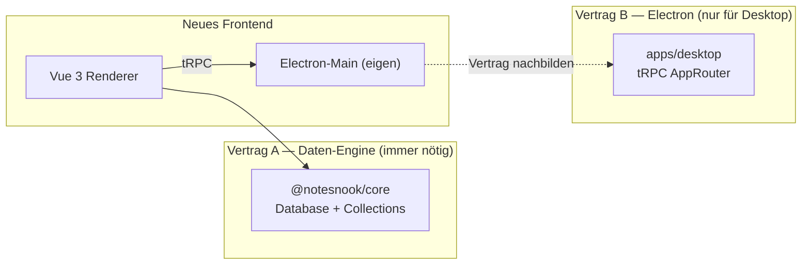

# NEXT_STEPS — Notesnook Vue Desktop Rewrite

> Single source of truth for the project plan, findings, decisions, and the
> next work items. Update this file as work progresses; treat it as the
> living project journal and onboarding doc.

---

## 1. Vorhaben im Detail

Komplettes, von-scratch-geschriebenes Frontend für Notesnook, das das bestehende
React-Renderer (`apps/web` im Hauptrepo `streetwriters/notesnook`) ersetzt und
deutlich benutzerfreundlicher wird. Ziele:

- **TailwindCSS v4 + Glassmorphism** statt Theme UI / Emotion
- **TypeScript** end-to-end (Main, Preload, Renderer, Tests)
- **Electron** als Desktop-Shell, **responsiv / mobile-first** im Layout-Denken
- **VS-Code-artige Editor-UX**: Multi-Tab, geschachtelte Split-Panes,
  Tab-Tear-out → neues Fenster (Focus-Mode), Command-Palette-Metapher
- **Backend-API-Kompatibilität** mit `@notesnook/core` (der Notesnook-Daten-
  engine, die client-seitig läuft — es gibt kein klassisches HTTP-Backend)
- **Eigenständiges Repo**, das die Notesnook-Packages via npm konsumiert

Die detaillierten UI-Anforderungen liegen in der YAML-Datei des Nutzers
(`Untitled-1`), zusammengefasst in §4 unten.

### 1.1 Architektur-Entscheidungen (fixiert)

| Aspekt | Entscheidung | Begründung |
|---|---|---|
| Repo | Separat unter `/Users/marco/Projects/notesnook-vue` | Unabhängige Roadmap, eigene CI, keine Hauptrepo-Blocker |
| Package Manager | **npm workspaces** | Kompatibel mit Hauptrepo; bewährter Pfad |
| Layout | **Monorepo** (`apps/desktop`, `packages/*`) | Skaliert für spätere Web-/Mobile-Apps |
| Framework | **Vue 3.5** + Vite | Völlig neues UX-Ziel, React-Renderer wird ersetzt |
| Styling | **TailwindCSS v4** + `@tailwindcss/vite` | Glassmorphism trivial, Design-Token-Plugin |
| UI-Primitives | Radix Vue (`reka-ui`) — geplant | Accessibility + Keyboard + Tailwind-freundlich |
| State | **Pinia** für App-Shell; Zustand-Stores aus `@notesnook/editor` bleiben | Framework-agnostisch, sauber faktoriert |
| Routing | Vue Router 4 — geplant | ersetzt den dual-Router des Hauptrepos |
| Editor | **TipTap mit `@tiptap/vue-3`** (Port von `@notesnook/editor`) | 60% der Extensions sind reines ProseMirror und laufen unverändert |
| Electron-Scaffolding | **`electron-vite`** | Main/Preload/Renderer getrennt, reif |
| Electron-Main | Eigenbau, aber **AppRouter-Vertrag nachbilden** | Freiheit + Kompatibilität mit dem bestehenden Main-Vertrag |
| Backend-Anbindung | `npm install @notesnook/core` etc. | Public auf npm, GPL-3.0-kompatibel |
| Lizenz | **GPL-3.0-or-later** | Pflicht bei Konsum von `@notesnook/core` |

### 1.2 Warum Vue statt React

- TipTap hat **native Vue-3-Bindings** (`@tiptap/vue-3`)
- `@notesnook/editor` ist *nicht* mit `@tiptap/react` gebaut — es hat eine
  eigene, dünne React-Node-View-Schicht auf `@tiptap/core`. Diese Schicht wird
  beim Port **gelöscht** und durch `nodeViewRenderer` + `NodeViewWrapper` von
  `@tiptap/vue-3` ersetzt
- ~60% der Editor-Codebasis sind reines ProseMirror (Schema, Commands, Plugins,
  KaTeX-Math, vendored `prosemirror-tables`) und laufen unter Vue unverändert
- Der wahre Hebel ist ohnehin der Ersatz von Theme UI durch Tailwind — der
  fällt *global* in einem Schritt weg, unabhängig vom UI-Framework

---

## 2. Was wir herausgefunden haben

### 2.1 Aktuelles Hauptrepo (IST-Zustand)

**Apps:**
- `apps/web` — **ein** React-18-Renderer für Web + Electron (Build-Aliase
  tauschen `desktop-bridge` und `sqlite` je `PLATFORM`)
- `apps/desktop` — reiner Electron-Main-Prozess (~6–10k LOC), lädt das
  `apps/web`-Bundle via Custom-Protocol `https://app.notesnook.com/*`
- `apps/mobile` — separate React-Native-App mit eigener Editor-Shell
  (`@notesnook/editor-mobile`)

**Stack des Renderers (`apps/web`):**
- React 18.3 + Vite 5.4 + SWC
- **Zustand 4.5** (16 Stores), klassenbasiert via `BaseStore`
- TanStack Query v4 + tRPC (nur für Electron-Bridge)
- **wouter** + eigener Hash-Router (zwei parallele Router)
- **Theme UI + Emotion** (`sx`-Prop überall), **kein Tailwind**
- `@notesnook/theme` — Scoped-CSS-Variablen pro UI-Region (`base`, `titleBar`,
  `list`, `editor`, …), JSON-validiert via Schema
- `@notesnook/ui` — nur ~4 Primitive (Menu, PopupPresenter, ScrollContainer, Icon)
- TipTap 2.6.6 mit **46 Custom-Extensions** + vendored `prosemirror-tables`
- Lingui 5.1 für i18n, `@dnd-kit` für DnD, `react-freeze` für Tab-Kaltstellung

**Bestehende VS-Code-artige Features (schon heute, aber custom):**
- `editor-store.ts` (~700+ LOC) mit rekursivem `LayoutNode`-Baum
  (`type: "group" | "split"`, `direction: "vertical" | "horizontal"`)
- Custom `SplitPane`, Tab-Pinning, Back/Forward-History per Tab
- Electron-Multi-Window: Main / Multi-Tab / Single-Note / Drag-Overlay,
  Cross-Window-Sync via `app:note-changed` (debounced pro noteId 300ms)

**Größenordnungen:**
- `apps/web/src`: ~317 Dateien, ~50–90k LOC
- `@notesnook/core`: ~98 Dateien, ~30–50k LOC (Daten-Engine)
- `@notesnook/editor`: ~148 Dateien, ~20–40k LOC (TipTap + 46 Extensions)
- `apps/desktop/src`: ~28 Dateien, ~6–10k LOC (Electron-Main)

### 2.2 Kopplungsanalyse — die zwei Verträge



**Vertrag A — `@notesnook/core` (Pflicht):**
- `Database`-Klasse mit `setup(options)`-Methode
- Collections: `notes`, `notebooks`, `tags`, `colors`, `reminders`,
  `attachments`, `vaults`, `monographs`, `settings`
- APIs: `sync`, `user`, `mfa`, `vault`, `lookup`, `pricing`, `subscriptions`
- Platform-Interfaces: `IStorage`, `IFileStorage`, `ICompressor`,
  `SQLiteOptions.dialect` — *Implementierungen liefert das Frontend*
- Datenmodell: `Note`, `Notebook`, `Topic`, `Tag`, `Color`, `Reminder`,
  `Attachment`, `Vault`, `ContentItem` (TipTap-Dokument), `DatabaseUpdatedEvent`
- **Wichtig:** Notes werden als ProseMirror-JSON gespeichert — ein neuer
  Editor muss dieses Format lesen & schreiben können

**Vertrag B — `apps/desktop` tRPC `AppRouter` (nur Electron):**
- ~33 Prozeduren in 9 Routern: `window`, `sqlite`, `os-integration`,
  `updater`, `safeStorage`, `spellChecker`, `backups`, `compress`, `bridge`
- 4 rohe IPC-Events: `app:note-changed`, `app:open-note`, `app:close-tab`,
  `app:external-drop`
- Wir bauen einen **eigenen Main**, implementieren dieselben Prozedur-Namen +
  Input/Output-Shapes — das ist der Mittelweg zwischen „frei" und
  „kompatibel"

### 2.3 Editor-Vue-Port — Aufwandschätzung

| Layer | Anteil | Vue-Port |
|---|---|---|
| Reine ProseMirror-Extensions (37 von 46) | ~50% | **0 Aufwand** — laufen unter `@tiptap/vue-3` |
| Zustand-Stores, Utils, `tool-definitions.ts` | ~10% | **0 Aufwand** — framework-agnostisch |
| Eigene `react/`-Node-View-Schicht (~500 LOC) | ~3% | **löschen**, durch `@tiptap/vue-3` ersetzen |
| 9 React-Node-View-`component.tsx` (attachment, audio, code-block, embed, image, table, task-item, task-list, web-clip) | ~10% | als `.vue` SFCs neu bauen |
| Toolbar + 8 Popups + Floating Menus + 16 Tool-Impl. | ~20% | neu (größter Einzel-Chunk) |
| `src/components/`, `src/hooks/` | ~5% | neu |
| `src/index.ts` (Hook + Component-Exporte) | ~2% | durch Vue-Äquivalente ersetzen |

**Gesamtschätzung:** ~10–14 Wochen Solo für einen treuen Port. **~7–9 Wochen**
bei bewusster Reduktion auf ~18 MVP-Extensions statt 46 + Command-Palette statt
vollständiger Toolbar.

### 2.4 npm-Verfügbarkeit der Packages (geprüft am 2026-07-19)

| Package | auf npm | Version |
|---|---|---|
| `@notesnook/core` | ✅ | 8.1.3 |
| `@notesnook/editor` | ✅ | 2.1.3 |
| `@notesnook/theme` | ✅ | 2.1.3 |
| `@notesnook/ui` | ✅ | 2.1.3 |
| `@notesnook/common` | ✅ | 2.1.3 |
| `@notesnook/crypto` | ✅ | 2.1.3 |
| `@notesnook/sodium` | ✅ | 2.1.3 |
| `@notesnook/streamable-fs` | ✅ | 2.1.3 |
| `@notesnook/logger` | ✅ | 2.1.3 |
| `@notesnook/intl` | ❌ **nicht published** | — |
| `@notesnook/desktop` | ❌ **nicht published** | — |

**Konsequenzen:**
- `@notesnook/intl` muss aus dem Hauptrepo-Source kopiert oder als eigenes
  Fork-Package veröffentlicht werden (Lingui-Strings + Locale-Loader)
- `@notesnook/desktop` wird nur als **Type-Import** für den `AppRouter`
  benötigt — wir definieren den Vertrag selbst in
  `apps/desktop/src/contracts/router.ts`

### 2.5 Was 1:1 bleiben muss vs. was frei neu gedacht werden darf

**Muss 1:1 (Backend-Verträge):**
- `@notesnook/core` Collections-API, Datenmodell, TipTap-Dokumentformat
- Sync-Engine, Vault-Verschlüsselung, Migrationslogik, Backup-Reader
- `IStorage` / `IFileStorage` / `ICompressor` / `SQLiteOptions` — nur
  Implementierungen liefern, Interface unverändert
- Vendored `prosemirror-tables`, KaTeX-Math-Node-View (reines ProseMirror)

**Darf frei neu gedacht werden:**
- Alle 16 Stores → auf 6–8 Pinia-Stores reduzieren
- ~35 Dialoge + 20 Settings-Sections → Settings als View, Dialoge als Wizard
- Custom Titlebar, SplitPane, Routing, Toolbar (Command Palette statt Ribbon)
- Mobile/Tablet-Slider → später oder streichen
- 46 Editor-Extensions → ~18 im MVP, Rest Phase 2/3

**Darf nicht neu gebaut werden (Kosten/Nutzen schlecht):**
- Sync-Engine, Vault, Migrationslogik, Backup-Reader — alles in `@notesnook/core`

---

## 3. Aktueller Stand im Repo `/Users/marco/Projects/notesnook-vue`

### 3.1 Was steht

- ✅ Monorepo-Layout: `apps/desktop`, `packages/contracts`, `packages/shared`
- ✅ `electron-vite`-Setup mit Main / Preload / Renderer getrennt
- ✅ Vue 3.5 + Vite + TailwindCSS v4 (`@tailwindcss/vite`)
- ✅ Pinia, Vue Router (noch nicht aktiv), TipTap 2.6.6 + `@tiptap/vue-3`
- ✅ `@notesnook/*` als npm-Dependencies installiert (alle außer `intl`, `desktop`)
- ✅ Electron-Main mit frameless Window + macOS `vibrancy: "under-window"`
- ✅ Preload via `contextBridge`: `appEvents` (4 Listener) + `os` + `electronTRPC`
  (tRPC-Bridge via `exposeElectronTRPC`)
- ✅ tRPC `AppRouter`-Vertrag in `apps/desktop/src/contracts/router.ts`
  mit echten Prozeduren: `ping`, `log`, `window`, `sqlite` (open/run/close/
  delete), `compress` (gzip/gunzip), `safeStorage` (set/get/remove),
  `fs` (10 Chunk-Store-Methoden), `updater` (Stub). Registry-Pattern: Main
  registriert Impls, Renderer importiert nur den Typ.
- ✅ Renderer-Shell: `TitleBar`, `Sidebar`, `NotesList` (echte Notes), `Editor`
  (aktive Note, read-only bis Phase 2), `App.vue` (Boot-Overlay)
- ✅ **Phase-2.1 TipTap-Spike** — `Editor.vue` läuft mit `@tiptap/vue-3` +
  `@tiptap/starter-kit`: lädt Notiz-Content als HTML via
  `database.content.findByNoteId`, rendert per `<EditorContent>`,
  debounced Autosave (800 ms) via `database.notes.add`. Store erweitert um
  `activeContent`, `contentState`, `saveState`, `loadActiveContent()`,
  `saveContent(noteId, html)`. ProseMirror-Base-CSS in `style.css`.
  **Runtime-Check `npm run dev` offen** (User-Maschine).
- ✅ **Phase-2.4a Editor-Node-View-Port** — neues Workspace-Paket
  `packages/editor-vue` (`@notesnook-vue/editor-vue`, Source-as-Entry,
  pfad-aliasiert). 3 der 9 React-Node-Views portiert: `attachment`
  (inline Atom), `task-item` + `task-list` (Editable-Content +
  `appendTransaction`-Stats-Plugin → Progress-Bar). Schema/parseHTML/renderHTML
  **verbatim** vom Upstream (`streetwriters/notesnook`, Branch `master`) für
  Byte-stabilen HTML-Round-trip; React-Node-View-Layer → `VueNodeViewRenderer`
  + `NodeViewWrapper`/`NodeViewContent`. Wiederverwendbare Helfer:
  `getDataAttribute`, `prosemirror.ts`-Subset, `formatBytes`.
  Round-trip-Vertragstest `tests/contract/editor-html.spec.ts` (5 Tests,
  happy-dom per File-Env-Override, Schema via leeren `Editor` gebaut).
  41 Contract-Tests grün, typecheck (node+web) + build clean.
  `Editor.vue` nutzt `[StarterKit, AttachmentNode, TaskListNode,
  TaskItemNode.configure({nested:true})]`. **Runtime-Check offen.**
- ✅ **Phase-1-Plattform-Seam** in `apps/desktop/src/renderer/src/platform/`:
  `desktop-bridge.ts` (lazy tRPC-Client), `sqlite-dialect.ts` (Kysely-Dialect
  → `sqlite.run`), `compressor.ts`, `key-store.ts` (safeStorage), `key-value.ts`
  (IndexedDB), `nncrypto.ts` (sodium), `storage.ts` (NNStorage), `file-store.ts`
  + `fs.ts` (FileStorage), `database.ts` (`initDatabase`-DI + `createDesktopPlatform`),
  `bootstrap.ts` (Ping → DB-Init → Seed), `stub-storage.ts`/`stub-fs.ts` (Gate-Stubs)
- ✅ Pinia `notes`-Store **echt**: `load()` → `database.notes.all().items()`,
  `create()`, `selectNote()`, `activeNote`
- ✅ Main-Prozess: `ipc.ts`, `sqlite.ts`, `compress.ts`, `safe-storage.ts`,
  `file-storage.ts` (alle via Registry-Pattern in `contracts/router.ts`)
- ✅ `packages/contracts` als Single-Source-of-Truth für Notesnook-Typen
  - `DatabaseOptions` / `SQLiteOptions` / `FileStorageAccessor` via
    `Parameters<Database["setup"]>[0]` abgeleitet — robust gegen Renames
  - Zusätzlich re-exportiert: `Cipher`, `SerializedKey`, `DataFormat`,
    `RequestOptions`, `Output`, `FileEncryptionMetadata*`, `Cancellable`,
    `hosts` + die Server-Interfaces (`SQLiteServer`, `CompressorServer`,
    `SafeStorageServer`, `FileStorageServer`, `FSFile`)
- ✅ Vertragstest-Suite: **9 Spec-Dateien, 36 Tests, alle grün** —
  `core-surface`, `bridge-router`, `sqlite-engine`, `bridge-dialect`,
  `data`, `database-encryption`, `nnstorage`, `filestorage`, `collections`
- ✅ `tsconfig` Project References (Node + Web), beide via `tsc` / `vue-tsc` clean
- ✅ `electron-vite build` produziert Main (17.6 KB) + Preload (1.15 KB) +
  Renderer (~4,19 MB JS — `@notesnook/core` + sodium inlined; lazy prism/katex-
  Chunks) + 15 KB CSS
- ✅ Git: 9 Commits auf `main` (3 Scaffold + 6 Phase 1), sauberer Baum,
  `.gitignore`, `.prettierignore`, `.vscode/extensions.json`

### 3.2 Wie vertragssicher gearbeitet wird

1. **Type-Lock:** `package.json` nutzt `~` statt `^` für `@notesnook/*` —
   nur Patch-Releases automatisch, Minor/Major bewusst
2. **Vertragsschicht:** Alle Code-Stellen importieren Notesnook-Typen von
   `@notesnook-vue/contracts`, nie direkt von `@notesnook/core`
3. **Vertragstests in CI:** Runtime-Prüfung der öffentlichen `core`-Exports
   bei jedem PR + jedem `@notesnook/*`-Bump
4. **Abgeleitete Typen:** `SQLiteOptions` etc. werden aus `Database["setup"]`
   abgeleitet — kein Duplikat, das bei Upgrades pflegebedürftig wäre
5. **Upgrade-Routine:** Monatlich `npm outdated @notesnook/*`, Upgrade-Branch
   mit Vertragstests, Release-Changelog des Hauptrepos lesen

### 3.3 Reproduzierbare Befehle

```bash
cd /Users/marco/Projects/notesnook-vue
npm install                                  # Dependencies + native Module
npm run dev                                  # Electron + Vite-Dev (Renderer-HMR)
npm run build                                # Production-Build (Main+Preload+Renderer)
npm run test:contract                        # Vertragstests (vitest)
npm run test:contract:watch                  # Vertragstests im Watch-Modus
(cd apps/desktop && npm run typecheck)       # tsc + vue-tsc
(cd apps/desktop && npm run typecheck:node)  # nur Node-Seite
(cd apps/desktop && npm run typecheck:web)   # nur Web-Seite
```

---

## 4. UI-Anforderungen (aus der YAML-Datei des Nutzers)

### 4.1 Sidebar (links)
- **All Notes**
- **Notebooks und Subnotebooks**
  - Icons pro Notebook setzbar
  - Sortierbar
- **Tags und Subtags**
  - Icons pro Tag setzbar
  - Sortierbar
- **Trash** (mit Restore-Funktion) ganz unten
- **Monographs**
- **Archive**
- **Settings** → **separates Fenster**
- **Sync Status** (irgendwo sichtbar)
- **Update Notifier** unten in der Sidebar

### 4.2 Notes List
- **Suchleiste oben mit Regex-Support**
- **Sortierbar** nach Titel, Erstellungsdatum, Änderungsdatum, Custom-Order
- **Gruppierung** nach Datum, Notebook, Tag, Custom Groups (gruppierbar)
- Oben rechts: **„New Note"-Button**, oben links: **Collapse-Sidebar-Button**
- **List-Entry zeigt:** Titel, erste Zeile, Erstellungsdatum, Änderungsdatum, Tags
  - Bei TipTap-Checkboxes: **Fortschrittsbalken** (x / y checked)
  - Bei Bild-Notiz: **erstes Bild als Thumbnail**

### 4.3 Note Editor
- **TipTap-basiert** wie das Original
- **Tab-Support** mit VS-Code-artigen Split-Panes
- Tabs sortierbar und schließbar
- **Tab-Drag-out → neues Fenster** (default Focus-Mode: ohne Sidebar + Notes List)
- **Feature-Parität** beim Editieren + Toolbar
  - Toolbar enthält: **Undo/Redo, Search, ToC**
  - **ToC als MiniMap rechts** des Editors
- **`…`-Menü** für Features außerhalb der Toolbar
  - **Properties → rechtes Sidebar:** Title, Notebook, Tags, Created, Modified,
    Word/Character/Line Count, Toggles (Pin, Favorite, Lock, Read Only,
    Archive, Disable Sync, Spell Check), Publish (Monograph), Linked Notes
    (in/out), History

---

## 5. Nächste Schritte (Roadmap)

Die Reihenfolge ist ein Vorschlag — der Nutzer steuert die Priorisierung.

### Phase 1 — Fundament & Daten-Pipeline (Woche 1–3)

> **Status 2026-07-19:** Phase 1 **komplett** (M1–M3, M5–M11; M4 entfällt).
> 36 Contract-Tests grün, typecheck (node+web) + build clean. Die Pipeline
> läuft end-to-end: `db.init()` + Migrationen + `notes.add`/`all` — im Renderer
> über die Bridge-Dialect, in Tests über In-Process-SQLite. NotesList liest
> `database.notes.all()`, bootstrap seeed zwei Willkommens-Notes.
> **Offen:** Runtime-Check per `npm run dev` steht auf der User-Maschine aus
> (in dieser Sandbox ist das Electron-Binary unvollständig — Frameworks fehlen,
> kein Netz zum Reinstall). Code ist fertig + deterministisch verifiziert.
> **M4 (FTS5 native Extensions) entfällt** — SQLite 3.53.2 (bündelt mit
> `better-sqlite3-multiple-ciphers@12`) liefert `trigram` als Built-in-Tokenizer;
> Migrationen laufen ohne ladbare Extensions. `html`-Tokenizer fehlt noch
> (nur für Search-Highlighting nötig) → ggf. Phase 6/7.
> **Attach­ments-Collection ist user-gated** (`_getEncryptionKey` →
> `db.user.getAttachmentsKey`, gesetzt beim Login) → voller Attachments-Round-
> trip braucht Auth (Phase 6). Die FileStorage-Verschlüsselung darunter ist
> verifiziert (`filestorage.spec`).
> **Fix:** `apps/desktop/package.json` `main` war `./dist-electron/…`, aber
> electron-vite baut nach `./out/…` → `npm run dev` scheiterte an "No electron
> app entry file found". Auf `./out/main/index.js` korrigiert.

- [x] **M1 tRPC-Bridge** — `main/ipc.ts` (`createIPCHandler`), Preload
  `exposeElectronTRPC()` (`appEvents`+`os` bleiben), Renderer
  `platform/desktop-bridge.ts` (`ipcLink`, lazy Proxy) + `ping`/`log`. ✅
- [x] **M2 Main-SQLite** — `main/sqlite.ts` (Port von Upstream
  `sqlite-kysely.ts`: `better-sqlite3-multiple-ciphers`, Prepared-Cache, Retry,
  Path-Allowlist, `unsafeMode`), Registry-Pattern (`registerSQLiteServer`).
  ✅
- [x] **M3 Renderer-Dialect** — `platform/sqlite-dialect.ts` (Port von
  `index.desktop.ts`: `SqliteDriver`/`SqliteBridgeConnection` forwarden an
  `sqlite.run`, Mutex, DI-Client). `@streetwriters/kysely` als direkte Dep. ✅
- [~] **M4 FTS5-Extensions** — **ENTFÄLLT** (Built-in-Trigram reicht, siehe oben).
- [x] **M5 Compressor** — `main/compress.ts` (Node `zlib`, base64) +
  `platform/compressor.ts` (`ICompressor` forwardet an `desktop.compress`). ✅
- [x] **Gate `db.init()`** — `platform/database.ts` (`initDatabase` mit DI,
  `createDesktopPlatform`) + `stub-storage.ts`/`stub-fs.ts`. Deterministisch
  verifiziert via `data.spec.ts` (In-Process) + `bridge-dialect.spec.ts`
  (echte Bridge-Forwarder über Fake-Bridge). ✅
- [x] **M6 Key-Store (safeStorage)** — `main/safe-storage.ts` (OS-Keychain,
  `secrets.json`-Persistenz) + Renderer `key-store.ts` (`getDatabaseKey`,
  `databaseKeyToPassword` hex, `SafeStorageKeyStore`); `sqliteOptions.password`
  verschlüsselt die DB (verifiziert in `database-encryption.spec`). ✅
- [x] **M7 NNStorage (echtes IStorage)** — `key-value.ts` (IndexedDB +
  Memory), `nncrypto.ts` (`@notesnook/crypto` sync, sodium), `storage.ts`
  (NNStorage, IStorage-Oberfläche nur — PGP/`openpgp`/`intl` entfallen, da
  nicht in `IStorage`). Verifiziert in `nnstorage.spec`. ✅
- [x] **M8 FileStorage (echtes IFileStorage)** — `main/file-storage.ts`
  (Node-fs Chunk-Store, namenssanitisiert) + Renderer `file-store.ts`
  (`NodeFSFileStore` forwardet) + `fs.ts` (`FileStorage`: streamable-fs +
  sodium secretstream + SHA-256-Hash; HTTP-Sync-Methoden stubben Phase 6).
  Verifiziert in `filestorage.spec`. ✅
- [x] **M9 Full-Init + Singleton-Boot** — `createDesktopPlatform` waltet
  echte NNStorage + FileStorage + Compressor + Dialect + Password;
  `bootstrap()` läuft beim App-Start; `getDatabase()` Singleton. ✅
- [x] **M10 Echte NotesList** — `stores/notes.ts` `load()` →
  `database.notes.all().items()`; `NotesList.vue` rendert Title/Headline/
  Datum/Tags; New-Note-Button; `Editor.vue` zeigt aktive Note (read-only bis
  TipTap Phase 2); `App.vue` Boot-Overlay. ✅
- [x] **M11 Contract-Tests erweitern** — `collections.spec`: notebooks, tags,
  settings, vault, sync (Attachments user-gated → Phase 6). ✅

#### Ursprüngliche 1.x-Items (Referenz, z.T. durch M-Struktur ersetzt)

- [x] 1.1 Platform-Implementierungen (sqlite-dialect + compressor + storage + fs)
- [x] 1.2 tRPC-Bridge (Preload `exposeElectronTRPC`, nicht rohe `appEvents`)
- [x] 1.3 Datenbank-Wiring (`initDatabase`-DI-Helfer + `createDesktopPlatform`)
- [x] 1.4 Erste echte Komponente — NotesList (`database.notes.all()`)
- [x] 1.5 Vertragstests erweitern (9 Spec-Dateien, 36 Tests)

### Phase 2 — Editor-Port (Woche 2–8, parallel zu Phase 1 möglich)

- [x] **2.1 TipTap-Vue-Spike** — `@tiptap/vue-3` + `@tiptap/starter-kit` in
  `Editor.vue` geladen; Editor lädt aktive Note als HTML via
  `database.content.findByNoteId`, rendert per `<EditorContent>`,
  debounced Autosave (800 ms) via `database.notes.add` (Content-Upsert +
  `dateEdited`/`headline`-Bump). Build + typecheck (node+web) clean, 36
  Contract-Tests grün. **Runtime-Check `npm run dev` offen** (User-Maschine).
  ✅
- [ ] **2.2 Tailwind-Token-Adapter** — `@notesnook/theme`'s `ThemeDefinition.scopes`
  → Tailwind-CSS-Variablen (`--color-surface`, `--backdrop-blur-base`, …)
  - Schema um `opacity` / `backdropBlur`-Felder erweitern (rückwärtskompatibel)
- [ ] **2.3 Vue-Primitives** — `Flex`/`Box`/`Text`/`Button`/`Input` mit Tailwind
  statt Theme UI (erspart spätere `sx`-Migration in jeder Komponente)
- [~] **2.4 Port-Reihenfolge der 9 React-Node-Views** (einfach → komplex).
  Eigener Paket-Scaffold `packages/editor-vue` (`@notesnook-vue/editor-vue`,
  Source-as-Entry, pfad-aliasiert wie `contracts`). Pro Node: `<name>.ts`
  (TipTap-Node, Schema/parseHTML/renderHTML **verbatim** vom Upstream für
  Byte-stabilen Round-trip) + `Component.vue` (Vue-View via `VueNodeViewRenderer`
  + `NodeViewWrapper`/`NodeViewContent` aus `@tiptap/vue-3`). Importe NIE direkt
  von `@tiptap/core`, sondern von `@tiptap/vue-3` (re-exportiert core).
  **Status 2026-07-19 (2.4a):**
  1. [x] `attachment` (inline Atom, File-Chip aus Attrs; Blob = Phase 6) ✅
  6. [x] `task-item` + `task-list` (Checkbox-Toggle, Editable-Content via
     `NodeViewContent`, `appendTransaction`-Stats-Plugin → Progress-Bar) ✅
  - Bewiesen: Parse→Serialize Round-trip der data-*-Attrs/Klassen via
    `tests/contract/editor-html.spec.ts` (5 Tests, happy-dom, Schema via
    leeren `Editor` gebaut). 41 Contract-Tests grün, typecheck+build clean.
  - **Aufgeschoben (Polish):** drop-override-Plugin, `[]`/`[x]`-Input-Regel,
    `sortList`, mobile/iOS-Touch (desktop-first, Entscheidung #8).
  2. [ ] `audio` (blob URL + `<audio>`) — **Phase-6-gated** (attachments auth)
  3. [ ] `web-clip` (iframe + fullscreen listener) — **Phase-6-gated**
  4. [ ] `embed` (Resizer + iframe sandbox) — selbstständig, kein Attachments
  5. [ ] `image` (IntersectionObserver + blob URL + alignment) — **Phase-6-gated**
  7. [ ] `code-block` (refractor-Highlighter + Lazy-Lang-Loading + caret/lines-sync)
  8. [ ] `table` (vendored `prosemirror-tables` + row/column toolbars — am aufwendigsten)
  - **Wiederverwendbare Helfer** schon portiert: `getDataAttribute`,
    `prosemirror.ts` (`findParentNodeClosestToPos`/`hasSameAttributes`/
    `getExactChangedNodes`/`getDeletedNodes`/`getParentAttributes`/
    `ensureLeadingParagraph`), `formatBytes`. `downloader.ts`/`useObserver`/
    `getSandboxFeatures`/`Resizer` folgen mit embed/image (2.4b/2.4e).
- [ ] **2.5 Toolbar** als letztes (höchste Masse, geringstes Schema-Risiko):
  - Erst Command Palette (`Ctrl+Shift+P`) + Slash-Commands (`/`)
  - Dann klassische Toolbar-Buttons für die verbleibenden Aktionen
  - 8 Popups reduzieren auf 4–5: Link, Color, Image, Table, ggf. Embed
- [ ] **2.6 `@notesnook/intl`-Quelle klären** — Lingui-Strings aus Hauptrepo
  kopieren oder eigene Fork publishen; vue-i18n-Konverter für `.po`-Files

### Phase 3 — App-Shell & Navigation (Woche 4–7)

- [ ] **3.1 Custom Titlebar** — macOS Traffic-Lights + Window Controls Overlay
  (Win/Linux), `vibrancy`/`acrylic`-Erkennung
- [ ] **3.2 Sidebar** — VS-Code-Explorer-Metapher mit Collapse-Sektionen:
  - All Notes, Notebooks (rekursiv mit Icons), Tags (rekursiv mit Icons),
    Monographs, Archive, Trash (unten), Settings (unten)
  - Sortable via `vue-draggable-plus`
- [ ] **3.3 Notes List** — Suchleiste mit Regex, Sort/Group-Controls, New-Note,
  Collapse-Sidebar, List-Entries mit Thumbnail + Progress-Bar + Tags
- [ ] **3.4 StatusBar unten** — Sync-Status, Wortzahl, Cursor-Position
- [ ] **3.5 Vue Router** — file-based via `unplugin-vue-router` oder klassisch;
  ersetzt den dual-Router-Ansatz des Hauptrepos

### Phase 4 — Multi-Window & Multi-Tab (Woche 7–12)

- [ ] **4.1 LayoutNode-Baum** als Pinia-Store (`stores/editor-layout.ts`):
  - Rekursive `type: "group" | "split"` mit `direction` + `children`
  - Tab-History (Back/Forward) per Tab
  - Sessions (`default`, `locked`, `readonly`, `deleted`, `conflicted`, `diff`)
  - `react-freeze` → Vue `<KeepAlive>` + `defineAsyncComponent`/Suspense
- [ ] **4.2 SplitPane** — `vue-splitpanes` oder Eigenbau mit Sash + Persistenz
- [ ] **4.3 Tabs** — Radix Vue Tabs + `vue-draggable-plus` für Sortierung
- [ ] **4.4 Tab-Tear-out → neues Fenster**:
  - `WindowManager` im Main-Prozess: `createWindow({ kind: "focus" })`
  - Drag-Session: transparentes Overlay-Window (`startDragSession`/`endDragSession`)
  - Cross-Window-Sync via `app:note-changed` (debounced pro noteId)
- [ ] **4.5 Settings als separates Fenster** — eigener Fenstertyp mit nur
  Settings-View (kein Editor, keine Sidebar)
- [ ] **4.6 Detach-Pane-into-Window** — Pane-Subtree serialisieren → an
  `window.open` → in altem Baum löschen (VS-Code-Feature)

### Phase 5 — Properties & ToC & Toolbar-Polish (Woche 10–14)

- [ ] **5.1 Properties-Panel als rechtes Sidebar** — Title, Notebook, Tags,
  Created/Modified, Word/Char/Line Count, Toggles (Pin/Favorite/Lock/ReadOnly/
  Archive/DisableSync/SpellCheck), Publish, Linked Notes, History
- [ ] **5.2 ToC als MiniMap rechts** — `getTableOfContents` aus
  `@notesnook/editor` nutzen, live aktualisieren, Klick → Cursor-Sprung
- [ ] **5.3 Toolbar** — Undo/Redo, Search (Slash-Command oder Modal),
  ToC-Toggle, Rest über Command Palette
- [ ] **5.4 `…`-Menü** — alle Features außerhalb der Toolbar

### Phase 6 — Sync, Vault, Native Features (Woche 12–16)

- [ ] **6.1 Sync-Status** — `database.sync`-Events abonnieren, StatusBar-Anzeige
- [ ] **6.2 Auto-Updater** — `electron-updater` im Main, tRPC `updater.*`
- [ ] **6.3 Vault** — Lock/Unlock via `database.vaults`, Secure-Storage via
  Electron `safeStorage`
- [ ] **6.4 Tray** — System-Tray mit „New Note / New Notebook / Show / Quit"
- [ ] **6.5 Deep Links** — `nn://`-Protocol, `app.setAsDefaultProtocolClient`
- [ ] **6.6 Spell-Checker** — Electron `session.defaultSession.spellcheck`
- [ ] **6.7 Backup/Restore** — `database.backups` + Sandboxed-Path-Checks

### Phase 7 — Polish & Release (Woche 16+)

- [ ] **7.1 i18n** — Lingui oder vue-i18n, `.po`-Files, Pseudo-Locale für Dev
- [ ] **7.2 PWA** — `vite-plugin-pwa` für den optionalen Web-Build
- [ ] **7.3 Theme-Editor** — `ThemeDefinition`-Schema, Scoped-Themes,
  Glassmorphism-Tokens (`opacity`, `backdropBlur`)
- [ ] **7.4 Performance** — `backdrop-filter` nur auf Overlays/Toolbars,
  native Vibrancy auf macOS, Acrylic auf Win11, `<KeepAlive>` für Tabs
- [ ] **7.5 electron-builder** — dmg + zip (macOS arm64/x64), nsis + portable
  (Win), AppImage + snap (Linux)
- [ ] **7.6 CI** — GitHub Actions: typecheck + tests + build für Win/macOS/Linux

---

## 6. Offene Entscheidungen (klären, wenn drankommend)

| # | Frage | Kontext | Empfehlung |
|---|---|---|---|
| 1 | **Lingui vs. vue-i18n** | `@lingui/react` ist React-spezifisch (`<Trans>`). `@notesnook/intl` nicht auf npm. | `@lingui/macro` nur mit `i18n._()`-Aufrufen weiterverwenden ODER vue-i18n + `.po`-Converter |
| 2 | **`block-id` & `outline-list` Lesbarkeit** | Alte Notes haben diese Block-Typen. Nur darstellen oder editieren? | Erst nur darstellen (billig), Edit-Support später |
| 3 | **Electron bleiben vs. Tauri** | Tauri = Rust-Main, kleineres Bundle, aber `better-sqlite3` + `sodium-native` neu bauen | **Electron bleiben** — 1–2 Monate Neubau gespart |
| 4 | **Editor-Fork im Hauptrepo vs. eigenes Package** | Port im Notesnook-Mainline oder Fork pflegen? | Im neuen Repo als `packages/editor-vue` (später Upstream-PR möglich) |
| 5 | **Theme-Schema-Erweiterung** | `ThemeDefinition.scopes` hat keine `opacity`/`backdropBlur`-Felder | Vor Phase 2.2 klären + rückwärtskompatibel defaulten |
| 6 | **MVP-Editor-Umfang** | 46 Extensions → wie viele im MVP? | ~18: paragraph, heading, bold/italic/underline/strike, link, bullet/ordered/task/check-list, blockquote, code-block, highlight, image, attachment, table, math |
| 7 | **`@notesnook/desktop`-Type-Quelle** | Nicht auf npm, nur als Type-Import nötig | Eigener Vertrag in `apps/desktop/src/contracts/router.ts` (bereits angelegt) |
| 8 | **Mobile / Tablet** | Hauptrepo hat Mobile-Slider; Vue-Äquivalent? | Später — Desktop zuerst |
| 9 | **`@tiptap/*`-Versionskollision** ✅ gelöst | `@notesnook/editor@2.1.3` pinnt `@tiptap/core@2.6.6` exact, aber seine `^2.6.6`-Extension-Deps resolven auf gehoistete **2.27.2** (peer `@tiptap/core@^2.7.0`). npm hoisted `core@2.27.2` nach Root + nested `core@2.6.6` unter `apps/desktop` + `@notesnook/editor`. Zwei `Node`-Klassen → Schema-Bruch, wenn gemischt. | **Gelöst 2026-07-19:** Root-`package.json` `overrides` zwingt alle `@tiptap/*` auf `2.6.6` (matcht editor exact). Clean Re-Resolution (`rm -rf node_modules/@tiptap package-lock.json && npm install`) — nun single `core@2.6.6`, keine nested Copies, 0× `2.27.2` im Lockfile. Typecheck + build + 36 Tests clean. Editor-Port baut ab 2.4 gegen dieselbe Core-Version wie `@notesnook/editor`. |

---

## 7. Risiken & Mitigationen

| Risiko | Wahrscheinlichkeit | Impact | Mitigation |
|---|---|---|---|
| `@notesnook/core`-Breaking-Change bei Minor-Upgrade | Mittel | Hoch | `~`-Pinning + Vertragstests in CI |
| `@notesnook/editor`-Port-Aufwand unterschätzt | Mittel | Hoch | Reduktion auf ~18 MVP-Extensions, Command Palette statt Toolbar |
| Theme-Schema bricht alte Themes bei Glassmorphism-Erweiterung | Niedrig | Mittel | Rückwärtskompatible Defaults für neue Felder |
| Tab-Tear-out-Komplexität (Overlay-Window, Cross-Window-Sync) | Hoch | Mittel | Schrittweise: erst Single-Window, dann Multi-Tab, dann Tear-out |
| `react-freeze` hat kein Vue-Äquivalent | Mittel | Niedrig | `<KeepAlive>` + Suspense, ggf. eigener Freeze-Mechanismus |
| `re-resizable` / `react-colorful` ohne Vue-Pendant | Niedrig | Niedrig | `vue3-draggable-resizable` + `@ckpack/vue-color` |
| Native Module (`better-sqlite3`, `sodium-native`) bauen nicht | Niedrig | Hoch | `patch-package` bereits als devDep, `npm approve-scripts` dokumentiert |
| `@notesnook/intl` fehlt auf npm | Hoch | Mittel | Source kopieren (GPL) oder eigenes Fork-Package publishen |
| API-Drift zwischen eigenem Main und Upstream-`AppRouter` | Mittel | Mittel | Vertragstests gegen `AppRouter`-Shape, monatlicher Diff-Check |

---

## 8. Referenzen

- **Hauptrepo:** `https://github.com/streetwriters/notesnook`
- **Neues Repo:** `/Users/marco/Projects/notesnook-vue`
- **Vertragsschicht:** `packages/contracts/src/index.ts`
- **Vertragstests:** `tests/contract/core-surface.spec.ts`
- **tRPC-Vertrag:** `apps/desktop/src/contracts/router.ts`
- **Plattform-Seam:** `apps/desktop/src/renderer/src/platform/`
- **Pinia-Store-Stub:** `apps/desktop/src/renderer/src/stores/notes.ts`
- **Editor-Port-Analyse:** siehe Chat-Verlauf (Subagent-Report vom 2026-07-19)
- **UI-Anforderungen:** YAML-Datei `Untitled-1` (in §4 oben zusammengefasst)

---

## 9. Glossar

- **Vertrag A** — `@notesnook/core` Collections-API (Pflicht)
- **Vertrag B** — `apps/desktop` tRPC `AppRouter` (nur Electron)
- **LayoutNode-Baum** — rekursive `group | split`-Struktur für Editor-Splits
- **Glassmorphism** — `backdrop-filter: blur()` + Translucenz auf Panels/Toolbars
- **Vibrancy** (macOS) / **Acrylic** (Win11) — native Compositor-Effekte via
  transparentes `BrowserWindow` + `vibrancy`/`backgroundMaterial`
- **Command Palette** — VS-Code-artiges `Ctrl+Shift+P`-Overlay für Aktionen
- **Slash-Commands** — TipTap `/`-Menü für Block-Einfügung
- **Focus Mode** — Editor-only-Ansicht ohne Sidebar + Notes List
- **Tab-Tear-out** — Tab per Drag in neues Fenster lösen
- **Detach-Pane** — Pane-Subtree in neues Fenster verschieben

---

## 10. Arbeits-Journal

### 2026-07-19 — Phase 1 ausgebaut (M1–M3, M5–M11; M4 entfallen)

Ausgangspunkt: Repo war gescafffoldet (Phase 0), Vertragstests grün, "Bereit für
Phase 1." Ziel des Tages: die komplette Daten-Pipeline bauen — ein laufendes
Electron-App, in dem `NotesList` echte Notes aus `database.notes.all()` rendert,
mit `@notesnook/core`'s `Database` im Renderer und SQLite/native Ops im Main,
erreicht über eine tRPC-Bridge.

**Sequenz (vom Nutzer freigegeben): De-Risk-Spine zuerst**, dann die schweren
Ports; Checkpoint nach jedem Milestone (Commits auf `main`).

**Erledigt & verifiziert** (36 Contract-Tests grün, typecheck node+web clean,
build clean):

- **M1 tRPC-Bridge** — `electron-trpc` (`createIPCHandler` Main, `exposeElectronTRPC`
  Preload — `appEvents`/`os` bleiben, `ipcLink`-Proxy-Client im Renderer, lazy
  konstruiert). `ping`/`log`-Prozeduren. `bridge-router.spec`.
- **M2 Main-SQLite** — Port von Upstream `sqlite-kysely.ts`
  (`better-sqlite3-multiple-ciphers`, Prepared-Cache, Retry, Path-Allowlist,
  `unsafeMode`). Registry-Pattern (`registerSQLiteServer`) hält `contracts/router`
  Node-frei. `sqlite-engine.spec` bestätigt das Native-Modul.
- **M3 Renderer-Dialect** — Port von `index.desktop.ts` (`SqliteDriver`/
  `SqliteBridgeConnection` forwarden an `sqlite.run`, Mutex, DI-Client).
  `@streetwriters/kysely` als direkte Dep. `bridge-dialect.spec` treibt den
  **echten** Bridge-Forwarder über eine Fake-Bridge (kein Electron nötig).
- **M5 Compressor** — Node `zlib` in Main; Renderer `ICompressor` forwardet.
- **Gate `db.init()`** — `initDatabase()`-DI-Helfer + `createDesktopPlatform` +
  Stub-Storage/-FS. Deterministisch verifiziert: `data.spec` (In-Process) +
  `bridge-dialect.spec` (echte Bridge). `db.init()` + Migrationen + `notes.add`/
  `all` round-trip.
- **M6 Key-Store** — Main `safe-storage.ts` (Electron `safeStorage` → OS-Keychain,
  persistiert in `userData/secrets.json` mit Plain-Fallback) + Renderer
  `key-store.ts` (`getDatabaseKey` generiert/persistiert 32 Byte, hex als
  `PRAGMA key`). `database-encryption.spec` beweist: mit Passwort ist die DB-Datei
  verschlüsselt (kein SQLite-Magic-Header, Klartext-Titel nicht im File).
- **M7 NNStorage** — `key-value.ts` (IndexedDB + Memory), `nncrypto.ts`
  (`@notesnook/crypto` sync, sodium), `storage.ts` (NNStorage, **nur IStorage-
  Oberfläche** — PGP-Methoden sind nicht in `IStorage`, also `openpgp`/`intl`
  **nicht nötig**). `nnstorage.spec`: Crypto-Roundtrip + Full-Init mit echtem
  NNStorage.
- **M8 FileStorage** — Main `file-storage.ts` (Node-fs-Chunk-Store, namenssanitisiert)
  + Renderer `file-store.ts` (`NodeFSFileStore` forwardet an `desktop.fs`) +
  `fs.ts` (`FileStorage`: `@notesnook/streamable-fs` + sodium-secretstream +
  SHA-256-Hash; HTTP-Sync-Methoden stubben Phase 6). `filestorage.spec`:
  writeEncryptedBase64→readEncrypted Roundtrip mit echtem sodium.
- **M9 Full-Init** — `createDesktopPlatform` waltet echte NNStorage + FileStorage
  + Compressor + Dialect + Password; `bootstrap()` läuft beim App-Start;
  `getDatabase()` Singleton.
- **M10 Echte NotesList** — `stores/notes.ts` `load()` →
  `database.notes.all().items()`; `NotesList.vue` rendert Title/Headline/Datum/Tags
  + Pin/Fav-Marker; New-Note-Button; `Editor.vue` zeigt aktive Note (read-only bis
  TipTap Phase 2); `App.vue` Boot-Overlay; bootstrap seeed zwei Willkommens-Notes.
- **M11 Contract-Tests** — `collections.spec`: notebooks + addToNotebook, tags,
  settings, vault.create/add/open, sync. (Attachments user-gated → Phase 6.)

**Wichtige Erkenntnisse / Abweichungen vom Plan:**

1. **M4 (FTS5 native Extensions) entfällt.** Getestet: SQLite 3.53.2 (bündelt mit
   `better-sqlite3-multiple-ciphers@12`) liefert `trigram` als **Built-in**
   FTS5-Tokenizer. Die Migrationen (`tokenize='porter trigram remove_diacritics 1'`)
   laufen **ohne ladbare Extensions**. Nur der `html`-Tokenizer fehlt (nur für
   Search-Highlighting) → ggf. Phase 6/7. Spart die native-Extension-Verpackung.
2. **Sodium-Bundling-Fix.** `@notesnook/core` bundelt selbst **kein** Sodium
   (delegiert Crypto an `IStorage`) — M7 zieht Sodium erstmals in den Renderer.
   `libsodium-wrappers-sumo`'s ESM-Build hat einen kaputten relativen
   `./libsodium-sumo.mjs`-Import → `electron.vite.config.ts` aliasiert auf das
   self-contained CJS/UMD-Build. Vitest inline `@notesnook/*`+`sodium-native`,
   damit das Node-Sodium-Build in Tests resolved. Renderer-Bundle ~4,2 MB
   (Sodium-WASM inlined) → Worker-Auslagerung ist Phase-7-Perf.
3. **`package.json`-Bugfix.** `main` war `./dist-electron/main/index.js`, aber
   electron-vite baut nach `./out/main/index.js` → `npm run dev` scheiterte an
   "No electron app entry file found". Auf `./out/main/index.js` korrigiert.
4. **NNStorage schmaler als geplant.** PGP-Methoden (`generatePGPKeyPair` etc.)
   sind **nicht** Teil von `IStorage` → `openpgp` + `@notesnook/intl`-Stub entfallen
   komplett (Sharing/Monograph = Phase 6).
5. **Attachments-Collection ist user-gated.** `attachments._getEncryptionKey`
   ruft `db.user.getAttachmentsKey()` (beim Login gesetzt) → voller
   Attachments-Roundtrip braucht Auth (Phase 6). Die FileStorage-Verschlüsselung
   darunter ist verifiziert (`filestorage.spec`).
6. **Vault-Titel-Quirk.** `vault.add` re-saved die Note und regeneriert den Titel
   aus dem Content → Test assertiert Note-Identität, nicht Titel.

**Offen (User-Maschine):** Runtime-Check per `npm run dev`. In dieser Sandbox
ist das Electron-Binary unvollständig (Frameworks fehlen, kein Netz zum
Reinstall) — Code ist fertig + deterministisch verifiziert. Falls nach
`npm install` `node_modules/electron/path.txt` fehlt (Postinstall übersprungen):
macOS-Fix `printf 'Electron.app/Contents/MacOS/Electron' >
node_modules/electron/path.txt`.

**Commits (auf `main`):**
- `2b97825` De-Risk-Spine (M1–M5 + Gate)
- `35a4190` M6 Key-Store + M7 NNStorage
- `f6b7701` M8 FileStorage + M9 Full-Init
- `24ea02e` M10 Real NotesList + dev-entry-Fix
- `30282f0` M11 Extended Contract-Tests
- `468c920` Docs: NEXT_STEPS Phase-1-Status

**Nächster Schritt:** Phase 2 — Editor-Port (TipTap-Vue-Spike, dann die 9
Node-Views), parallel möglich.

---

### 2026-07-19 — Phase 2.1 TipTap-Vue-Spike

Ziel: Beweisen, dass `@tiptap/vue-3` im `Editor.vue` läuft und Notiz-Content
end-to-end round-tript (laden → anzeigen → bearbeiten → speichern).

**Erledigt & deterministisch verifiziert** (build clean, typecheck node+web
clean, 36 Contract-Tests grün):

- **Store erweitert** (`stores/notes.ts`) — `activeContent` (HTML),
  `contentState` (`idle|loading|loaded|locked|error`), `saveState`,
  `loadActiveContent()` (`db.content.findByNoteId` → HTML; vault-locked →
  `contentState="locked"`, Phase 6), `saveContent(noteId, html)` via
  `db.notes.add({ id, title, content:{type:"tiptap", data:html}, …flags })`
  — derselbe Pfad wie der Upstream-Editor (Content-Upsert +
  `dateEdited`/`headline`-Bump atomar).
- **`Editor.vue` neu** — `useEditor` + `<EditorContent>` mit `StarterKit`;
  `onUpdate` → debounced Autosave (800 ms); beim Notizwechsel wird der
  Pending-Edit der *vorigen* Note geflusht, dann Content geladen und per
  `editor.chain().setContent(html, false).run()` gesetzt (ohne `onUpdate`,
  damit ein Laden nie dirty markiert); Save-State-Indikator (Saving…/Saved).
- **ProseMirror-Base-CSS** in `style.css` (outline none, Min-Height,
  Empty-Hint, Code/Heading-Farben). Theme-Wiring kommt mit 2.2.
- **Dep** `@tiptap/starter-kit@2.6.6` zu `apps/desktop` deps hinzugefügt
  (war schon transitiv gehoisted; Lockfile war bereits "up to date").

**Wichtige Erkenntnisse:**

1. **Content ist HTML, nicht ProseMirror-JSON.** Notesnook speichert
   `NoteContent.data` für `type:"tiptap"` als **HTML-String** (`getContentFromData`
   → `new Tiptap(data)` → `toHTML()`). TipTap parst das HTML via Schema-Regeln
   und serialisiert mit `editor.getHTML()` zurück. Der im Plan erwähnte
   "ProseMirror-JSON"-Zusatz (§2.1 Vertrag A) trifft auf das interne
   TipTap-Dokument zu, nicht auf das Storage-Format — Storage ist HTML.
2. **`@tiptap/*`-Versionskollision im Lockfile** (neue Entscheidung #9).
   `@notesnook/editor@2.1.3` pinnt `@tiptap/core@2.6.6` exact, aber seine
   `^2.6.6`-Extension-Deps resolven auf gehoistete **2.27.2** (peer
   `@tiptap/core@^2.7.0`). Ergebnis: Root `@tiptap/core@2.27.2`, dazu nested
   `core@2.6.6` unter `apps/desktop` UND unter `@notesnook/editor`.
   **Spike-Regel:** nur aus `@tiptap/vue-3` + `@tiptap/starter-kit`
   importieren — beide resolven `@tiptap/core` intern auf Root-`core@2.27.2`,
   also teilen Editor und Extensions **ein** ProseMirror-Schema. Direkter
   `@tiptap/core`-Import aus dem Renderer würde die nested 2.6.6 greifen →
   zwei `Node`-Klassen → Schema-Bruch. Vor Phase 2.4 per `overrides`
   aufräumen (Empfehlung: alles 2.6.6, damit der Port gegen editor-exact baut).
3. **`exactOptionalPropertyTypes: true`** macht `<EditorContent :editor="e">`
   streng — `editor` ist `Editor | undefined`, also `v-else-if="editor"`
   nötig (narrowt auf `Editor`). Watch-Old-Value ist bei Vue `T | undefined`,
   Callback-Signatur entsprechend breiter.

**Offen (User-Maschine):** Runtime-Check per `npm run dev` — visuell
verifizieren, dass TipTap die Willkommens-Notes rendert und Edits gespeichert
werden (Neustart → Edit noch da). In dieser Session nicht gestartet
(Electron-GUI-Prozess). Code ist fertig + deterministisch verifiziert
(typecheck + build + 36 Contract-Tests).

**Nächster Schritt:** Phase 2.2 (Tailwind-Token-Adapter) oder 2.4
(Node-View-Ports) — nach Nutzerpriorisierung. Vor 2.4 das
`@tiptap/*`-Override (Entscheidung #9) klären.

### 2026-07-19 — Entscheidung #9 gelöst: `@tiptap/*`-Override auf 2.6.6

Direkt im Anschluss an 2.1 die Versionskollision ausgeräumt (vor 2.4, solange
der Kontext frisch war — De-Risk-First).

**Erledigt & verifiziert** (typecheck node+web clean, build clean, 36
Contract-Tests grün):

- Root-`package.json` `overrides`-Block (40 Einträge) zwingt jedes
  `@tiptap/*` auf `2.6.6` — die exakte Version, gegen die `@notesnook/editor
  @2.1.3` gebaut ist (`@tiptap/core`/`pm`/`starter-kit` exact, Extension-Deps
  teils `^2.6.6`, die zu 2.27.2 drifteten).
- **Clean Re-Resolution nötig:** bloßes `npm install` (auch `--force`) trug
  die Overrides *nicht* in die Reifikation — npm meldete "up to date", weil
  das alte `node_modules/@tiptap` (2.27.2) die Re-Resolution dirigierte und
  der Lockfile keine `overrides`-Sektion schrieb. Lösung:
  `rm -rf node_modules/@tiptap package-lock.json && npm install`. Danach:
  single `core@2.6.6`, **keine** nested Copies (weder unter `apps/desktop`
  noch `@notesnook/editor`), 0× `2.27.2` im Lockfile, alle Extension-Packages
  2.6.6.
- **Keine Patches verloren:** weder `@notesnook/editor` noch das Root-Repo
  haben `.patch`-Dateien, die `@tiptap/*` referenzieren → frische 2.6.6-Install
  ist unbedenklich.

**Konsequenz für 2.4+:** Der Editor-Port baut jetzt gegen dieselbe
`@tiptap/core@2.6.6` wie `@notesnook/editor`. Die 2.1-Spike-Regel "nur aus
`@tiptap/vue-3` + `@tiptap/starter-kit` importieren" war eine Workaround-Regel
für die Split-Versions-Situation — sie ist nicht mehr zwingend (nur noch eine
Core-Kopie), bleibt aber gute Hygiene. Renderer-Bundle 4.811 kB (−88 kB,
single core).

**Nächster Schritt:** Phase 2.2 (Tailwind-Token-Adapter) oder 2.4
(Node-View-Ports) — nach Nutzerpriorisierung.

### 2026-07-19 — Phase 2.4a: erste 3 Editor-Node-Views portiert (attachment, task-item, task-list)

Nutzerpriorisierung: 2.4 (Node-View-Ports) vor 2.2. Erste Inkrement-Reichweite
vom Nutzer freigegeben: `attachment` + `task-item` + `task-list` (beweist beide
Node-View-Formen — inline-Atom + Editable-Content-mit-PM-Plugin — und liefert
die §4.2 Progress-Bar). Rest (audio, web-clip, embed, image, code-block, table)
in späteren Inkrementen; audio/web-clip/image sind **Phase-6-gated** (attachments
auth).

**Erledigt & verifiziert** (typecheck node+web clean, build clean, 41
Contract-Tests grün — 36 + 5 neue):

- **`packages/editor-vue`** — neues Workspace-Paket (`@notesnook-vue/editor-vue`),
  Source-as-Entry (mirror `contracts`), pfad-aliasiert in `tsconfig.json` +
  `apps/desktop/tsconfig.web.json` (deren `include` um `packages/editor-vue/src`
  erweitert, so dass `vue-tsc` die SFCs typisiert). Deps: `@tiptap/vue-3`,
  `@tiptap/pm`, `@tiptap/extension-task-item/list`, `vue` — alle 2.6.6 / ^3.5.0.
  **Kein direktes `@tiptap/core`-Dep** (Schema-Split-Hygiene; core via vue-3).
  `vue-shims.d.ts` für nicht-vue-tsc-Kontext.
- **Port-Strategie** — pro Node: `<name>.ts` (TipTap-Node, Schema/parseHTML/
  renderHTML/**verbatim** vom Upstream `streetwriters/notesnook` Branch `master`
  via WebFetch) + `Component.vue` (Vue-View via `VueNodeViewRenderer` +
  `NodeViewWrapper`/`NodeViewContent`). React-`createNodeView`-Layer ersetzt;
  `wrapperFactory`/`contentDOMFactory` → `NodeViewWrapper as`/`NodeViewContent`.
- **`attachment`** — inline-Atom, File-Chip (Icon + Filename + `formatBytes`).
  `getDataAttribute`-Helfer portiert (round-trip data-hash/filename/mime/size).
  `insertAttachment`/`removeAttachment`/`updateAttachment` commands; MIME-Routing
  auf image/audio entfällt (Phase 6). Keyboard-Shortcut + `hasPermission` entfallen.
- **`task-item`** — `TaskItem.extend`: class-basiertes `checked` (`.checked`),
  `li.checklist--item`, `ensureLeadingParagraph` als `getContent`. Mobile/Touch
  entfallen. `TaskItemNode.configure({nested:true})` im Editor (sonst fehlt
  nested-Content — Stock-Default ist `paragraph+`).
- **`task-list`** — `TaskList.extend`: `stats`/`title`/`readonly`-Attrs,
  `appendTransaction`-Plugin (Parent/Child-Auto-Check + `stats`-Sync → Progress-Bar)
  **1:1 portiert**. Drop-Override-Plugin + `[]`/`[x]`-Input-Regel + `sortList`
  aufgeschoben (Polish). Komponente: Header (Master-Toggle + Titel-Input +
  `checked/total` + Clear-Completed) über `NodeViewContent as="ul"`.
- **Wiederverwendbare Helfer** — `utils/getDataAttribute.ts`,
  `utils/prosemirror.ts` (Subset: `findParentNodeClosestToPos`, `hasSameAttributes`,
  `getExactChangedNodes`+`getChangedNodeRanges`, `getDeletedNodes`,
  `getParentAttributes`, `ensureLeadingParagraph`), `utils/formatBytes.ts`.
  `downloader`/`useObserver`/`getSandboxFeatures`/`Resizer` folgen mit embed/image.
- **Integration** — `Editor.vue` `[StarterKit, AttachmentNode, TaskListNode,
  TaskItemNode.configure({nested:true})]`. `bootstrap.ts` seeedt eine dritte
  Willkommens-Note mit Checklist + Attachment-Chip (fake Hash; realer Blob =
  Phase 6).
- **Round-trip-Vertragstest** `tests/contract/editor-html.spec.ts` — 5 Tests:
  beweist Parse→Serialize (data-hash/filename/mime/size, `class="checklist"` +
  `data-title`, class-basiertes `checked`, nested Checklists, gemischter
  Seed-Shape). happy-dom per File-Env-Override (`// @vitest-environment
  happy-dom`); die anderen 36 Tests bleiben in `node`. Schema via leeren `Editor`
  gebaut (flacht StarterKit via `ExtensionManager`; kein Custom-Node-View-Mount
  da Content leer) — parse/serialize via ProseMirror `DOMParser`/`DOMSerializer`,
  kein Editor-View/Selection nötig. `vitest.config.ts` um `@vitejs/plugin-vue`
  (für `.vue` im Test) + `@notesnook-vue/editor-vue`-Alias erweitert;
  `happy-dom` als root devDep.

**Wichtige Erkenntnisse:**

1. **Stock `TaskItem.content()` = `paragraph+`**, nesting nur mit
   `nested: true` (Notesnook setzt das auf Editor-Ebene). Ohne es fallen
   nested Checklists beim Parsen weg — Round-trip-Test hat das aufgedeckt.
2. **`getSchemaByResolvedExtensions` flattet nicht** — `splitExtensions`
   filtert nur nach `type`; `StarterKit` (type `extension`) fällt durchs Raster
   → `doc` fehlt. Lösung: echten leeren `Editor` für das Schema nehmen
   (ExtensionManager flattet).
3. **`@notesnook/editor` ist React** (peer: react, theme-ui, framer-motion,
   zustand) + lädt nicht (mac-scrollbar/extension-character-count-Resolution).
   Schema/Behaviour also **aus dem Upstream-Source (GitHub `master`)** portiert,
  nicht aus dem npm-Paket importiert. Typen lokal redeklariert (klein, stabil).
4. **`updateAttributes` custom-meta** (addToHistory/preventUpdate/forceUpdate)
  für attachment+task nicht nötig (deren Commands nutzen `tr.setNodeMarkup`
  direkt bzw. Stock-updateAttributes). Braucht image/embed (`setImageSize`/
  `setEmbedSize`) → shim dann portieren.

**Offen (User-Maschine):** Runtime-Check `npm run dev` — Checklist rendern,
Checkbox toggeln → Progress-Bar aktualisieren, Titel editieren, Edits
persistieren (Neustart). In dieser Session nicht gestartet (Electron-GUI). Code
fertig + deterministisch verifiziert (typecheck + build + 41 Contract-Tests).

**Commits (auf `main`):**
- `d8ff3d1` 2.1 TipTap-Spike
- `ea45c81` Entscheidung #9 (`@tiptap/*` 2.6.6 overrides)
- (dieser) 2.4a editor-vue + attachment/task-item/task-list

**Nächster Schritt:** 2.4b `embed` (selbstständig, kein Phase-6-Gate) oder 2.4c
`code-block` — nach Nutzerpriorisierung. 2.2 (Tailwind-Token-Adapter) parallel
möglich.

---

_Zuletzt aktualisiert: 2026-07-19_
_Status: Phase 1 + 2.1 TipTap-Spike + Entscheidung #9 (`@tiptap/*` 2.6.6) + 2.4a (editor-vue: attachment/task-item/task-list). 41 Contract-Tests grün (36 + 5 editor-html round-trip), typecheck (node+web) + build clean. Editor nutzt `@notesnook-vue/editor-vue`-Nodes; Schema verbatim vom Upstream für Byte-stabilen HTML-Round-trip. Runtime-Check `npm run dev` offen. Bereit für 2.4b/2.4c oder 2.2._