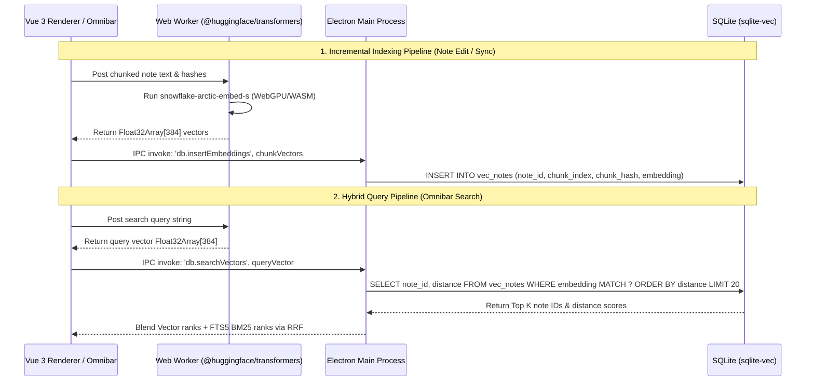

# Vector Search Architecture & Implementation Plan: Notesnook Vue

This document outlines the architecture, component selection, and implementation roadmap for adding **100% On-Device, Offline-First, Zero-Knowledge E2EE Vector Search** to Notesnook Vue alongside the existing FTS5 lexical search.

---

## 1. Core Principles & Constraints

1. **Zero-Knowledge E2EE & Privacy**: All vector embeddings are generated on-device and stored directly inside the user's encrypted SQLite database (`better-sqlite3-multiple-ciphers`). No plaintext note content or vector embeddings leave the device.
2. **100% Offline-First**: Search, embedding generation, and vector matching work with zero network dependencies. Model assets are pre-bundled in Electron installer assets (`extraResources`).
3. **Non-Blocking Execution**: Inference runs in a background Web Worker (Renderer) using WebGPU / WASM, while SQLite queries execute asynchronously in the main Node process.
4. **Local Derived Data**: Vector tables (`vec_notes`) are local-only derived indexes. They do not sync over the network; each device builds its own vector index from decrypted note content.

---

## 2. Technology Selection

### A. Embedding Model: `snowflake-arctic-embed-s` (INT8)
- **Parameters**: 33 Million
- **Vector Dimensions**: 384
- **Quantization**: INT8
- **Model Size**: ~33 MB
- **Retrieval Accuracy (MTEB Benchmark)**: ~52.0
- **Packaging**: Pre-packaged in Electron installer assets (`extraResources`) for instant offline launch.

### B. Embedding Runtime: `@huggingface/transformers` in Web Worker
- **Package**: `@huggingface/transformers` (official Transformers.js v3+ release)
- **Execution Context**: Background Web Worker spawned by the Vue 3 renderer.
- **Hardware Acceleration**: WebGPU enabled (Chromium native GPU) with automatic WASM + SIMD CPU fallback.
- **Benefits**: Pure JS/WASM distribution that eliminates native C++ cross-compilation complexity across macOS (Intel/Apple Silicon), Windows (x64/arm64), and Linux (x64).

### C. Vector Storage Engine: `sqlite-vec`
- **Package**: `sqlite-vec` (Alex Garcia's C extension for SQLite `vec0` virtual tables).
- **Execution Context**: Loaded into `better-sqlite3-multiple-ciphers` in `apps/desktop/src/main/sqlite.ts` via `db.loadExtension(sqliteVecPath)`.
- **Security**: Embeddings reside inside the user's encrypted `.sqlite` database file—decrypted in memory upon database key unlock and encrypted at rest on disk.
- **Query Engine**: SIMD-accelerated exact K-Nearest Neighbor (KNN) cosine distance search (`vec_distance_cosine()`).

---

## 3. Corrected Database Schema (`vec0`)

Because notes are chunked into multiple segments, the primary key MUST be a unique integer `chunk_id`.

```sql
-- Load sqlite-vec extension on every account DB open/swap
-- Create vec0 virtual table for 384-dimensional embeddings.
-- distance_metric=cosine MUST be declared at creation; vec0 defaults to L2.
CREATE VIRTUAL TABLE IF NOT EXISTS vec_notes USING vec0(
  chunk_id INTEGER PRIMARY KEY AUTOINCREMENT,
  note_id TEXT,
  chunk_index INTEGER,
  chunk_hash TEXT,
  embedding float[384] distance_metric=cosine
);
```

### Native KNN via `MATCH` (do not brute-force scan)
`vec0` only uses its index for the `MATCH` KNN path. A query like
`ORDER BY vec_distance_cosine(...) LIMIT k` is a full-table scan and defeats the index —
use the virtual table's native operator instead:

```sql
SELECT note_id, distance
FROM vec_notes
WHERE embedding MATCH ?   -- bind the query vector
ORDER BY distance
LIMIT 20;
```

### Content-Hash Invalidation & Chunking
- **Chunking Window**: ~256 tokens per chunk with 10% overlap, split at paragraph / heading boundaries.
- **Content Hashing**: Compute a fast hash (e.g. Murmur3/SHA256) per chunk (`chunk_hash`).
- **Incremental Indexing**: Skip embedding generation for any chunk whose `chunk_hash` already matches an existing row *for that note* (dedup is per-note, not global — identical paragraphs across two notes are legitimately separate indexable rows). Delete obsolete chunks when a note is edited or deleted.

---

## 4. End-to-End System Architecture



---

## 5. Hybrid Search (RRF Scoring)

Omnibar queries combine Lexical BM25 rank with Vector Cosine Distance rank using **Reciprocal Rank Fusion (RRF)**:

$$\text{RRF Score}(d) = \frac{1}{60 + \text{rank}_{\text{FTS}}(d)} + \frac{1}{60 + \text{rank}_{\text{Vector}}(d)}$$

---

## 6. Implementation & Spike Roadmap

### Phase 0: Proof-of-Concept Spike (Verification Gate)
- [ ] **Spike A (SQLite ABI + indexed KNN)**: Verify `sqlite-vec` loads into `better-sqlite3-multiple-ciphers` in `apps/desktop/src/main/sqlite.ts` without ABI mismatches; that the `vec_notes` schema (with `distance_metric=cosine`) actually creates; and that a cosine `MATCH` KNN runs at target scale (e.g. 100k chunks) with acceptable latency. If `vec0`'s indexed KNN does not perform, the storage choice shifts (e.g. in-process `usearch`/`hnswlib`) — find out here, not in Phase 1.
- [ ] **Spike B (WebGPU Worker)**: Confirm `@huggingface/transformers` runs inside an Electron Web Worker with WebGPU acceleration and WASM SIMD fallback.

### Phase 0.5: Native Packaging Matrix
The `sqlite-vec` *loadable extension* (`.dylib/.so/.dll`, not a Node addon) must be shipped per platform/arch, ABI-matched to the `better-sqlite3-multiple-ciphers` SQLite build, and placed outside the asar (via `extraResources` / `asarUnpack`) so `db.loadExtension()` can reach it. This is the expensive part of the plan and expands the existing per-OS/arch rebuild surface:
- [ ] Confirm loadable distribution for macOS (Intel + Apple Silicon), Windows (x64 + arm64), Linux (x64).
- [ ] Decide whether to ship prebuilt loadables (ABI-matched) or build `sqlite-vec` from source in CI against the multiple-ciphers SQLite.
- [ ] Place the ~33MB ONNX model in `extraResources` (bundled — offline-first; no runtime download).

### Phase 1: Database & Multi-Account Lifecycle
- [ ] Wire `sqlite-vec` extension loading into the database live-swap pipeline (`sqlite.ts`); load on every per-account DB open/swap and tear down the vector index on account switch.
- [ ] Add `vec_notes` table migration with `chunk_id INTEGER PRIMARY KEY`.
- [ ] Wire remote SSE sync invalidation in `sync.ts` — *design point, not a blanket re-embed*: after a sync, compare each note's `dateModified` against a per-note last-indexed timestamp and re-embed only notes that changed on other devices (do NOT re-embed everything on every sync).

### Phase 2: Background Indexing Pipeline
- [ ] Implement text chunker (~256 tokens) with Murmur3 content-hashing in `packages/shared`.
- [ ] Create `src/renderer/src/workers/embedding.worker.ts` hosting `@huggingface/transformers`.
- [ ] Add background queue in `notes.ts` store for incremental note indexing.

### Phase 3: Omnibar Hybrid Search
- [ ] Update `useOmnibarStore` to execute dual queries (FTS5 + `sqlite-vec`) and blend results with RRF.
- [ ] Add user settings for Vector Search toggle, re-indexing, and status metrics.

---

## 7. Performance & Power Budget

The per-query and per-edit costs are small; the workloads that actually hurt are **bulk indexing** (first install, large server sync, account switch) and **sustained inference while on battery**. With the gating below, battery impact for a typical interactive session is effectively zero; without it, a large sync on battery is noticeable.

### Cost profile
- **Per-edit (keystroke saves): negligible if gated.** A typical edit touches 1–2 chunks; hash-gating embeds only those (~5–15ms/chunk WebGPU, ~50–200ms WASM CPU). Embedding must be debounced *separately and longer* than autosave (1–2s after last edit) and run off the save critical path — embeddings are derived data and may lag the persisted note by seconds at zero UX cost.
- **Per-search query: negligible.** One forward pass (~5–15ms) + one `vec0` KNN (~1–5ms at realistic scale). FTS5 + vector run concurrently and fuse via RRF.
- **Bulk indexing: the real cost.** 10k notes × ~5 chunks = 50k chunks ≈ ~8 min sustained WebGPU, ~80 min WASM CPU. Must be background, resumable, throttled, idle-gated; search must work with a partial index (FTS5 always does; vector results improve as indexing catches up).
- **Steady-state idle: ~zero.** Lazy-load the model on first use; terminate the worker after an idle timeout (e.g. 5 min) so no memory/GPU is held when unused.

### Levers that keep it minimal
1. **Idle-gate the embedding queue.** Run only in dead time; pause on user input. Reuse the repo's existing `requestIdleCallback` + per-idle-frame chunking discipline (see list fan-out pattern). Biggest single lever.
2. **Battery awareness via `powerMonitor`.** Wire Electron `powerMonitor.onBattery`/`onLine`. Pause *bulk* indexing on battery; allow only small incremental edit re-embeds. Resume full throughput on AC. This is what protects battery life.
3. **Throttle throughput, not just idle-gate.** Cap chunks/sec (e.g. 30–50) with a yield/sleep between batches so CPU/GPU isn't pinned at 100% even during allowed indexing windows.
4. **Hash-gate trivial edits.** Whitespace/HTML normalization that doesn't change text yields the same `chunk_hash` → skip entirely. Guards against edit churn.
5. **Batch IPC + bulk inserts.** SQLite is behind a serialized mutex with per-query IPC round-trip cost — never one IPC per chunk. Batch vectors to main and bulk-insert; 50k round-trips would otherwise dominate wall-time.
6. **Persist indexing progress.** Survive restart/quit without redoing a long initial index (mirrors session-persistence discipline).
7. **Lazy model load + idle worker teardown.** Don't hold the ~33MB model + GPU buffers resident when unused.

### Flat-KNN ceiling (explicit)
`vec0` is brute-force SIMD KNN, not ANN. It is fine to ~100k–500k chunks; beyond that, query latency climbs linearly. At "power user with tens of thousands of notes" scale, switch the storage leg to an in-process ANN index (`usearch`/`hnswlib`). Validating KNN latency at target scale is part of Spike A — if flat KNN doesn't hold, the storage choice changes here, not after build-out.
